<!-- GENERATED by tools/chaosdoc from chaos/scenarios.json — DO NOT EDIT BY HAND. -->
<!-- Regenerate:  go run ./tools/chaosdoc   (CI drift-guard: go run ./tools/chaosdoc -check) -->

# Chaos scenarios — what we break, and what must hold

> **These four chaos docs:** [primitive](chaos.md) (`kind: FaultInjection`) → [judging](chaos-oracle.md) (the oracle: modes + pillars) → [nightly program](chaos-suite.md) (safety, graduation) → **catalog + live status** (this page, generated).

open-infra is **continuously tested against failure**. Every scenario below drives a real
resource *chain*, injects a real fault at a marked point (⚡), and asserts a business- or
systems-level **invariant** — not just "did it come back up". This page is generated from
[`chaos/scenarios.json`](../chaos/scenarios.json); it can never drift from the source-of-truth.

**Tally:** 67 scenarios — 🟢 56 pass · 🔴 1 finding · ⚪ 1 inconclusive · ⏳ 9 pending · ⏸️ 0 parked.

**Last nightly:** `capture-kill` 🟢 success ([2026-09-03](https://github.com/harn3ss/open-infra/actions/runs/33757557379)) · `isolation` 🟢 success ([2026-09-05](https://github.com/harn3ss/open-infra/actions/runs/33964399259)) · `latency` 🟢 success ([2026-09-03](https://github.com/harn3ss/open-infra/actions/runs/33757557379)) · `loss` 🟢 success ([2026-08-31](https://github.com/harn3ss/open-infra/actions/runs/33412646518)) · `lottery` 🟢 success ([2026-09-05](https://github.com/harn3ss/open-infra/actions/runs/33964399259)) · `partition` 🟢 success ([2026-09-04](https://github.com/harn3ss/open-infra/actions/runs/33874326976)) · `sink-failure` 🟢 success ([2026-09-05](https://github.com/harn3ss/open-infra/actions/runs/33964399259)) · `sink-kill` 🟢 success ([2026-09-01](https://github.com/harn3ss/open-infra/actions/runs/33513849041)) · `sinkkill` 🟢 success ([2026-08-14](https://github.com/harn3ss/open-infra/actions/runs/31763172418)) · `stress-cpu` 🟢 success ([2026-09-03](https://github.com/harn3ss/open-infra/actions/runs/33757557379)) · `stress-mem` 🟢 success ([2026-09-05](https://github.com/harn3ss/open-infra/actions/runs/33964399259))

## 🌙 Last night's run — 2026-09-05

The scenarios the scheduled nightly actually exercised last night, diagrams expanded. Each also appears in its batch below; the full catalog is the [index](#scenario-index).

### M24 · lottery (correlation capstone) — THE nightly run &nbsp; 🟢 PASS &nbsp; _(nightly 2026-09-05)_

diagram — chain, ⚡ fault, oracle

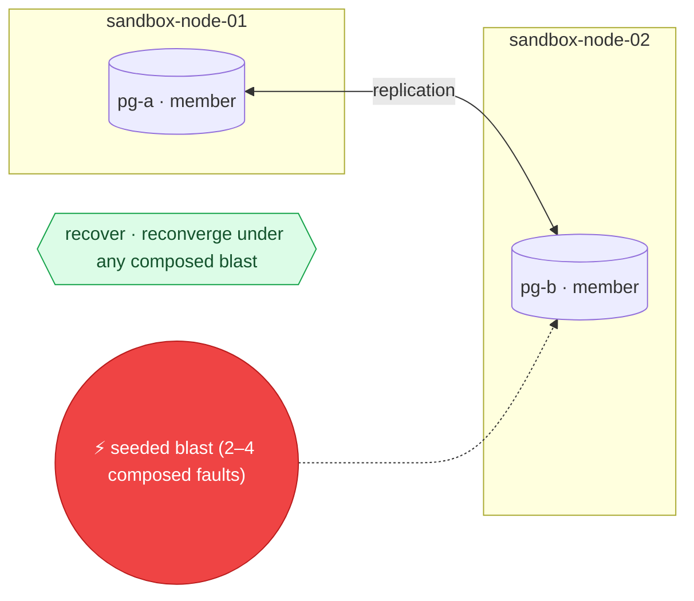
```mermaid
flowchart LR
  subgraph sg_sandbox_node_01["sandbox-node-01"]
    n_a__sandbox_node_01[("pg-a · member")]
  end
  subgraph sg_sandbox_node_02["sandbox-node-02"]
    n_b__sandbox_node_02[("pg-b · member")]
  end
  n_a__sandbox_node_01 <-->|"replication"| n_b__sandbox_node_02
  FAULT(("⚡ seeded blast (2–4 composed faults)")):::fault
  FAULT -.-> n_b__sandbox_node_02
  ORACLE{{"recover · reconverge under any composed blast"}}:::oracle_recover
  classDef fault fill:#ef4444,color:#fff,stroke:#b91c1c;
  classDef oracle_recover fill:#dcfce7,stroke:#16a34a,color:#14532d;
  classDef oracle_tolerate fill:#fef9c3,stroke:#ca8a04,color:#713f12;
  classDef oracle_deny fill:#dbeafe,stroke:#2563eb,color:#1e3a8a;
```

### M04 · partition-isolation &nbsp; 🟢 PASS &nbsp; _(nightly 2026-09-05)_

diagram — chain, ⚡ fault, oracle

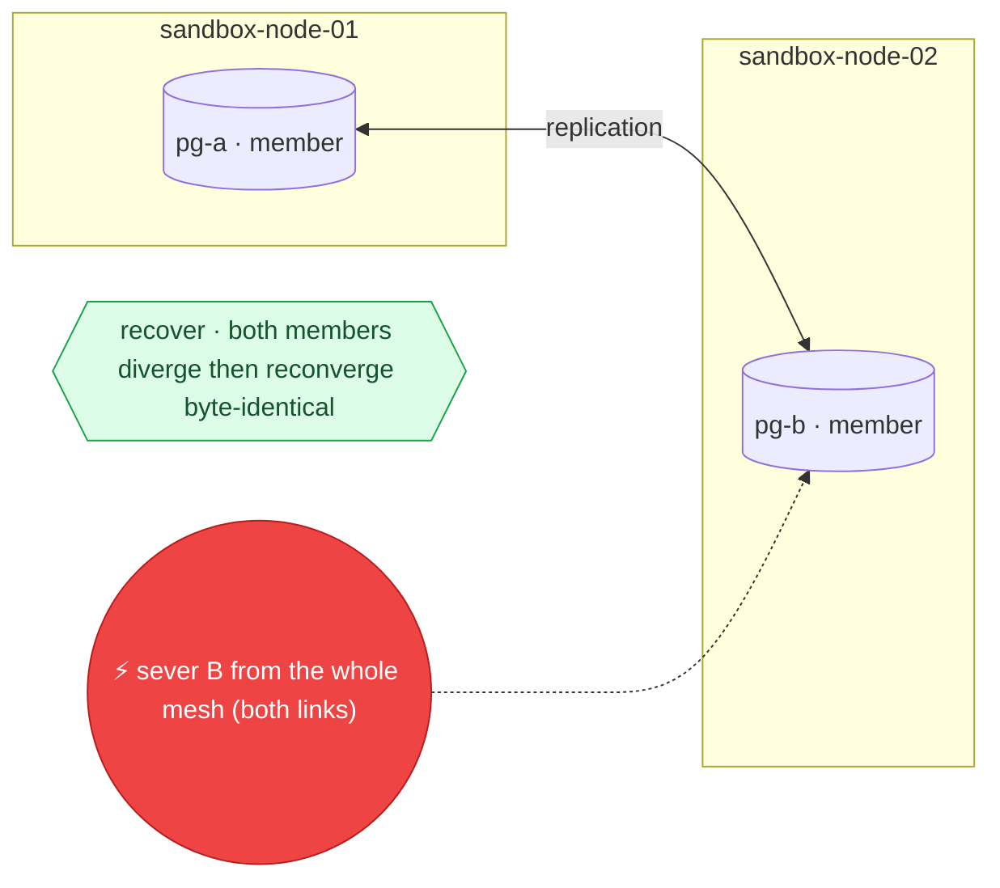
```mermaid
flowchart LR
  subgraph sg_sandbox_node_01["sandbox-node-01"]
    n_a__sandbox_node_01[("pg-a · member")]
  end
  subgraph sg_sandbox_node_02["sandbox-node-02"]
    n_b__sandbox_node_02[("pg-b · member")]
  end
  n_a__sandbox_node_01 <-->|"replication"| n_b__sandbox_node_02
  FAULT(("⚡ sever B from the whole mesh (both links)")):::fault
  FAULT -.-> n_b__sandbox_node_02
  ORACLE{{"recover · both members diverge then reconverge byte-identical"}}:::oracle_recover
  classDef fault fill:#ef4444,color:#fff,stroke:#b91c1c;
  classDef oracle_recover fill:#dcfce7,stroke:#16a34a,color:#14532d;
  classDef oracle_tolerate fill:#fef9c3,stroke:#ca8a04,color:#713f12;
  classDef oracle_deny fill:#dbeafe,stroke:#2563eb,color:#1e3a8a;
```

### M12 · stress-mem &nbsp; 🟢 PASS &nbsp; _(nightly 2026-09-05)_

diagram — chain, ⚡ fault, oracle

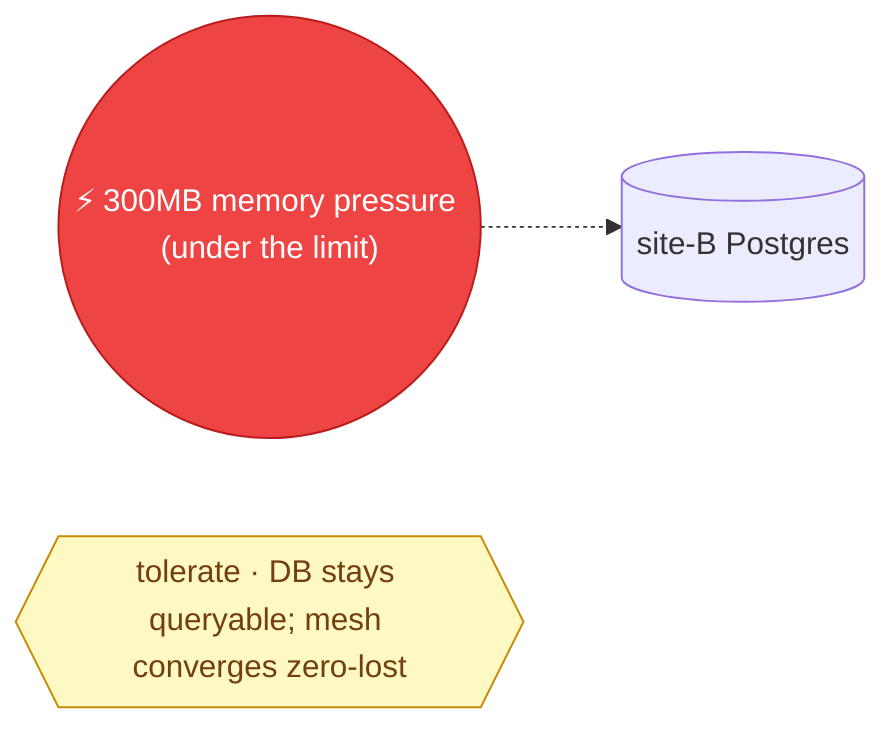
```mermaid
flowchart LR
  n_b[("site-B Postgres")]
  FAULT(("⚡ 300MB memory pressure (under the limit)")):::fault
  FAULT -.-> n_b
  ORACLE{{"tolerate · DB stays queryable; mesh converges zero-lost"}}:::oracle_tolerate
  classDef fault fill:#ef4444,color:#fff,stroke:#b91c1c;
  classDef oracle_recover fill:#dcfce7,stroke:#16a34a,color:#14532d;
  classDef oracle_tolerate fill:#fef9c3,stroke:#ca8a04,color:#713f12;
  classDef oracle_deny fill:#dbeafe,stroke:#2563eb,color:#1e3a8a;
```

---

> **Freshness — read this before the green.** `nightly-lottery` means the fault is in the lottery's **draw palette**; its *Verified* date is the last night it was **actually drawn** (a night draws only 2–4 faults, so these dates vary and many read *not recorded* until drawn and machine-stamped by the run). `hand-driven` / `on-demand` are **point-in-time**, not refreshed nightly. Nuance: the lottery judges a drawn fault with a deliberately generous **convergence** oracle (the mesh reconverged), *not* each scenario's standalone oracle — so `nightly-lottery` means "drawn and the mesh recovered", a bit weaker than "this scenario's exact check passed". The banner above is the lottery run itself.

### Legend

| Symbol | Meaning |
|---|---|
| ⚡ (red) | fault-injection point — where the break is applied |
| green badge | **recover** — after the fault heals, no acknowledged work was lost |
| amber badge | **tolerate** — a continuous SLO held *while* the fault was live |
| blue badge | **deny** — a negative invariant that must NEVER happen (zero tolerance) |
| 🟢🔴⚪⏳⏸️ | pass · finding · inconclusive · pending · parked |

Shapes: `[(cylinder)]` = database/storage · `[[subroutine]]` = stream/directory · `([stadium])` = function · `[/parallelogram/]` = VM · `[rectangle]` = app/service. Where a resource spanned multiple sandbox nodes (HA / replicas / live-migration), each node is drawn as its own **subgraph** and the instances are tied together.

### Scenario index

| ID | Scenario | Category | Sandbox nodes | Status | Verified |
|---|---|---|---|---|---|
| [C1](#s-C1) | SaaS — all three oracle modes at once | Application + SecurityGroup + Postgres (HA) | 01,02 | 🟢 PASS | 2026-08-01 · hand-driven |
| [C2](#s-C2) | Zero-downtime cutover | Migration + live writes | pool | 🟢 PASS | 2026-08-01 · hand-driven |
| [C3](#s-C3) | Ledger conservation under DB failover | Application + Postgres (HA) | 01,02 | 🟢 PASS | 2026-08-01 · hand-driven |
| [C4](#s-C4) | VDI correlated outage | Directory + FileShare | pool | 🟢 PASS | 2026-08-01 · hand-driven |
| [C5](#s-C5) | Active-active multi-region | Multi-master mesh (2 regions) | 01,02 | 🟢 PASS | 2026-08-01 · hand-driven |
| [C6](#s-C6) | Event pipeline (DB→Stream→Function) | Stream + Function | pool | 🟢 PASS | 2026-08-01 · hand-driven |
| [N01](#s-N01) | HPA scale-out under load + replica kill | Application autoscaling | pool | 🟢 PASS | 2026-08-02 · hand-driven |
| [N02](#s-N02) | Scale-to-zero cold burst with backlog | Function (Knative) | pool | 🟢 PASS | 2026-08-02 · hand-driven |
| [N03](#s-N03) | Postgres final snapshot → delete → restore | Snapshots (console-orchestrated) | pool | ⏳ PENDING | 2026-08-02 · hand-driven |
| [N04](#s-N04) | MariaDB backup → restore | Snapshots (console-orchestrated) | pool | ⏳ PENDING | 2026-08-02 · hand-driven |
| [N05](#s-N05) | Kill MinIO backup target mid-snapshot | Snapshots + object store | pool | ⏳ PENDING | 2026-08-02 · hand-driven |
| [N06](#s-N06) | Permission-boundary self-escalation deny | IAM (kind: Policy / Role) | pool | 🟢 PASS | 2026-08-02 · hand-driven |
| [N07](#s-N07) | Least-privilege — mutating verbs denied | IAM (impersonation / SAR) | pool | 🟢 PASS | 2026-08-02 · hand-driven |
| [N08](#s-N08) | Cross-namespace SecurityGroup isolation | SecurityGroup (Cilium/NetworkPolicy) | pool | 🟢 PASS | 2026-08-02 · hand-driven |
| [N09](#s-N09) | DataFlow autoSyncTables under concurrent writes | DataFlow (mesh) | 01,02 | 🟢 PASS | 2026-08-02 · hand-driven |
| [N10](#s-N10) | Heterogeneous pg↔mysql mesh | DataFlow (cross-engine) | 01,02 | 🔴 FINDING | 2026-08-02 · hand-driven |
| [N11](#s-N11) | Dead-letter on a poison row | apply-sink error handling | pool | 🟢 PASS | 2026-08-02 · hand-driven |
| [N12](#s-N12) | Multi-master LWW conflict determinism | Multi-master mesh | 01,02 | 🟢 PASS | 2026-08-02 · hand-driven |
| [N13](#s-N13) | Cross-engine key coercion (pg→mysql) | Migration (cross-engine) | pool | 🟢 PASS | 2026-08-02 · hand-driven |
| [N14](#s-N14) | Migration resume after apply-sink delete | Migration lifecycle | pool | 🟢 PASS | 2026-08-02 · hand-driven |
| [N15](#s-N15) | Migration idempotency | Migration lifecycle | pool | 🟢 PASS | 2026-08-02 · hand-driven |
| [N16](#s-N16) | VM live-migration under node drain | Virtual machine | 01,02 | ⏳ PENDING | 2026-08-02 · hand-driven |
| [N17](#s-N17) | Block-mode volume hotplug to a running VM | Volume + VM | pool | ⏳ PENDING | 2026-08-02 · hand-driven |
| [N18](#s-N18) | VM disk backup → restore | Virtual machine (Longhorn/KubeVirt) | pool | ⏳ PENDING | 2026-08-02 · hand-driven |
| [N19](#s-N19) | Stream fan-out to two Functions | Stream (delivery guarantee) | pool | 🟢 PASS | 2026-08-02 · hand-driven |
| [N20](#s-N20) | PriorityClass preemption under pressure | Scheduling / control-plane | pool | 🟢 PASS | 2026-08-02 · hand-driven |
| [S01](#s-S01) | MariaDB Galera node kill | MySQL (HA) | 01,02,03 | 🟢 PASS | 2026-08-02 · hand-driven |
| [S02](#s-S02) | Mongo/FerretDB backend kill | MongoDB (FerretDB on Postgres) | pool | 🟢 PASS | 2026-08-02 · hand-driven |
| [S03](#s-S03) | Babelfish pod kill | Babelfish (SQL-Server-compatible) | pool | 🟢 PASS | 2026-08-02 · hand-driven |
| [S04](#s-S04) | Cross-engine primary-key coercion | Migration (cross-engine) | pool | 🟢 PASS | 2026-08-02 · hand-driven |
| [S10](#s-S10) | 3-node DataFlow mesh convergence | DataFlow (mesh, N≥3) | 01,02,03 | 🟢 PASS | 2026-08-02 · hand-driven |
| [S12](#s-S12) | Kill 2-of-3 Deployment replicas | Application availability | 01,02,03 | 🟢 PASS | 2026-08-02 · hand-driven |
| [S13](#s-S13) | Function cold-start burst | Function (Knative) | pool | 🟢 PASS | 2026-08-02 · hand-driven |
| [S14](#s-S14) | HA-VM under fault | Virtual machine | pool | ⚪ INCONCLUSIVE | 2026-08-02 · hand-driven |
| [S15](#s-S15) | Longhorn Volume replica loss | Volume (Longhorn) | 01,02 | 🟢 PASS | 2026-08-02 · hand-driven |
| [S16](#s-S16) | FileShare killed mid-write | FileShare (SMB) | pool | 🟢 PASS | 2026-08-02 · hand-driven |
| [S17](#s-S17) | Online Volume expand | Volume (Longhorn) | pool | 🟢 PASS | 2026-08-02 · hand-driven |
| [S18](#s-S18) | Live SecurityGroup egress change | SecurityGroup | pool | 🟢 PASS | 2026-08-02 · hand-driven |
| [S19](#s-S19) | Secret rotation propagation | Application config | pool | 🟢 PASS | 2026-08-02 · hand-driven |
| [S20](#s-S20) | ResourceQuota caps a runaway | Control-plane (quota) | pool | 🟢 PASS | 2026-08-02 · hand-driven |
| [M01](#s-M01) | app-availability | Application | pool | 🟢 PASS | not recorded · on-demand |
| [M02](#s-M02) | cnpg-failover | Postgres (HA) | 01,02 | 🟢 PASS | not recorded · on-demand |
| [M03](#s-M03) | partition | Multi-master mesh | 01,02 | 🟢 PASS | 2026-09-04 · nightly-lottery |
| [M04](#s-M04) | partition-isolation | Multi-master mesh | 01,02 | 🟢 PASS | 2026-09-05 · nightly-lottery |
| [M05](#s-M05) | partition-flapping | Multi-master mesh | 01,02 | 🟢 PASS | not recorded · on-demand |
| [M06](#s-M06) | partition-latency | Multi-master mesh | 01,02 | 🟢 PASS | 2026-09-03 · nightly-lottery |
| [M07](#s-M07) | partition-loss | Multi-master mesh | 01,02 | 🟢 PASS | 2026-08-31 · nightly-lottery |
| [M08](#s-M08) | clock-skew | Multi-master mesh | 01,02 | 🟢 PASS | not recorded · on-demand |
| [M09](#s-M09) | healing-order | Multi-master mesh (timing) | 01,02 | 🟢 PASS | not recorded · on-demand |
| [M10](#s-M10) | concurrent (mesh under overlapping chaos) | Multi-master mesh | 01,02 | 🟢 PASS | not recorded · on-demand |
| [M11](#s-M11) | stress-cpu | apply-sink (fault variety) | pool | 🟢 PASS | 2026-09-03 · nightly-lottery |
| [M12](#s-M12) | stress-mem | Postgres (fault variety) | pool | 🟢 PASS | 2026-09-05 · nightly-lottery |
| [M13](#s-M13) | sink-kill | apply-sink | pool | 🟢 PASS | 2026-09-01 · nightly-lottery |
| [M14](#s-M14) | sink-drain-kill | apply-sink (hardest state) | pool | 🟢 PASS | not recorded · on-demand |
| [M15](#s-M15) | migration | Migration (fidelity) | pool | 🟢 PASS | not recorded · on-demand |
| [M16](#s-M16) | stream-noloss | Stream (CDC) | pool | 🟢 PASS | not recorded · on-demand |
| [M17](#s-M17) | dataflow-converge | DataFlow | 01,02 | 🟢 PASS | not recorded · on-demand |
| [M18](#s-M18) | security-deny | SecurityGroup | pool | 🟢 PASS | not recorded · on-demand |
| [M19](#s-M19) | directory-recover | Active Directory | pool | 🟢 PASS | not recorded · on-demand |
| [M20](#s-M20) | fileshare-durable | FileShare (SMB) | pool | 🟢 PASS | not recorded · on-demand |
| [M21](#s-M21) | volume-durable | Volume (Longhorn) | 01,02 | 🟢 PASS | not recorded · on-demand |
| [M22](#s-M22) | storage-replica-loss | Storage (Longhorn) | 01,02,03 | 🟢 PASS | not recorded · on-demand |
| [M23](#s-M23) | vm-resilience | Virtual machine | pool | 🟢 PASS | not recorded · on-demand |
| [M24](#s-M24) | lottery (correlation capstone) — THE nightly run | Multi-master mesh (seeded) | 01,02 | 🟢 PASS | 2026-09-05 · nightly-lottery |
| [N21](#s-N21) | Subscriptions no-loss under engine kill (open-appsync) | GraphQLApi subscriptions + NATS JetStream | pool | ⏳ PENDING | not recorded · not yet run (pending first green) |
| [N22](#s-N22) | Async Lambda invoke no-loss under shim kill | Lambda (aws-shim) async invoke + NATS JetStream | pool | ⏳ PENDING | 2026-08-10 · hand-driven live run (green once; pending the nightly streak) |
| [N23](#s-N23) | Async Lambda invoke delivered (happy path) under shim kill | Lambda (aws-shim) async invoke + Knative Function + NATS JetStream | pool | ⏳ PENDING | 2026-08-10 · hand-driven live run (green once; pending the nightly streak) |

> **Sandbox nodes** column: which of `sandbox-node-01/02/03` a scenario used. `pool` = a single pod scheduler-placed within the 3-node sandbox; numbers = a resource spread across those specific nodes (see the per-scenario subgraphs).

---

## Composite workflows

Realistic multi-kind tenant stacks hit by one fault, judged on a business-level invariant (money conserved / no order lost / identity+data survive) — often blending oracle modes in a single run. Hand-driven.

### C1 · SaaS — all three oracle modes at once &nbsp; 🟢 PASS

**Category:** Application + SecurityGroup + Postgres (HA) &nbsp;•&nbsp; **Oracle:** tolerate — availability + zero lost orders + zero fence breaches through failover

**Ran on:** sandbox-node-01, sandbox-node-02

**Verified:** 2026-08-01 · hand-driven

> One run exercised recover + tolerate + deny together: app availability 150/150, orders 139/139 (zero lost), tenant fence 0 breaches, DB failed over. (Surfaced + fixed the SG-labels-on-DB bug.)

diagram — chain, ⚡ fault, oracle

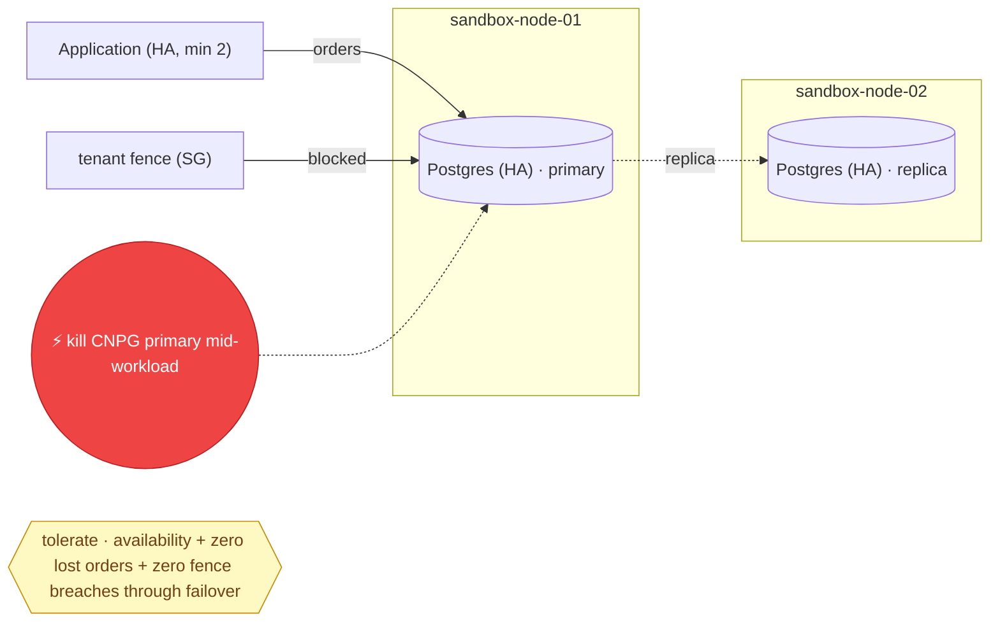
```mermaid
flowchart LR
  n_app["Application (HA, min 2)"]
  n_fence["tenant fence (SG)"]
  subgraph sg_sandbox_node_01["sandbox-node-01"]
    n_db__sandbox_node_01[("Postgres (HA) · primary")]
  end
  subgraph sg_sandbox_node_02["sandbox-node-02"]
    n_db__sandbox_node_02[("Postgres (HA) · replica")]
  end
  n_db__sandbox_node_01 -.->|"replica"| n_db__sandbox_node_02
  n_app -->|"orders"| n_db__sandbox_node_01
  n_fence -->|"blocked"| n_db__sandbox_node_01
  FAULT(("⚡ kill CNPG primary mid-workload")):::fault
  FAULT -.-> n_db__sandbox_node_01
  ORACLE{{"tolerate · availability + zero lost orders + zero fence breaches through failover"}}:::oracle_tolerate
  classDef fault fill:#ef4444,color:#fff,stroke:#b91c1c;
  classDef oracle_recover fill:#dcfce7,stroke:#16a34a,color:#14532d;
  classDef oracle_tolerate fill:#fef9c3,stroke:#ca8a04,color:#713f12;
  classDef oracle_deny fill:#dbeafe,stroke:#2563eb,color:#1e3a8a;
```

### C2 · Zero-downtime cutover &nbsp; 🟢 PASS

**Category:** Migration + live writes &nbsp;•&nbsp; **Oracle:** recover — zero downtime for the app + full fidelity at target

**Ran on:** scheduler-placed within the sandbox-node-01…03 pool

**Verified:** 2026-08-01 · hand-driven

> Source 120/120 writes committed (zero app downtime) and all 120 reached the target.

diagram — chain, ⚡ fault, oracle

```mermaid
flowchart LR
  n_src[("source DB")]
  n_sink["apply-sink"]
  n_tgt[("target DB")]
  n_src -->|"CDC"| n_sink
  n_sink -->|"apply"| n_tgt
  FAULT(("⚡ kill apply-sink mid-cutover")):::fault
  FAULT -.-> n_sink
  ORACLE{{"recover · zero downtime for the app + full fidelity at target"}}:::oracle_recover
  classDef fault fill:#ef4444,color:#fff,stroke:#b91c1c;
  classDef oracle_recover fill:#dcfce7,stroke:#16a34a,color:#14532d;
  classDef oracle_tolerate fill:#fef9c3,stroke:#ca8a04,color:#713f12;
  classDef oracle_deny fill:#dbeafe,stroke:#2563eb,color:#1e3a8a;
```

### C3 · Ledger conservation under DB failover &nbsp; 🟢 PASS

**Category:** Application + Postgres (HA) &nbsp;•&nbsp; **Oracle:** recover — SUM(balance) conserved exactly

**Ran on:** sandbox-node-01, sandbox-node-02

**Verified:** 2026-08-01 · hand-driven

> 144/150 transfers committed, 6 failed in the ~2.4s failover window, SUM(balance)=100000 exactly — no torn transfer.

diagram — chain, ⚡ fault, oracle

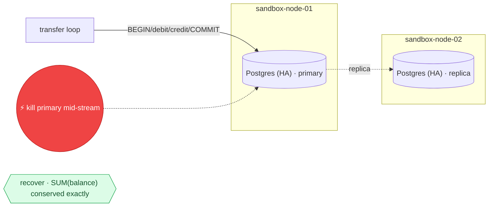
```mermaid
flowchart LR
  n_app["transfer loop"]
  subgraph sg_sandbox_node_01["sandbox-node-01"]
    n_db__sandbox_node_01[("Postgres (HA) · primary")]
  end
  subgraph sg_sandbox_node_02["sandbox-node-02"]
    n_db__sandbox_node_02[("Postgres (HA) · replica")]
  end
  n_db__sandbox_node_01 -.->|"replica"| n_db__sandbox_node_02
  n_app -->|"BEGIN/debit/credit/COMMIT"| n_db__sandbox_node_01
  FAULT(("⚡ kill primary mid-stream")):::fault
  FAULT -.-> n_db__sandbox_node_01
  ORACLE{{"recover · SUM(balance) conserved exactly"}}:::oracle_recover
  classDef fault fill:#ef4444,color:#fff,stroke:#b91c1c;
  classDef oracle_recover fill:#dcfce7,stroke:#16a34a,color:#14532d;
  classDef oracle_tolerate fill:#fef9c3,stroke:#ca8a04,color:#713f12;
  classDef oracle_deny fill:#dbeafe,stroke:#2563eb,color:#1e3a8a;
```

### C4 · VDI correlated outage &nbsp; 🟢 PASS

**Category:** Directory + FileShare &nbsp;•&nbsp; **Oracle:** recover — identity + files both survive the correlated outage

**Ran on:** scheduler-placed within the sandbox-node-01…03 pool

**Verified:** 2026-08-01 · hand-driven

> Killed the AD domain controller AND the Samba pod together; both recovered — user re-auth intact, file intact + writable.

diagram — chain, ⚡ fault, oracle

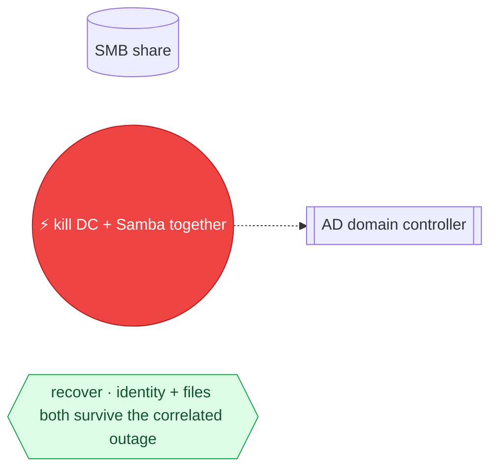
```mermaid
flowchart LR
  n_dc[["AD domain controller"]]
  n_fs[("SMB share")]
  FAULT(("⚡ kill DC + Samba together")):::fault
  FAULT -.-> n_dc
  ORACLE{{"recover · identity + files both survive the correlated outage"}}:::oracle_recover
  classDef fault fill:#ef4444,color:#fff,stroke:#b91c1c;
  classDef oracle_recover fill:#dcfce7,stroke:#16a34a,color:#14532d;
  classDef oracle_tolerate fill:#fef9c3,stroke:#ca8a04,color:#713f12;
  classDef oracle_deny fill:#dbeafe,stroke:#2563eb,color:#1e3a8a;
```

### C5 · Active-active multi-region &nbsp; 🟢 PASS

**Category:** Multi-master mesh (2 regions) &nbsp;•&nbsp; **Oracle:** tolerate — both serve local writes through the split, then reconverge

**Ran on:** sandbox-node-01, sandbox-node-02

**Verified:** 2026-08-01 · hand-driven

> Both regions served 20/20 local writes THROUGH the split; healed → reconverged 40/40 with zero lost writes.

diagram — chain, ⚡ fault, oracle

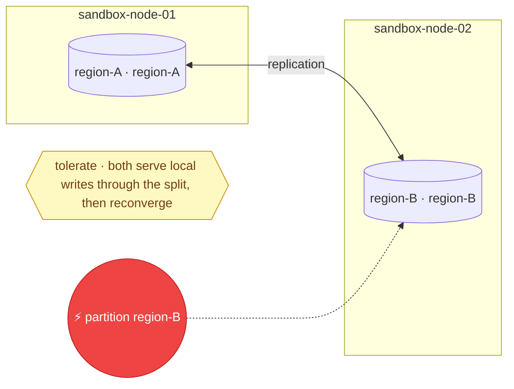
```mermaid
flowchart LR
  subgraph sg_sandbox_node_01["sandbox-node-01"]
    n_ra__sandbox_node_01[("region-A · region-A")]
  end
  subgraph sg_sandbox_node_02["sandbox-node-02"]
    n_rb__sandbox_node_02[("region-B · region-B")]
  end
  n_ra__sandbox_node_01 <-->|"replication"| n_rb__sandbox_node_02
  FAULT(("⚡ partition region-B")):::fault
  FAULT -.-> n_rb__sandbox_node_02
  ORACLE{{"tolerate · both serve local writes through the split, then reconverge"}}:::oracle_tolerate
  classDef fault fill:#ef4444,color:#fff,stroke:#b91c1c;
  classDef oracle_recover fill:#dcfce7,stroke:#16a34a,color:#14532d;
  classDef oracle_tolerate fill:#fef9c3,stroke:#ca8a04,color:#713f12;
  classDef oracle_deny fill:#dbeafe,stroke:#2563eb,color:#1e3a8a;
```

### C6 · Event pipeline (DB→Stream→Function) &nbsp; 🟢 PASS

**Category:** Stream + Function &nbsp;•&nbsp; **Oracle:** recover — zero events lost (durable consumer resumes from offset)

**Ran on:** scheduler-placed within the sandbox-node-01…03 pool

**Verified:** 2026-08-01 · hand-driven

> Killed the Function's durable-consumer pump mid-stream; it redelivered from offset — all 120 changes reached the function, zero loss.

diagram — chain, ⚡ fault, oracle

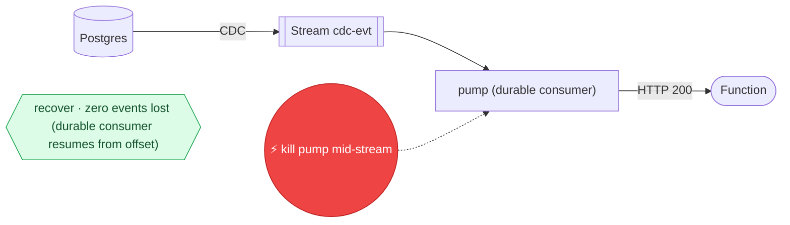
```mermaid
flowchart LR
  n_db[("Postgres")]
  n_st[["Stream cdc-evt"]]
  n_pump["pump (durable consumer)"]
  n_fn(["Function"])
  n_db -->|"CDC"| n_st
  n_st --> n_pump
  n_pump -->|"HTTP 200"| n_fn
  FAULT(("⚡ kill pump mid-stream")):::fault
  FAULT -.-> n_pump
  ORACLE{{"recover · zero events lost (durable consumer resumes from offset)"}}:::oracle_recover
  classDef fault fill:#ef4444,color:#fff,stroke:#b91c1c;
  classDef oracle_recover fill:#dcfce7,stroke:#16a34a,color:#14532d;
  classDef oracle_tolerate fill:#fef9c3,stroke:#ca8a04,color:#713f12;
  classDef oracle_deny fill:#dbeafe,stroke:#2563eb,color:#1e3a8a;
```

---

## Targeted batch (N-series)

New-coverage probes across untested ground: IAM/permission boundary, cross-namespace isolation, DataFlow internals, cross-engine replication, migration lifecycle, autoscaling, snapshots, and VM storage. Hand-driven.

### N01 · HPA scale-out under load + replica kill &nbsp; 🟢 PASS

**Category:** Application autoscaling &nbsp;•&nbsp; **Oracle:** tolerate — availability holds; HPA restores the replica count

**Ran on:** scheduler-placed within the sandbox-node-01…03 pool

**Verified:** 2026-08-02 · hand-driven

> Concurrent load pushed CPU past the HPA target; the app scaled out 1→4 (max). Killing a scaled replica recovered back to 4 — scale-out and self-heal both hold.

diagram — chain, ⚡ fault, oracle

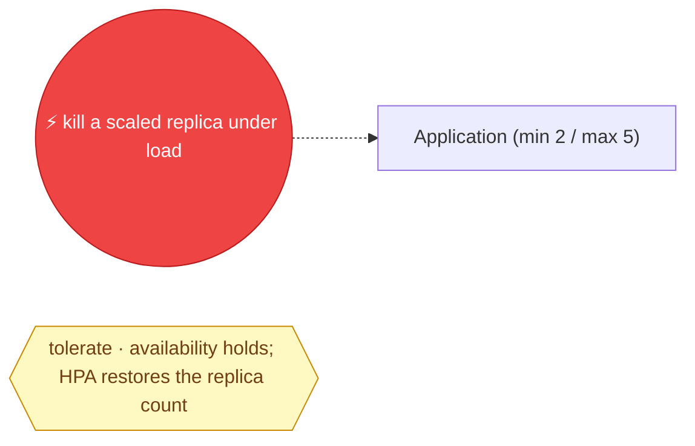
```mermaid
flowchart LR
  n_app["Application (min 2 / max 5)"]
  FAULT(("⚡ kill a scaled replica under load")):::fault
  FAULT -.-> n_app
  ORACLE{{"tolerate · availability holds; HPA restores the replica count"}}:::oracle_tolerate
  classDef fault fill:#ef4444,color:#fff,stroke:#b91c1c;
  classDef oracle_recover fill:#dcfce7,stroke:#16a34a,color:#14532d;
  classDef oracle_tolerate fill:#fef9c3,stroke:#ca8a04,color:#713f12;
  classDef oracle_deny fill:#dbeafe,stroke:#2563eb,color:#1e3a8a;
```

### N02 · Scale-to-zero cold burst with backlog &nbsp; 🟢 PASS

**Category:** Function (Knative) &nbsp;•&nbsp; **Oracle:** recover — the whole backlog drains on wake, nothing dropped

**Ran on:** scheduler-placed within the sandbox-node-01…03 pool

**Verified:** 2026-08-02 · hand-driven

> Function scaled to ZERO after idle (0 replicas), then a 30-event burst cold-started it and the durable pump drained the whole backlog (Unprocessed=0).

diagram — chain, ⚡ fault, oracle

```mermaid
flowchart LR
  n_st[["Stream (backlog)"]]
  n_fn(["Function (scaled to 0)"])
  n_st --> n_fn
  FAULT(("⚡ idle → 0, then cold burst")):::fault
  FAULT -.-> n_fn
  ORACLE{{"recover · the whole backlog drains on wake, nothing dropped"}}:::oracle_recover
  classDef fault fill:#ef4444,color:#fff,stroke:#b91c1c;
  classDef oracle_recover fill:#dcfce7,stroke:#16a34a,color:#14532d;
  classDef oracle_tolerate fill:#fef9c3,stroke:#ca8a04,color:#713f12;
  classDef oracle_deny fill:#dbeafe,stroke:#2563eb,color:#1e3a8a;
```

### N03 · Postgres final snapshot → delete → restore &nbsp; ⏳ PENDING

**Category:** Snapshots (console-orchestrated) &nbsp;•&nbsp; **Oracle:** recover — restore into a new DB returns every row

**Ran on:** scheduler-placed within the sandbox-node-01…03 pool

**Verified:** 2026-08-02 · hand-driven

> Snapshots are orchestrated by the console-api (no CRD); driven via the BFF.

diagram — chain, ⚡ fault, oracle

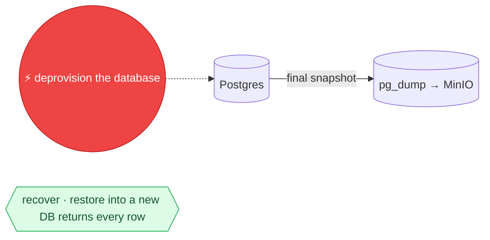
```mermaid
flowchart LR
  n_db[("Postgres")]
  n_snap[("pg_dump → MinIO")]
  n_db -->|"final snapshot"| n_snap
  FAULT(("⚡ deprovision the database")):::fault
  FAULT -.-> n_db
  ORACLE{{"recover · restore into a new DB returns every row"}}:::oracle_recover
  classDef fault fill:#ef4444,color:#fff,stroke:#b91c1c;
  classDef oracle_recover fill:#dcfce7,stroke:#16a34a,color:#14532d;
  classDef oracle_tolerate fill:#fef9c3,stroke:#ca8a04,color:#713f12;
  classDef oracle_deny fill:#dbeafe,stroke:#2563eb,color:#1e3a8a;
```

### N04 · MariaDB backup → restore &nbsp; ⏳ PENDING

**Category:** Snapshots (console-orchestrated) &nbsp;•&nbsp; **Oracle:** recover — restored DB returns all data

**Ran on:** scheduler-placed within the sandbox-node-01…03 pool

**Verified:** 2026-08-02 · hand-driven

diagram — chain, ⚡ fault, oracle

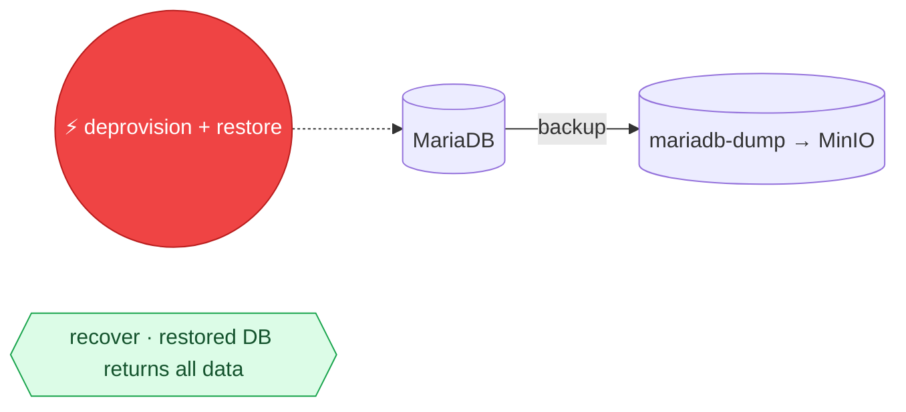
```mermaid
flowchart LR
  n_db[("MariaDB")]
  n_snap[("mariadb-dump → MinIO")]
  n_db -->|"backup"| n_snap
  FAULT(("⚡ deprovision + restore")):::fault
  FAULT -.-> n_db
  ORACLE{{"recover · restored DB returns all data"}}:::oracle_recover
  classDef fault fill:#ef4444,color:#fff,stroke:#b91c1c;
  classDef oracle_recover fill:#dcfce7,stroke:#16a34a,color:#14532d;
  classDef oracle_tolerate fill:#fef9c3,stroke:#ca8a04,color:#713f12;
  classDef oracle_deny fill:#dbeafe,stroke:#2563eb,color:#1e3a8a;
```

### N05 · Kill MinIO backup target mid-snapshot &nbsp; ⏳ PENDING

**Category:** Snapshots + object store &nbsp;•&nbsp; **Oracle:** recover — snapshot integrity preserved / retried, never silently truncated

**Ran on:** scheduler-placed within the sandbox-node-01…03 pool

**Verified:** 2026-08-02 · hand-driven

diagram — chain, ⚡ fault, oracle

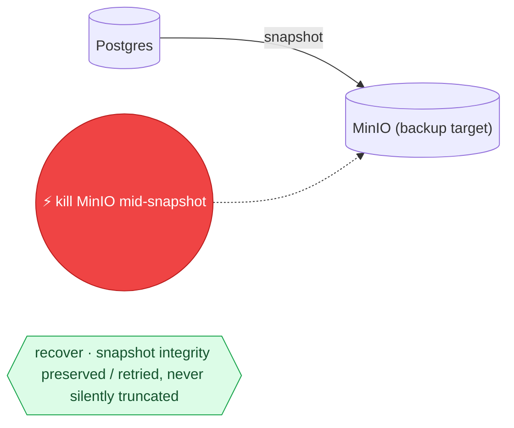
```mermaid
flowchart LR
  n_db[("Postgres")]
  n_snap[("MinIO (backup target)")]
  n_db -->|"snapshot"| n_snap
  FAULT(("⚡ kill MinIO mid-snapshot")):::fault
  FAULT -.-> n_snap
  ORACLE{{"recover · snapshot integrity preserved / retried, never silently truncated"}}:::oracle_recover
  classDef fault fill:#ef4444,color:#fff,stroke:#b91c1c;
  classDef oracle_recover fill:#dcfce7,stroke:#16a34a,color:#14532d;
  classDef oracle_tolerate fill:#fef9c3,stroke:#ca8a04,color:#713f12;
  classDef oracle_deny fill:#dbeafe,stroke:#2563eb,color:#1e3a8a;
```

### N06 · Permission-boundary self-escalation deny &nbsp; 🟢 PASS

**Category:** IAM (kind: Policy / Role) &nbsp;•&nbsp; **Oracle:** deny — escalation grants never materialize (0 breaches)

**Ran on:** scheduler-placed within the sandbox-node-01…03 pool

**Verified:** 2026-08-02 · hand-driven

> A Policy that tried to grant policies:*/users:*/roles:* had all three dropped at compile time; the compiled ClusterRole held only the in-boundary grant.

diagram — chain, ⚡ fault, oracle

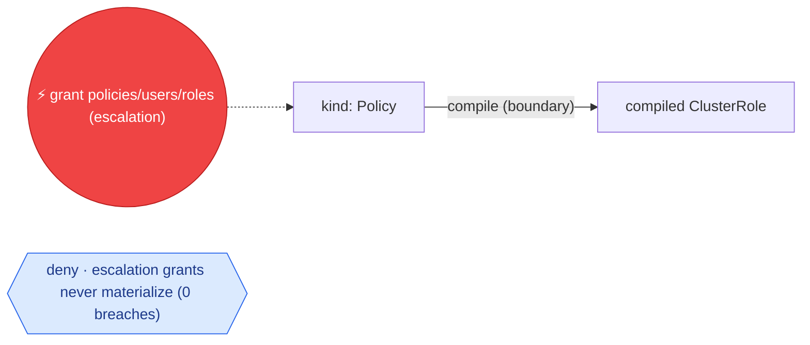
```mermaid
flowchart LR
  n_pol["kind: Policy"]
  n_cr["compiled ClusterRole"]
  n_pol -->|"compile (boundary)"| n_cr
  FAULT(("⚡ grant policies/users/roles (escalation)")):::fault
  FAULT -.-> n_pol
  ORACLE{{"deny · escalation grants never materialize (0 breaches)"}}:::oracle_deny
  classDef fault fill:#ef4444,color:#fff,stroke:#b91c1c;
  classDef oracle_recover fill:#dcfce7,stroke:#16a34a,color:#14532d;
  classDef oracle_tolerate fill:#fef9c3,stroke:#ca8a04,color:#713f12;
  classDef oracle_deny fill:#dbeafe,stroke:#2563eb,color:#1e3a8a;
```

### N07 · Least-privilege — mutating verbs denied &nbsp; 🟢 PASS

**Category:** IAM (impersonation / SAR) &nbsp;•&nbsp; **Oracle:** deny — every out-of-role mutating verb is denied

**Ran on:** scheduler-placed within the sandbox-node-01…03 pool

**Verified:** 2026-08-02 · hand-driven

> Read-only subject can list, but delete/create denied across kinds.

diagram — chain, ⚡ fault, oracle

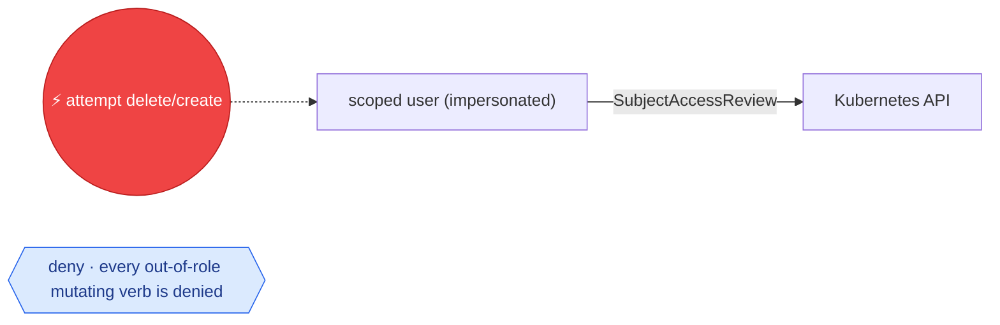
```mermaid
flowchart LR
  n_user["scoped user (impersonated)"]
  n_api["Kubernetes API"]
  n_user -->|"SubjectAccessReview"| n_api
  FAULT(("⚡ attempt delete/create")):::fault
  FAULT -.-> n_user
  ORACLE{{"deny · every out-of-role mutating verb is denied"}}:::oracle_deny
  classDef fault fill:#ef4444,color:#fff,stroke:#b91c1c;
  classDef oracle_recover fill:#dcfce7,stroke:#16a34a,color:#14532d;
  classDef oracle_tolerate fill:#fef9c3,stroke:#ca8a04,color:#713f12;
  classDef oracle_deny fill:#dbeafe,stroke:#2563eb,color:#1e3a8a;
```

### N08 · Cross-namespace SecurityGroup isolation &nbsp; 🟢 PASS

**Category:** SecurityGroup (Cilium/NetworkPolicy) &nbsp;•&nbsp; **Oracle:** deny — cross-namespace access blocked; same-namespace allowed

**Ran on:** scheduler-placed within the sandbox-node-01…03 pool

**Verified:** 2026-08-02 · hand-driven

> Same-ns client 200; client in another namespace denied.

diagram — chain, ⚡ fault, oracle

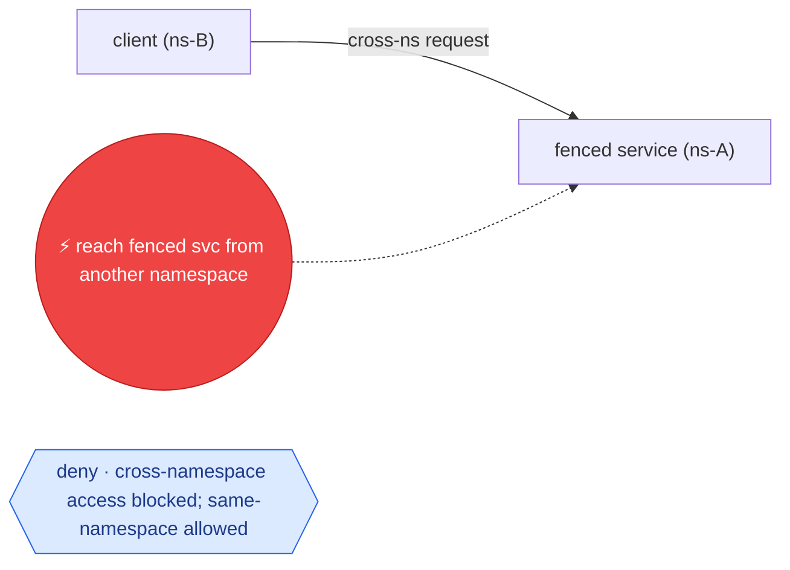
```mermaid
flowchart LR
  n_svc["fenced service (ns-A)"]
  n_ext["client (ns-B)"]
  n_ext -->|"cross-ns request"| n_svc
  FAULT(("⚡ reach fenced svc from another namespace")):::fault
  FAULT -.-> n_svc
  ORACLE{{"deny · cross-namespace access blocked; same-namespace allowed"}}:::oracle_deny
  classDef fault fill:#ef4444,color:#fff,stroke:#b91c1c;
  classDef oracle_recover fill:#dcfce7,stroke:#16a34a,color:#14532d;
  classDef oracle_tolerate fill:#fef9c3,stroke:#ca8a04,color:#713f12;
  classDef oracle_deny fill:#dbeafe,stroke:#2563eb,color:#1e3a8a;
```

### N09 · DataFlow autoSyncTables under concurrent writes &nbsp; 🟢 PASS

**Category:** DataFlow (mesh) &nbsp;•&nbsp; **Oracle:** recover — the new table is auto-created + synced on every peer

**Ran on:** sandbox-node-01, sandbox-node-02

**Verified:** 2026-08-02 · hand-driven

> New table added on one master under load → auto-created on the peer and synced 15/15.

diagram — chain, ⚡ fault, oracle

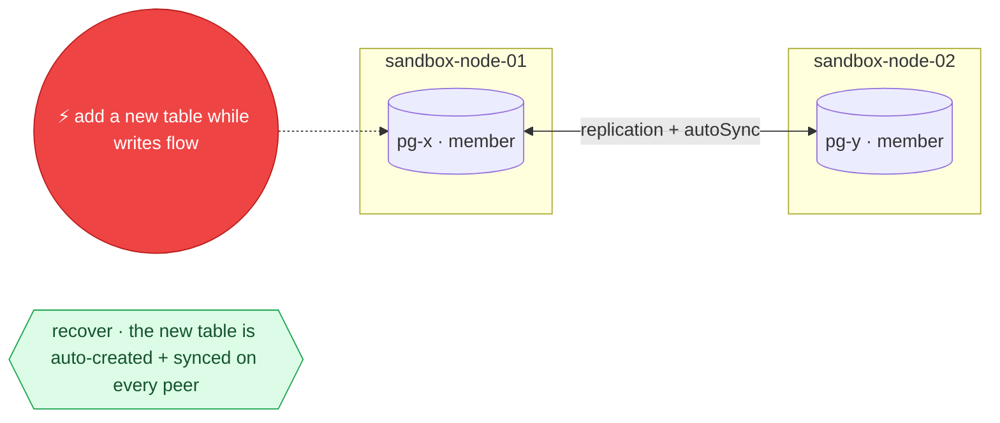
```mermaid
flowchart LR
  subgraph sg_sandbox_node_01["sandbox-node-01"]
    n_a__sandbox_node_01[("pg-x · member")]
  end
  subgraph sg_sandbox_node_02["sandbox-node-02"]
    n_b__sandbox_node_02[("pg-y · member")]
  end
  n_a__sandbox_node_01 <-->|"replication + autoSync"| n_b__sandbox_node_02
  FAULT(("⚡ add a new table while writes flow")):::fault
  FAULT -.-> n_a__sandbox_node_01
  ORACLE{{"recover · the new table is auto-created + synced on every peer"}}:::oracle_recover
  classDef fault fill:#ef4444,color:#fff,stroke:#b91c1c;
  classDef oracle_recover fill:#dcfce7,stroke:#16a34a,color:#14532d;
  classDef oracle_tolerate fill:#fef9c3,stroke:#ca8a04,color:#713f12;
  classDef oracle_deny fill:#dbeafe,stroke:#2563eb,color:#1e3a8a;
```

### N10 · Heterogeneous pg↔mysql mesh &nbsp; 🔴 FINDING

**Category:** DataFlow (cross-engine) &nbsp;•&nbsp; **Oracle:** recover — both engines converge to all rows

**Ran on:** sandbox-node-01, sandbox-node-02

**Verified:** 2026-08-02 · hand-driven

> FINDING (confirmed): a managed MariaDB without highAvailability ships log_bin=OFF, so Debezium cannot capture from it. pg→mysql applied 10/10, mysql→pg yielded 0/10 — the mesh silently runs one-way. Fix: enable binlog (log_bin + binlog_format=ROW) on a managed MariaDB used as a CDC source.

diagram — chain, ⚡ fault, oracle

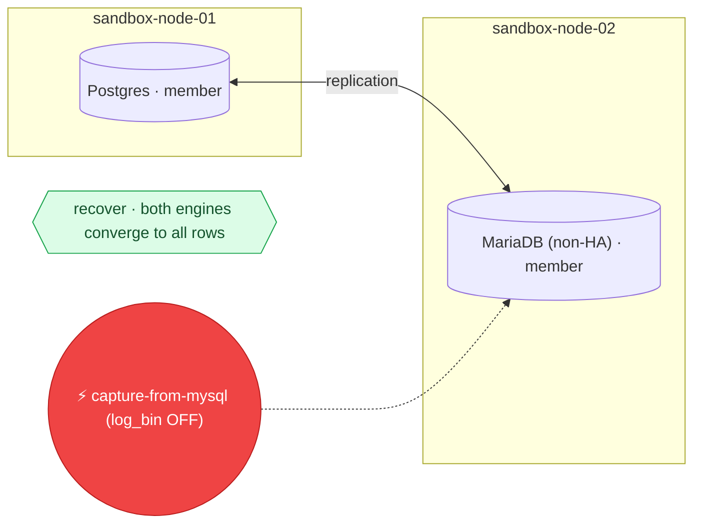
```mermaid
flowchart LR
  subgraph sg_sandbox_node_01["sandbox-node-01"]
    n_pg__sandbox_node_01[("Postgres · member")]
  end
  subgraph sg_sandbox_node_02["sandbox-node-02"]
    n_my__sandbox_node_02[("MariaDB (non-HA) · member")]
  end
  n_pg__sandbox_node_01 <-->|"replication"| n_my__sandbox_node_02
  FAULT(("⚡ capture-from-mysql (log_bin OFF)")):::fault
  FAULT -.-> n_my__sandbox_node_02
  ORACLE{{"recover · both engines converge to all rows"}}:::oracle_recover
  classDef fault fill:#ef4444,color:#fff,stroke:#b91c1c;
  classDef oracle_recover fill:#dcfce7,stroke:#16a34a,color:#14532d;
  classDef oracle_tolerate fill:#fef9c3,stroke:#ca8a04,color:#713f12;
  classDef oracle_deny fill:#dbeafe,stroke:#2563eb,color:#1e3a8a;
```

### N11 · Dead-letter on a poison row &nbsp; 🟢 PASS

**Category:** apply-sink error handling &nbsp;•&nbsp; **Oracle:** recover — poison dead-lettered; good rows keep flowing (no head-of-line block)

**Ran on:** scheduler-placed within the sandbox-node-01…03 pool

**Verified:** 2026-08-02 · hand-driven

> Poison row (violates a target CHECK) did not head-of-line block: all good rows applied, poison never corrupted the target; apply-sink dead-letters to a bounded DLQ after MAX_DELIVER.

diagram — chain, ⚡ fault, oracle

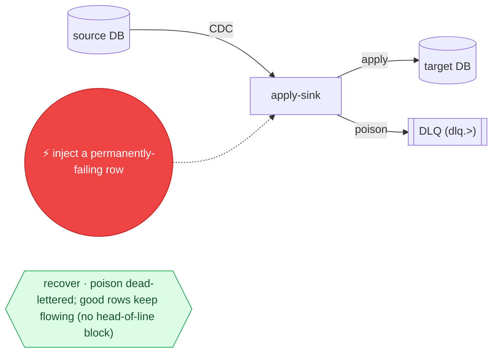
```mermaid
flowchart LR
  n_src[("source DB")]
  n_sink["apply-sink"]
  n_tgt[("target DB")]
  n_dlq[["DLQ (dlq.>)"]]
  n_src -->|"CDC"| n_sink
  n_sink -->|"apply"| n_tgt
  n_sink -->|"poison"| n_dlq
  FAULT(("⚡ inject a permanently-failing row")):::fault
  FAULT -.-> n_sink
  ORACLE{{"recover · poison dead-lettered; good rows keep flowing (no head-of-line block)"}}:::oracle_recover
  classDef fault fill:#ef4444,color:#fff,stroke:#b91c1c;
  classDef oracle_recover fill:#dcfce7,stroke:#16a34a,color:#14532d;
  classDef oracle_tolerate fill:#fef9c3,stroke:#ca8a04,color:#713f12;
  classDef oracle_deny fill:#dbeafe,stroke:#2563eb,color:#1e3a8a;
```

### N12 · Multi-master LWW conflict determinism &nbsp; 🟢 PASS

**Category:** Multi-master mesh &nbsp;•&nbsp; **Oracle:** recover — both masters converge to the same winner per key (deterministic LWW)

**Ran on:** sandbox-node-01, sandbox-node-02

**Verified:** 2026-08-02 · hand-driven

> 10 simultaneous conflicting writes to the same keys on both masters → all 10 resolved to the same winner on both; no split-brain.

diagram — chain, ⚡ fault, oracle

```mermaid
flowchart LR
  subgraph sg_sandbox_node_01["sandbox-node-01"]
    n_a__sandbox_node_01[("master-A · master")]
  end
  subgraph sg_sandbox_node_02["sandbox-node-02"]
    n_b__sandbox_node_02[("master-B · master")]
  end
  n_a__sandbox_node_01 <-->|"replication"| n_b__sandbox_node_02
  FAULT(("⚡ simultaneous conflicting writes (same keys)")):::fault
  FAULT -.-> n_b__sandbox_node_02
  ORACLE{{"recover · both masters converge to the same winner per key (deterministic LWW)"}}:::oracle_recover
  classDef fault fill:#ef4444,color:#fff,stroke:#b91c1c;
  classDef oracle_recover fill:#dcfce7,stroke:#16a34a,color:#14532d;
  classDef oracle_tolerate fill:#fef9c3,stroke:#ca8a04,color:#713f12;
  classDef oracle_deny fill:#dbeafe,stroke:#2563eb,color:#1e3a8a;
```

### N13 · Cross-engine key coercion (pg→mysql) &nbsp; 🟢 PASS

**Category:** Migration (cross-engine) &nbsp;•&nbsp; **Oracle:** recover — target table builds + loads without a key-length error

**Ran on:** scheduler-placed within the sandbox-node-01…03 pool

**Verified:** 2026-08-02 · hand-driven

> INT pk + TEXT UNIQUE key loaded 25/25 with no key-spec error. Fidelity note: the source UNIQUE constraint is not replicated to the target (primary key only).

diagram — chain, ⚡ fault, oracle

```mermaid
flowchart LR
  n_pg[("Postgres")]
  n_my[("MariaDB")]
  n_pg -->|"CDC + schema-sync"| n_my
  FAULT(("⚡ TEXT primary/unique key on a MySQL target")):::fault
  FAULT -.-> n_my
  ORACLE{{"recover · target table builds + loads without a key-length error"}}:::oracle_recover
  classDef fault fill:#ef4444,color:#fff,stroke:#b91c1c;
  classDef oracle_recover fill:#dcfce7,stroke:#16a34a,color:#14532d;
  classDef oracle_tolerate fill:#fef9c3,stroke:#ca8a04,color:#713f12;
  classDef oracle_deny fill:#dbeafe,stroke:#2563eb,color:#1e3a8a;
```

### N14 · Migration resume after apply-sink delete &nbsp; 🟢 PASS

**Category:** Migration lifecycle &nbsp;•&nbsp; **Oracle:** recover — apply-sink self-heals and resumes from offset, no loss

**Ran on:** scheduler-placed within the sandbox-node-01…03 pool

**Verified:** 2026-08-02 · hand-driven

> Deleted the apply-sink Deployment mid-CDC; the composition recreated it (~212s) and CDC resumed from offset to 40/40 — zero loss.

diagram — chain, ⚡ fault, oracle

```mermaid
flowchart LR
  n_src[("source DB")]
  n_sink["apply-sink"]
  n_tgt[("target DB")]
  n_src -->|"CDC"| n_sink
  n_sink -->|"apply"| n_tgt
  FAULT(("⚡ delete the apply-sink Deployment mid-CDC")):::fault
  FAULT -.-> n_sink
  ORACLE{{"recover · apply-sink self-heals and resumes from offset, no loss"}}:::oracle_recover
  classDef fault fill:#ef4444,color:#fff,stroke:#b91c1c;
  classDef oracle_recover fill:#dcfce7,stroke:#16a34a,color:#14532d;
  classDef oracle_tolerate fill:#fef9c3,stroke:#ca8a04,color:#713f12;
  classDef oracle_deny fill:#dbeafe,stroke:#2563eb,color:#1e3a8a;
```

### N15 · Migration idempotency &nbsp; 🟢 PASS

**Category:** Migration lifecycle &nbsp;•&nbsp; **Oracle:** recover — idempotent upsert — no duplicate rows

**Ran on:** scheduler-placed within the sandbox-node-01…03 pool

**Verified:** 2026-08-02 · hand-driven

> Re-running the same migration kept exactly 20 rows — the upsert is idempotent, no duplication.

diagram — chain, ⚡ fault, oracle

```mermaid
flowchart LR
  n_src[("source DB")]
  n_tgt[("target DB")]
  n_src -->|"CDC (run twice)"| n_tgt
  FAULT(("⚡ re-run the same migration")):::fault
  FAULT -.-> n_tgt
  ORACLE{{"recover · idempotent upsert — no duplicate rows"}}:::oracle_recover
  classDef fault fill:#ef4444,color:#fff,stroke:#b91c1c;
  classDef oracle_recover fill:#dcfce7,stroke:#16a34a,color:#14532d;
  classDef oracle_tolerate fill:#fef9c3,stroke:#ca8a04,color:#713f12;
  classDef oracle_deny fill:#dbeafe,stroke:#2563eb,color:#1e3a8a;
```

### N16 · VM live-migration under node drain &nbsp; ⏳ PENDING

**Category:** Virtual machine &nbsp;•&nbsp; **Oracle:** tolerate — VM live-migrates to another node with no downtime

**Ran on:** sandbox-node-01, sandbox-node-02

**Verified:** 2026-08-02 · hand-driven

diagram — chain, ⚡ fault, oracle

```mermaid
flowchart LR
  subgraph sg_sandbox_node_01["sandbox-node-01"]
    n_vm__sandbox_node_01[/"VM · from"/]
  end
  subgraph sg_sandbox_node_02["sandbox-node-02"]
    n_vm__sandbox_node_02[/"VM · to (live-migrate)"/]
  end
  n_vm__sandbox_node_01 -.->|"to (live-migrate)"| n_vm__sandbox_node_02
  FAULT(("⚡ cordon + drain the source node")):::fault
  FAULT -.-> n_vm__sandbox_node_01
  ORACLE{{"tolerate · VM live-migrates to another node with no downtime"}}:::oracle_tolerate
  classDef fault fill:#ef4444,color:#fff,stroke:#b91c1c;
  classDef oracle_recover fill:#dcfce7,stroke:#16a34a,color:#14532d;
  classDef oracle_tolerate fill:#fef9c3,stroke:#ca8a04,color:#713f12;
  classDef oracle_deny fill:#dbeafe,stroke:#2563eb,color:#1e3a8a;
```

### N17 · Block-mode volume hotplug to a running VM &nbsp; ⏳ PENDING

**Category:** Volume + VM &nbsp;•&nbsp; **Oracle:** recover — volume attaches + is usable with no VM reboot

**Ran on:** scheduler-placed within the sandbox-node-01…03 pool

**Verified:** 2026-08-02 · hand-driven

diagram — chain, ⚡ fault, oracle

```mermaid
flowchart LR
  n_vm[/"running VM"/]
  n_vol[("Block Volume")]
  n_vol -->|"hotplug"| n_vm
  FAULT(("⚡ attach a volume live")):::fault
  FAULT -.-> n_vm
  ORACLE{{"recover · volume attaches + is usable with no VM reboot"}}:::oracle_recover
  classDef fault fill:#ef4444,color:#fff,stroke:#b91c1c;
  classDef oracle_recover fill:#dcfce7,stroke:#16a34a,color:#14532d;
  classDef oracle_tolerate fill:#fef9c3,stroke:#ca8a04,color:#713f12;
  classDef oracle_deny fill:#dbeafe,stroke:#2563eb,color:#1e3a8a;
```

### N18 · VM disk backup → restore &nbsp; ⏳ PENDING

**Category:** Virtual machine (Longhorn/KubeVirt) &nbsp;•&nbsp; **Oracle:** recover — a new VM boots from the restored disk with its data

**Ran on:** scheduler-placed within the sandbox-node-01…03 pool

**Verified:** 2026-08-02 · hand-driven

diagram — chain, ⚡ fault, oracle

```mermaid
flowchart LR
  n_vm[/"VM"/]
  n_snap[("Longhorn backup → MinIO")]
  n_vm -->|"CSI snapshot"| n_snap
  FAULT(("⚡ delete + restore the root disk")):::fault
  FAULT -.-> n_vm
  ORACLE{{"recover · a new VM boots from the restored disk with its data"}}:::oracle_recover
  classDef fault fill:#ef4444,color:#fff,stroke:#b91c1c;
  classDef oracle_recover fill:#dcfce7,stroke:#16a34a,color:#14532d;
  classDef oracle_tolerate fill:#fef9c3,stroke:#ca8a04,color:#713f12;
  classDef oracle_deny fill:#dbeafe,stroke:#2563eb,color:#1e3a8a;
```

### N19 · Stream fan-out to two Functions &nbsp; 🟢 PASS

**Category:** Stream (delivery guarantee) &nbsp;•&nbsp; **Oracle:** recover — both functions receive every event (independent consumers)

**Ran on:** scheduler-placed within the sandbox-node-01…03 pool

**Verified:** 2026-08-02 · hand-driven

> One Stream, two Functions → two independent durable consumers (fn-f1, fn-f2); both drained all 30 events (Unprocessed=0 each).

diagram — chain, ⚡ fault, oracle

```mermaid
flowchart LR
  n_db[("Postgres")]
  n_st[["Stream cdc-evt"]]
  n_f1(["Function f1"])
  n_f2(["Function f2"])
  n_db -->|"CDC"| n_st
  n_st --> n_f1
  n_st --> n_f2
  ORACLE{{"recover · both functions receive every event (independent consumers)"}}:::oracle_recover
  classDef fault fill:#ef4444,color:#fff,stroke:#b91c1c;
  classDef oracle_recover fill:#dcfce7,stroke:#16a34a,color:#14532d;
  classDef oracle_tolerate fill:#fef9c3,stroke:#ca8a04,color:#713f12;
  classDef oracle_deny fill:#dbeafe,stroke:#2563eb,color:#1e3a8a;
```

### N20 · PriorityClass preemption under pressure &nbsp; 🟢 PASS

**Category:** Scheduling / control-plane &nbsp;•&nbsp; **Oracle:** tolerate — high-priority workload scheduled; low-priority evicted

**Ran on:** scheduler-placed within the sandbox-node-01…03 pool

**Verified:** 2026-08-02 · hand-driven

> Packed a node with 5 low-priority pods; a high-priority pod scheduled by preempting 2 of them (confirmed via Preempted events). Run in a no-quota scratch namespace so real node pressure could build.

diagram — chain, ⚡ fault, oracle

```mermaid
flowchart LR
  n_lo["low-priority pods"]
  n_hi["high-priority pod"]
  n_hi -->|"preempts"| n_lo
  FAULT(("⚡ fill capacity, then schedule a high-priority pod")):::fault
  FAULT -.-> n_lo
  ORACLE{{"tolerate · high-priority workload scheduled; low-priority evicted"}}:::oracle_tolerate
  classDef fault fill:#ef4444,color:#fff,stroke:#b91c1c;
  classDef oracle_recover fill:#dcfce7,stroke:#16a34a,color:#14532d;
  classDef oracle_tolerate fill:#fef9c3,stroke:#ca8a04,color:#713f12;
  classDef oracle_deny fill:#dbeafe,stroke:#2563eb,color:#1e3a8a;
```

---

## Discovery batch (S-series)

A broad first wave across non-Postgres engines, new fault types, control-plane, storage, and security/config.

### S01 · MariaDB Galera node kill &nbsp; 🟢 PASS

**Category:** MySQL (HA) &nbsp;•&nbsp; **Oracle:** recover — committed rows survive on quorum

**Ran on:** sandbox-node-01, sandbox-node-02, sandbox-node-03

**Verified:** 2026-08-02 · hand-driven

diagram — chain, ⚡ fault, oracle

```mermaid
flowchart LR
  subgraph sg_sandbox_node_01["sandbox-node-01"]
    n_db__sandbox_node_01[("MariaDB (Galera) · galera-1")]
  end
  subgraph sg_sandbox_node_02["sandbox-node-02"]
    n_db__sandbox_node_02[("MariaDB (Galera) · galera-2")]
  end
  subgraph sg_sandbox_node_03["sandbox-node-03"]
    n_db__sandbox_node_03[("MariaDB (Galera) · galera-3")]
  end
  n_db__sandbox_node_01 -.->|"galera-2"| n_db__sandbox_node_02
  n_db__sandbox_node_01 -.->|"galera-3"| n_db__sandbox_node_03
  FAULT(("⚡ kill a Galera node")):::fault
  FAULT -.-> n_db__sandbox_node_01
  ORACLE{{"recover · committed rows survive on quorum"}}:::oracle_recover
  classDef fault fill:#ef4444,color:#fff,stroke:#b91c1c;
  classDef oracle_recover fill:#dcfce7,stroke:#16a34a,color:#14532d;
  classDef oracle_tolerate fill:#fef9c3,stroke:#ca8a04,color:#713f12;
  classDef oracle_deny fill:#dbeafe,stroke:#2563eb,color:#1e3a8a;
```

### S02 · Mongo/FerretDB backend kill &nbsp; 🟢 PASS

**Category:** MongoDB (FerretDB on Postgres) &nbsp;•&nbsp; **Oracle:** recover — documents survive

**Ran on:** scheduler-placed within the sandbox-node-01…03 pool

**Verified:** 2026-08-02 · hand-driven

diagram — chain, ⚡ fault, oracle

```mermaid
flowchart LR
  n_db[("FerretDB + Postgres backend")]
  FAULT(("⚡ kill the storage-Postgres")):::fault
  FAULT -.-> n_db
  ORACLE{{"recover · documents survive"}}:::oracle_recover
  classDef fault fill:#ef4444,color:#fff,stroke:#b91c1c;
  classDef oracle_recover fill:#dcfce7,stroke:#16a34a,color:#14532d;
  classDef oracle_tolerate fill:#fef9c3,stroke:#ca8a04,color:#713f12;
  classDef oracle_deny fill:#dbeafe,stroke:#2563eb,color:#1e3a8a;
```

### S03 · Babelfish pod kill &nbsp; 🟢 PASS

**Category:** Babelfish (SQL-Server-compatible) &nbsp;•&nbsp; **Oracle:** recover — data durable across the reschedule (Longhorn PVC)

**Ran on:** scheduler-placed within the sandbox-node-01…03 pool

**Verified:** 2026-08-02 · hand-driven

diagram — chain, ⚡ fault, oracle

```mermaid
flowchart LR
  n_db[("Babelfish (StatefulSet on Longhorn)")]
  FAULT(("⚡ kill the pod")):::fault
  FAULT -.-> n_db
  ORACLE{{"recover · data durable across the reschedule (Longhorn PVC)"}}:::oracle_recover
  classDef fault fill:#ef4444,color:#fff,stroke:#b91c1c;
  classDef oracle_recover fill:#dcfce7,stroke:#16a34a,color:#14532d;
  classDef oracle_tolerate fill:#fef9c3,stroke:#ca8a04,color:#713f12;
  classDef oracle_deny fill:#dbeafe,stroke:#2563eb,color:#1e3a8a;
```

### S04 · Cross-engine primary-key coercion &nbsp; 🟢 PASS

**Category:** Migration (cross-engine) &nbsp;•&nbsp; **Oracle:** recover — target builds + fully populates

**Ran on:** scheduler-placed within the sandbox-node-01…03 pool

**Verified:** 2026-08-02 · hand-driven

> A pg text/UUID primary key would fail CREATE on MySQL as TEXT (Error 1170) → empty target; PK LOB columns coerce to VARCHAR(255)/NVARCHAR(255), so cross-engine migration of such keys builds and fully populates (verified 25/25).

diagram — chain, ⚡ fault, oracle

```mermaid
flowchart LR
  n_pg[("Postgres")]
  n_my[("MySQL")]
  n_pg -->|"CDC + schema-sync"| n_my
  FAULT(("⚡ TEXT primary key on a MySQL target")):::fault
  FAULT -.-> n_my
  ORACLE{{"recover · target builds + fully populates"}}:::oracle_recover
  classDef fault fill:#ef4444,color:#fff,stroke:#b91c1c;
  classDef oracle_recover fill:#dcfce7,stroke:#16a34a,color:#14532d;
  classDef oracle_tolerate fill:#fef9c3,stroke:#ca8a04,color:#713f12;
  classDef oracle_deny fill:#dbeafe,stroke:#2563eb,color:#1e3a8a;
```

### S10 · 3-node DataFlow mesh convergence &nbsp; 🟢 PASS

**Category:** DataFlow (mesh, N≥3) &nbsp;•&nbsp; **Oracle:** recover — all three members reconverge byte-identical

**Ran on:** sandbox-node-01, sandbox-node-02, sandbox-node-03

**Verified:** 2026-08-02 · hand-driven

> An earlier 'non-convergence' was traced to the 8-CPU sandbox quota starving apply-sinks (env, not product). Given capacity, the 3-node mesh converges 90/90/90. Multi-master now verified at N=2 and N=3.

diagram — chain, ⚡ fault, oracle

```mermaid
flowchart LR
  subgraph sg_sandbox_node_01["sandbox-node-01"]
    n_a__sandbox_node_01[("pg-a · member")]
  end
  subgraph sg_sandbox_node_02["sandbox-node-02"]
    n_b__sandbox_node_02[("pg-b · member")]
  end
  subgraph sg_sandbox_node_03["sandbox-node-03"]
    n_c__sandbox_node_03[("pg-c · member")]
  end
  n_a__sandbox_node_01 <-->|"repl"| n_b__sandbox_node_02
  n_b__sandbox_node_02 <-->|"repl"| n_c__sandbox_node_03
  n_a__sandbox_node_01 <-->|"repl"| n_c__sandbox_node_03
  FAULT(("⚡ capture kill (full mesh)")):::fault
  FAULT -.-> n_a__sandbox_node_01
  ORACLE{{"recover · all three members reconverge byte-identical"}}:::oracle_recover
  classDef fault fill:#ef4444,color:#fff,stroke:#b91c1c;
  classDef oracle_recover fill:#dcfce7,stroke:#16a34a,color:#14532d;
  classDef oracle_tolerate fill:#fef9c3,stroke:#ca8a04,color:#713f12;
  classDef oracle_deny fill:#dbeafe,stroke:#2563eb,color:#1e3a8a;
```

### S12 · Kill 2-of-3 Deployment replicas &nbsp; 🟢 PASS

**Category:** Application availability &nbsp;•&nbsp; **Oracle:** tolerate — Service keeps serving; Deployment restores the count

**Ran on:** sandbox-node-01, sandbox-node-02, sandbox-node-03

**Verified:** 2026-08-02 · hand-driven

diagram — chain, ⚡ fault, oracle

```mermaid
flowchart LR
  subgraph sg_sandbox_node_01["sandbox-node-01"]
    n_app__sandbox_node_01["Application (3 replicas) · replica"]
  end
  subgraph sg_sandbox_node_02["sandbox-node-02"]
    n_app__sandbox_node_02["Application (3 replicas) · replica"]
  end
  subgraph sg_sandbox_node_03["sandbox-node-03"]
    n_app__sandbox_node_03["Application (3 replicas) · replica"]
  end
  n_app__sandbox_node_01 -.->|"replica"| n_app__sandbox_node_02
  n_app__sandbox_node_01 -.->|"replica"| n_app__sandbox_node_03
  FAULT(("⚡ kill 2 of 3 replicas")):::fault
  FAULT -.-> n_app__sandbox_node_01
  ORACLE{{"tolerate · Service keeps serving; Deployment restores the count"}}:::oracle_tolerate
  classDef fault fill:#ef4444,color:#fff,stroke:#b91c1c;
  classDef oracle_recover fill:#dcfce7,stroke:#16a34a,color:#14532d;
  classDef oracle_tolerate fill:#fef9c3,stroke:#ca8a04,color:#713f12;
  classDef oracle_deny fill:#dbeafe,stroke:#2563eb,color:#1e3a8a;
```

### S13 · Function cold-start burst &nbsp; 🟢 PASS

**Category:** Function (Knative) &nbsp;•&nbsp; **Oracle:** tolerate — all 60 requests served (60/60)

**Ran on:** scheduler-placed within the sandbox-node-01…03 pool

**Verified:** 2026-08-02 · hand-driven

diagram — chain, ⚡ fault, oracle

```mermaid
flowchart LR
  n_fn(["Function (scale-from-zero)"])
  FAULT(("⚡ burst 60 concurrent requests from cold")):::fault
  FAULT -.-> n_fn
  ORACLE{{"tolerate · all 60 requests served (60/60)"}}:::oracle_tolerate
  classDef fault fill:#ef4444,color:#fff,stroke:#b91c1c;
  classDef oracle_recover fill:#dcfce7,stroke:#16a34a,color:#14532d;
  classDef oracle_tolerate fill:#fef9c3,stroke:#ca8a04,color:#713f12;
  classDef oracle_deny fill:#dbeafe,stroke:#2563eb,color:#1e3a8a;
```

### S14 · HA-VM under fault &nbsp; ⚪ INCONCLUSIVE

**Category:** Virtual machine &nbsp;•&nbsp; **Oracle:** recover — the VM returns to Running

**Ran on:** scheduler-placed within the sandbox-node-01…03 pool

**Verified:** 2026-08-02 · hand-driven

> Blocked on an intermittent CDI image-import flake (vm-root-scratch) — an environment issue, not a product result. The standalone VM resilience chain passes.

diagram — chain, ⚡ fault, oracle

```mermaid
flowchart LR
  n_vm[/"VM (HA)"/]
  FAULT(("⚡ fault the VM")):::fault
  FAULT -.-> n_vm
  ORACLE{{"recover · the VM returns to Running"}}:::oracle_recover
  classDef fault fill:#ef4444,color:#fff,stroke:#b91c1c;
  classDef oracle_recover fill:#dcfce7,stroke:#16a34a,color:#14532d;
  classDef oracle_tolerate fill:#fef9c3,stroke:#ca8a04,color:#713f12;
  classDef oracle_deny fill:#dbeafe,stroke:#2563eb,color:#1e3a8a;
```

### S15 · Longhorn Volume replica loss &nbsp; 🟢 PASS

**Category:** Volume (Longhorn) &nbsp;•&nbsp; **Oracle:** recover — data intact; Longhorn rebuilds the replica

**Ran on:** sandbox-node-01, sandbox-node-02

**Verified:** 2026-08-02 · hand-driven

diagram — chain, ⚡ fault, oracle

```mermaid
flowchart LR
  subgraph sg_sandbox_node_01["sandbox-node-01"]
    n_vol__sandbox_node_01[("Longhorn Volume · replica")]
  end
  subgraph sg_sandbox_node_02["sandbox-node-02"]
    n_vol__sandbox_node_02[("Longhorn Volume · replica")]
  end
  n_vol__sandbox_node_01 -.->|"replica"| n_vol__sandbox_node_02
  FAULT(("⚡ lose a replica")):::fault
  FAULT -.-> n_vol__sandbox_node_02
  ORACLE{{"recover · data intact; Longhorn rebuilds the replica"}}:::oracle_recover
  classDef fault fill:#ef4444,color:#fff,stroke:#b91c1c;
  classDef oracle_recover fill:#dcfce7,stroke:#16a34a,color:#14532d;
  classDef oracle_tolerate fill:#fef9c3,stroke:#ca8a04,color:#713f12;
  classDef oracle_deny fill:#dbeafe,stroke:#2563eb,color:#1e3a8a;
```

### S16 · FileShare killed mid-write &nbsp; 🟢 PASS

**Category:** FileShare (SMB) &nbsp;•&nbsp; **Oracle:** recover — the committed file is intact + writable after restart

**Ran on:** scheduler-placed within the sandbox-node-01…03 pool

**Verified:** 2026-08-02 · hand-driven

diagram — chain, ⚡ fault, oracle

```mermaid
flowchart LR
  n_fs[("SMB share")]
  FAULT(("⚡ kill the Samba pod mid-write")):::fault
  FAULT -.-> n_fs
  ORACLE{{"recover · the committed file is intact + writable after restart"}}:::oracle_recover
  classDef fault fill:#ef4444,color:#fff,stroke:#b91c1c;
  classDef oracle_recover fill:#dcfce7,stroke:#16a34a,color:#14532d;
  classDef oracle_tolerate fill:#fef9c3,stroke:#ca8a04,color:#713f12;
  classDef oracle_deny fill:#dbeafe,stroke:#2563eb,color:#1e3a8a;
```

### S17 · Online Volume expand &nbsp; 🟢 PASS

**Category:** Volume (Longhorn) &nbsp;•&nbsp; **Oracle:** recover — capacity grows with data intact

**Ran on:** scheduler-placed within the sandbox-node-01…03 pool

**Verified:** 2026-08-02 · hand-driven

> An earlier 'failure' was a harness bug (ambiguous 'volume' short-name hit the wrong CRD). With volume.openinfra.dev: 1Gi→2Gi propagated and Longhorn expanded in ~16s.

diagram — chain, ⚡ fault, oracle

```mermaid
flowchart LR
  n_vol[("Longhorn Volume")]
  FAULT(("⚡ expand 1Gi → 2Gi online")):::fault
  FAULT -.-> n_vol
  ORACLE{{"recover · capacity grows with data intact"}}:::oracle_recover
  classDef fault fill:#ef4444,color:#fff,stroke:#b91c1c;
  classDef oracle_recover fill:#dcfce7,stroke:#16a34a,color:#14532d;
  classDef oracle_tolerate fill:#fef9c3,stroke:#ca8a04,color:#713f12;
  classDef oracle_deny fill:#dbeafe,stroke:#2563eb,color:#1e3a8a;
```

### S18 · Live SecurityGroup egress change &nbsp; 🟢 PASS

**Category:** SecurityGroup &nbsp;•&nbsp; **Oracle:** tolerate — the change applies to running pods with no restart

**Ran on:** scheduler-placed within the sandbox-node-01…03 pool

**Verified:** 2026-08-02 · hand-driven

diagram — chain, ⚡ fault, oracle

```mermaid
flowchart LR
  n_cl["client"]
  n_svc["target service"]
  n_cl -->|"egress"| n_svc
  FAULT(("⚡ flip SG egress denied → allowed (live)")):::fault
  FAULT -.-> n_svc
  ORACLE{{"tolerate · the change applies to running pods with no restart"}}:::oracle_tolerate
  classDef fault fill:#ef4444,color:#fff,stroke:#b91c1c;
  classDef oracle_recover fill:#dcfce7,stroke:#16a34a,color:#14532d;
  classDef oracle_tolerate fill:#fef9c3,stroke:#ca8a04,color:#713f12;
  classDef oracle_deny fill:#dbeafe,stroke:#2563eb,color:#1e3a8a;
```

### S19 · Secret rotation propagation &nbsp; 🟢 PASS

**Category:** Application config &nbsp;•&nbsp; **Oracle:** recover — the new secret value is picked up

**Ran on:** scheduler-placed within the sandbox-node-01…03 pool

**Verified:** 2026-08-02 · hand-driven

diagram — chain, ⚡ fault, oracle

```mermaid
flowchart LR
  n_app["Application (envFrom secret)"]
  FAULT(("⚡ rotate the secret + rollout-restart")):::fault
  FAULT -.-> n_app
  ORACLE{{"recover · the new secret value is picked up"}}:::oracle_recover
  classDef fault fill:#ef4444,color:#fff,stroke:#b91c1c;
  classDef oracle_recover fill:#dcfce7,stroke:#16a34a,color:#14532d;
  classDef oracle_tolerate fill:#fef9c3,stroke:#ca8a04,color:#713f12;
  classDef oracle_deny fill:#dbeafe,stroke:#2563eb,color:#1e3a8a;
```

### S20 · ResourceQuota caps a runaway &nbsp; 🟢 PASS

**Category:** Control-plane (quota) &nbsp;•&nbsp; **Oracle:** deny — excess pods rejected at admission (blast contained)

**Ran on:** scheduler-placed within the sandbox-node-01…03 pool

**Verified:** 2026-08-02 · hand-driven

diagram — chain, ⚡ fault, oracle

```mermaid
flowchart LR
  n_run["50-pod runaway"]
  n_q["ResourceQuota"]
  n_run -->|"admission"| n_q
  FAULT(("⚡ request 50 pods past the quota")):::fault
  FAULT -.-> n_run
  ORACLE{{"deny · excess pods rejected at admission (blast contained)"}}:::oracle_deny
  classDef fault fill:#ef4444,color:#fff,stroke:#b91c1c;
  classDef oracle_recover fill:#dcfce7,stroke:#16a34a,color:#14532d;
  classDef oracle_tolerate fill:#fef9c3,stroke:#ca8a04,color:#713f12;
  classDef oracle_deny fill:#dbeafe,stroke:#2563eb,color:#1e3a8a;
```

---

## Nightly suite

The scheduled nightly run executes the **lottery** (M24) — a seeded draw of 2–4 concurrent faults — on a self-hosted runner, sandbox-scoped. The other scenarios here are the on-demand library the lottery composes from (also runnable individually via workflow_dispatch). Each asserts its fault actually landed (proof-of-fire) while the break is held, so a false-green fails loud. This page regenerates on every nightly run.

### M01 · app-availability &nbsp; 🟢 PASS

**Category:** Application &nbsp;•&nbsp; **Oracle:** tolerate — HTTP success rate ≥ SLO during the fault

**Ran on:** scheduler-placed within the sandbox-node-01…03 pool

**Verified:** not recorded · on-demand

diagram — chain, ⚡ fault, oracle

```mermaid
flowchart LR
  n_app["Application (HA)"]
  n_db[("Postgres")]
  n_app --> n_db
  FAULT(("⚡ kill an instance")):::fault
  FAULT -.-> n_app
  ORACLE{{"tolerate · HTTP success rate ≥ SLO during the fault"}}:::oracle_tolerate
  classDef fault fill:#ef4444,color:#fff,stroke:#b91c1c;
  classDef oracle_recover fill:#dcfce7,stroke:#16a34a,color:#14532d;
  classDef oracle_tolerate fill:#fef9c3,stroke:#ca8a04,color:#713f12;
  classDef oracle_deny fill:#dbeafe,stroke:#2563eb,color:#1e3a8a;
```

### M02 · cnpg-failover &nbsp; 🟢 PASS

**Category:** Postgres (HA) &nbsp;•&nbsp; **Oracle:** recover — failover with no lost writes

**Ran on:** sandbox-node-01, sandbox-node-02

**Verified:** not recorded · on-demand

diagram — chain, ⚡ fault, oracle

```mermaid
flowchart LR
  subgraph sg_sandbox_node_01["sandbox-node-01"]
    n_db__sandbox_node_01[("CNPG cluster · primary")]
  end
  subgraph sg_sandbox_node_02["sandbox-node-02"]
    n_db__sandbox_node_02[("CNPG cluster · replica")]
  end
  n_db__sandbox_node_01 -.->|"replica"| n_db__sandbox_node_02
  FAULT(("⚡ kill the primary")):::fault
  FAULT -.-> n_db__sandbox_node_01
  ORACLE{{"recover · failover with no lost writes"}}:::oracle_recover
  classDef fault fill:#ef4444,color:#fff,stroke:#b91c1c;
  classDef oracle_recover fill:#dcfce7,stroke:#16a34a,color:#14532d;
  classDef oracle_tolerate fill:#fef9c3,stroke:#ca8a04,color:#713f12;
  classDef oracle_deny fill:#dbeafe,stroke:#2563eb,color:#1e3a8a;
```

### M03 · partition &nbsp; 🟢 PASS

**Category:** Multi-master mesh &nbsp;•&nbsp; **Oracle:** recover — reconverge byte-identical after heal

**Ran on:** sandbox-node-01, sandbox-node-02

**Verified:** [2026-09-04](https://github.com/harn3ss/open-infra/actions/runs/33874326976) · nightly-lottery 🟢

diagram — chain, ⚡ fault, oracle

```mermaid
flowchart LR
  subgraph sg_sandbox_node_01["sandbox-node-01"]
    n_a__sandbox_node_01[("pg-a · member")]
  end
  subgraph sg_sandbox_node_02["sandbox-node-02"]
    n_b__sandbox_node_02[("pg-b · member")]
  end
  n_a__sandbox_node_01 <-->|"replication"| n_b__sandbox_node_02
  FAULT(("⚡ clean partition")):::fault
  FAULT -.-> n_b__sandbox_node_02
  ORACLE{{"recover · reconverge byte-identical after heal"}}:::oracle_recover
  classDef fault fill:#ef4444,color:#fff,stroke:#b91c1c;
  classDef oracle_recover fill:#dcfce7,stroke:#16a34a,color:#14532d;
  classDef oracle_tolerate fill:#fef9c3,stroke:#ca8a04,color:#713f12;
  classDef oracle_deny fill:#dbeafe,stroke:#2563eb,color:#1e3a8a;
```

### M04 · partition-isolation &nbsp; 🟢 PASS

**Category:** Multi-master mesh &nbsp;•&nbsp; **Oracle:** recover — both members diverge then reconverge byte-identical

**Ran on:** sandbox-node-01, sandbox-node-02

**Verified:** [2026-09-05](https://github.com/harn3ss/open-infra/actions/runs/33964399259) · nightly-lottery 🟢

diagram — chain, ⚡ fault, oracle

```mermaid
flowchart LR
  subgraph sg_sandbox_node_01["sandbox-node-01"]
    n_a__sandbox_node_01[("pg-a · member")]
  end
  subgraph sg_sandbox_node_02["sandbox-node-02"]
    n_b__sandbox_node_02[("pg-b · member")]
  end
  n_a__sandbox_node_01 <-->|"replication"| n_b__sandbox_node_02
  FAULT(("⚡ sever B from the whole mesh (both links)")):::fault
  FAULT -.-> n_b__sandbox_node_02
  ORACLE{{"recover · both members diverge then reconverge byte-identical"}}:::oracle_recover
  classDef fault fill:#ef4444,color:#fff,stroke:#b91c1c;
  classDef oracle_recover fill:#dcfce7,stroke:#16a34a,color:#14532d;
  classDef oracle_tolerate fill:#fef9c3,stroke:#ca8a04,color:#713f12;
  classDef oracle_deny fill:#dbeafe,stroke:#2563eb,color:#1e3a8a;
```

### M05 · partition-flapping &nbsp; 🟢 PASS

**Category:** Multi-master mesh &nbsp;•&nbsp; **Oracle:** recover — reconverge byte-identical after flapping stops

**Ran on:** sandbox-node-01, sandbox-node-02

**Verified:** not recorded · on-demand

diagram — chain, ⚡ fault, oracle

```mermaid
flowchart LR
  subgraph sg_sandbox_node_01["sandbox-node-01"]
    n_a__sandbox_node_01[("pg-a · member")]
  end
  subgraph sg_sandbox_node_02["sandbox-node-02"]
    n_b__sandbox_node_02[("pg-b · member")]
  end
  n_a__sandbox_node_01 <-->|"replication"| n_b__sandbox_node_02
  FAULT(("⚡ repeated cut/heal cycles")):::fault
  FAULT -.-> n_b__sandbox_node_02
  ORACLE{{"recover · reconverge byte-identical after flapping stops"}}:::oracle_recover
  classDef fault fill:#ef4444,color:#fff,stroke:#b91c1c;
  classDef oracle_recover fill:#dcfce7,stroke:#16a34a,color:#14532d;
  classDef oracle_tolerate fill:#fef9c3,stroke:#ca8a04,color:#713f12;
  classDef oracle_deny fill:#dbeafe,stroke:#2563eb,color:#1e3a8a;
```

### M06 · partition-latency &nbsp; 🟢 PASS

**Category:** Multi-master mesh &nbsp;•&nbsp; **Oracle:** tolerate — keeps converging under a ~4× slower apply path

**Ran on:** sandbox-node-01, sandbox-node-02

**Verified:** [2026-09-03](https://github.com/harn3ss/open-infra/actions/runs/33757557379) · nightly-lottery 🟢

diagram — chain, ⚡ fault, oracle

```mermaid
flowchart LR
  subgraph sg_sandbox_node_01["sandbox-node-01"]
    n_a__sandbox_node_01[("pg-a · member")]
  end
  subgraph sg_sandbox_node_02["sandbox-node-02"]
    n_b__sandbox_node_02[("pg-b · member")]
  end
  n_a__sandbox_node_01 <-->|"replication"| n_b__sandbox_node_02
  FAULT(("⚡ 800ms latency both ways")):::fault
  FAULT -.-> n_b__sandbox_node_02
  ORACLE{{"tolerate · keeps converging under a ~4× slower apply path"}}:::oracle_tolerate
  classDef fault fill:#ef4444,color:#fff,stroke:#b91c1c;
  classDef oracle_recover fill:#dcfce7,stroke:#16a34a,color:#14532d;
  classDef oracle_tolerate fill:#fef9c3,stroke:#ca8a04,color:#713f12;
  classDef oracle_deny fill:#dbeafe,stroke:#2563eb,color:#1e3a8a;
```

### M07 · partition-loss &nbsp; 🟢 PASS

**Category:** Multi-master mesh &nbsp;•&nbsp; **Oracle:** tolerate — keeps converging under sustained loss

**Ran on:** sandbox-node-01, sandbox-node-02

**Verified:** [2026-08-31](https://github.com/harn3ss/open-infra/actions/runs/33412646518) · nightly-lottery 🟢

diagram — chain, ⚡ fault, oracle

```mermaid
flowchart LR
  subgraph sg_sandbox_node_01["sandbox-node-01"]
    n_a__sandbox_node_01[("pg-a · member")]
  end
  subgraph sg_sandbox_node_02["sandbox-node-02"]
    n_b__sandbox_node_02[("pg-b · member")]
  end
  n_a__sandbox_node_01 <-->|"replication"| n_b__sandbox_node_02
  FAULT(("⚡ 15% packet loss")):::fault
  FAULT -.-> n_b__sandbox_node_02
  ORACLE{{"tolerate · keeps converging under sustained loss"}}:::oracle_tolerate
  classDef fault fill:#ef4444,color:#fff,stroke:#b91c1c;
  classDef oracle_recover fill:#dcfce7,stroke:#16a34a,color:#14532d;
  classDef oracle_tolerate fill:#fef9c3,stroke:#ca8a04,color:#713f12;
  classDef oracle_deny fill:#dbeafe,stroke:#2563eb,color:#1e3a8a;
```

### M08 · clock-skew &nbsp; 🟢 PASS

**Category:** Multi-master mesh &nbsp;•&nbsp; **Oracle:** recover — LWW still converges (no lost write)

**Ran on:** sandbox-node-01, sandbox-node-02

**Verified:** not recorded · on-demand

diagram — chain, ⚡ fault, oracle

```mermaid
flowchart LR
  subgraph sg_sandbox_node_01["sandbox-node-01"]
    n_a__sandbox_node_01[("pg-a · member")]
  end
  subgraph sg_sandbox_node_02["sandbox-node-02"]
    n_b__sandbox_node_02[("pg-b · member")]
  end
  n_a__sandbox_node_01 <-->|"replication"| n_b__sandbox_node_02
  FAULT(("⚡ clock skew on a member")):::fault
  FAULT -.-> n_b__sandbox_node_02
  ORACLE{{"recover · LWW still converges (no lost write)"}}:::oracle_recover
  classDef fault fill:#ef4444,color:#fff,stroke:#b91c1c;
  classDef oracle_recover fill:#dcfce7,stroke:#16a34a,color:#14532d;
  classDef oracle_tolerate fill:#fef9c3,stroke:#ca8a04,color:#713f12;
  classDef oracle_deny fill:#dbeafe,stroke:#2563eb,color:#1e3a8a;
```

### M09 · healing-order &nbsp; 🟢 PASS

**Category:** Multi-master mesh (timing) &nbsp;•&nbsp; **Oracle:** recover — reconverge regardless of heal order

**Ran on:** sandbox-node-01, sandbox-node-02

**Verified:** not recorded · on-demand

diagram — chain, ⚡ fault, oracle

```mermaid
flowchart LR
  n_s["a→b sink"]
  subgraph sg_sandbox_node_01["sandbox-node-01"]
    n_a__sandbox_node_01[("pg-a · member")]
  end
  subgraph sg_sandbox_node_02["sandbox-node-02"]
    n_b__sandbox_node_02[("pg-b · member")]
  end
  n_a__sandbox_node_01 --> n_s
  n_s --> n_b__sandbox_node_02
  FAULT(("⚡ overlap partition + held-down sink, heal in order")):::fault
  FAULT -.-> n_s
  ORACLE{{"recover · reconverge regardless of heal order"}}:::oracle_recover
  classDef fault fill:#ef4444,color:#fff,stroke:#b91c1c;
  classDef oracle_recover fill:#dcfce7,stroke:#16a34a,color:#14532d;
  classDef oracle_tolerate fill:#fef9c3,stroke:#ca8a04,color:#713f12;
  classDef oracle_deny fill:#dbeafe,stroke:#2563eb,color:#1e3a8a;
```

### M10 · concurrent (mesh under overlapping chaos) &nbsp; 🟢 PASS

**Category:** Multi-master mesh &nbsp;•&nbsp; **Oracle:** recover — reconverge with zero lost writes (graduation test)

**Ran on:** sandbox-node-01, sandbox-node-02

**Verified:** not recorded · on-demand

diagram — chain, ⚡ fault, oracle

```mermaid
flowchart LR
  subgraph sg_sandbox_node_01["sandbox-node-01"]
    n_a__sandbox_node_01[("pg-a · member")]
  end
  subgraph sg_sandbox_node_02["sandbox-node-02"]
    n_b__sandbox_node_02[("pg-b · member")]
  end
  n_a__sandbox_node_01 <-->|"replication"| n_b__sandbox_node_02
  FAULT(("⚡ partition + sink kill together")):::fault
  FAULT -.-> n_b__sandbox_node_02
  ORACLE{{"recover · reconverge with zero lost writes (graduation test)"}}:::oracle_recover
  classDef fault fill:#ef4444,color:#fff,stroke:#b91c1c;
  classDef oracle_recover fill:#dcfce7,stroke:#16a34a,color:#14532d;
  classDef oracle_tolerate fill:#fef9c3,stroke:#ca8a04,color:#713f12;
  classDef oracle_deny fill:#dbeafe,stroke:#2563eb,color:#1e3a8a;
```

### M11 · stress-cpu &nbsp; 🟢 PASS

**Category:** apply-sink (fault variety) &nbsp;•&nbsp; **Oracle:** tolerate — keeps converging under CPU pressure

**Ran on:** scheduler-placed within the sandbox-node-01…03 pool

**Verified:** [2026-09-03](https://github.com/harn3ss/open-infra/actions/runs/33757557379) · nightly-lottery 🟢

diagram — chain, ⚡ fault, oracle

```mermaid
flowchart LR
  n_s["a→b apply-sink"]
  FAULT(("⚡ saturate the sink's CPU")):::fault
  FAULT -.-> n_s
  ORACLE{{"tolerate · keeps converging under CPU pressure"}}:::oracle_tolerate
  classDef fault fill:#ef4444,color:#fff,stroke:#b91c1c;
  classDef oracle_recover fill:#dcfce7,stroke:#16a34a,color:#14532d;
  classDef oracle_tolerate fill:#fef9c3,stroke:#ca8a04,color:#713f12;
  classDef oracle_deny fill:#dbeafe,stroke:#2563eb,color:#1e3a8a;
```

### M12 · stress-mem &nbsp; 🟢 PASS

**Category:** Postgres (fault variety) &nbsp;•&nbsp; **Oracle:** tolerate — DB stays queryable; mesh converges zero-lost

**Ran on:** scheduler-placed within the sandbox-node-01…03 pool

**Verified:** [2026-09-05](https://github.com/harn3ss/open-infra/actions/runs/33964399259) · nightly-lottery 🟢

diagram — chain, ⚡ fault, oracle

```mermaid
flowchart LR
  n_b[("site-B Postgres")]
  FAULT(("⚡ 300MB memory pressure (under the limit)")):::fault
  FAULT -.-> n_b
  ORACLE{{"tolerate · DB stays queryable; mesh converges zero-lost"}}:::oracle_tolerate
  classDef fault fill:#ef4444,color:#fff,stroke:#b91c1c;
  classDef oracle_recover fill:#dcfce7,stroke:#16a34a,color:#14532d;
  classDef oracle_tolerate fill:#fef9c3,stroke:#ca8a04,color:#713f12;
  classDef oracle_deny fill:#dbeafe,stroke:#2563eb,color:#1e3a8a;
```

### M13 · sink-kill &nbsp; 🟢 PASS

**Category:** apply-sink &nbsp;•&nbsp; **Oracle:** recover — resume from offset, no loss

**Ran on:** scheduler-placed within the sandbox-node-01…03 pool

**Verified:** [2026-09-01](https://github.com/harn3ss/open-infra/actions/runs/33513849041) · nightly-lottery 🟢

diagram — chain, ⚡ fault, oracle

```mermaid
flowchart LR
  n_src[("source")]
  n_s["apply-sink"]
  n_tgt[("target")]
  n_src --> n_s
  n_s --> n_tgt
  FAULT(("⚡ kill the apply-sink")):::fault
  FAULT -.-> n_s
  ORACLE{{"recover · resume from offset, no loss"}}:::oracle_recover
  classDef fault fill:#ef4444,color:#fff,stroke:#b91c1c;
  classDef oracle_recover fill:#dcfce7,stroke:#16a34a,color:#14532d;
  classDef oracle_tolerate fill:#fef9c3,stroke:#ca8a04,color:#713f12;
  classDef oracle_deny fill:#dbeafe,stroke:#2563eb,color:#1e3a8a;
```

### M14 · sink-drain-kill &nbsp; 🟢 PASS

**Category:** apply-sink (hardest state) &nbsp;•&nbsp; **Oracle:** recover — no loss even killed at its hardest moment

**Ran on:** scheduler-placed within the sandbox-node-01…03 pool

**Verified:** not recorded · on-demand

diagram — chain, ⚡ fault, oracle

```mermaid
flowchart LR
  n_src[("source")]
  n_s["apply-sink (mid-backlog)"]
  n_tgt[("target")]
  n_src --> n_s
  n_s --> n_tgt
  FAULT(("⚡ kill mid-backlog-drain")):::fault
  FAULT -.-> n_s
  ORACLE{{"recover · no loss even killed at its hardest moment"}}:::oracle_recover
  classDef fault fill:#ef4444,color:#fff,stroke:#b91c1c;
  classDef oracle_recover fill:#dcfce7,stroke:#16a34a,color:#14532d;
  classDef oracle_tolerate fill:#fef9c3,stroke:#ca8a04,color:#713f12;
  classDef oracle_deny fill:#dbeafe,stroke:#2563eb,color:#1e3a8a;
```

### M15 · migration &nbsp; 🟢 PASS

**Category:** Migration (fidelity) &nbsp;•&nbsp; **Oracle:** recover — target reflects every acknowledged source row

**Ran on:** scheduler-placed within the sandbox-node-01…03 pool

**Verified:** not recorded · on-demand

diagram — chain, ⚡ fault, oracle

```mermaid
flowchart LR
  n_src[("source DB")]
  n_tgt[("target DB")]
  n_src -->|"CDC"| n_tgt
  FAULT(("⚡ kill capture/apply mid-migration")):::fault
  FAULT -.-> n_src
  ORACLE{{"recover · target reflects every acknowledged source row"}}:::oracle_recover
  classDef fault fill:#ef4444,color:#fff,stroke:#b91c1c;
  classDef oracle_recover fill:#dcfce7,stroke:#16a34a,color:#14532d;
  classDef oracle_tolerate fill:#fef9c3,stroke:#ca8a04,color:#713f12;
  classDef oracle_deny fill:#dbeafe,stroke:#2563eb,color:#1e3a8a;
```

### M16 · stream-noloss &nbsp; 🟢 PASS

**Category:** Stream (CDC) &nbsp;•&nbsp; **Oracle:** recover — stream message count ≥ driven changes (no dropped events)

**Ran on:** scheduler-placed within the sandbox-node-01…03 pool

**Verified:** not recorded · on-demand

diagram — chain, ⚡ fault, oracle

```mermaid
flowchart LR
  n_db[("source DB")]
  n_st[["Stream cdc-evt"]]
  n_db -->|"CDC"| n_st
  FAULT(("⚡ kill the capture")):::fault
  FAULT -.-> n_db
  ORACLE{{"recover · stream message count ≥ driven changes (no dropped events)"}}:::oracle_recover
  classDef fault fill:#ef4444,color:#fff,stroke:#b91c1c;
  classDef oracle_recover fill:#dcfce7,stroke:#16a34a,color:#14532d;
  classDef oracle_tolerate fill:#fef9c3,stroke:#ca8a04,color:#713f12;
  classDef oracle_deny fill:#dbeafe,stroke:#2563eb,color:#1e3a8a;
```

### M17 · dataflow-converge &nbsp; 🟢 PASS

**Category:** DataFlow &nbsp;•&nbsp; **Oracle:** recover — members byte-identical after heal

**Ran on:** sandbox-node-01, sandbox-node-02

**Verified:** not recorded · on-demand

diagram — chain, ⚡ fault, oracle

```mermaid
flowchart LR
  subgraph sg_sandbox_node_01["sandbox-node-01"]
    n_a__sandbox_node_01[("member-A · member")]
  end
  subgraph sg_sandbox_node_02["sandbox-node-02"]
    n_b__sandbox_node_02[("member-B · member")]
  end
  n_a__sandbox_node_01 <-->|"DataFlow mesh"| n_b__sandbox_node_02
  FAULT(("⚡ DataFlow capture kill")):::fault
  FAULT -.-> n_a__sandbox_node_01
  ORACLE{{"recover · members byte-identical after heal"}}:::oracle_recover
  classDef fault fill:#ef4444,color:#fff,stroke:#b91c1c;
  classDef oracle_recover fill:#dcfce7,stroke:#16a34a,color:#14532d;
  classDef oracle_tolerate fill:#fef9c3,stroke:#ca8a04,color:#713f12;
  classDef oracle_deny fill:#dbeafe,stroke:#2563eb,color:#1e3a8a;
```

### M18 · security-deny &nbsp; 🟢 PASS

**Category:** SecurityGroup &nbsp;•&nbsp; **Oracle:** deny — the fence never leaks (0 breaches)

**Ran on:** scheduler-placed within the sandbox-node-01…03 pool

**Verified:** not recorded · on-demand

diagram — chain, ⚡ fault, oracle

```mermaid
flowchart LR
  n_cl["egress-locked client"]
  n_svc["forbidden service"]
  n_cl -->|"blocked"| n_svc
  FAULT(("⚡ locked client churns against a forbidden service")):::fault
  FAULT -.-> n_svc
  ORACLE{{"deny · the fence never leaks (0 breaches)"}}:::oracle_deny
  classDef fault fill:#ef4444,color:#fff,stroke:#b91c1c;
  classDef oracle_recover fill:#dcfce7,stroke:#16a34a,color:#14532d;
  classDef oracle_tolerate fill:#fef9c3,stroke:#ca8a04,color:#713f12;
  classDef oracle_deny fill:#dbeafe,stroke:#2563eb,color:#1e3a8a;
```

### M19 · directory-recover &nbsp; 🟢 PASS

**Category:** Active Directory &nbsp;•&nbsp; **Oracle:** recover — an account created pre-fault survives the restart

**Ran on:** scheduler-placed within the sandbox-node-01…03 pool

**Verified:** not recorded · on-demand

diagram — chain, ⚡ fault, oracle

```mermaid
flowchart LR
  n_dc[["AD domain controller"]]
  FAULT(("⚡ kill the DC")):::fault
  FAULT -.-> n_dc
  ORACLE{{"recover · an account created pre-fault survives the restart"}}:::oracle_recover
  classDef fault fill:#ef4444,color:#fff,stroke:#b91c1c;
  classDef oracle_recover fill:#dcfce7,stroke:#16a34a,color:#14532d;
  classDef oracle_tolerate fill:#fef9c3,stroke:#ca8a04,color:#713f12;
  classDef oracle_deny fill:#dbeafe,stroke:#2563eb,color:#1e3a8a;
```

### M20 · fileshare-durable &nbsp; 🟢 PASS

**Category:** FileShare (SMB) &nbsp;•&nbsp; **Oracle:** recover — a pre-fault file is present + writable after restart

**Ran on:** scheduler-placed within the sandbox-node-01…03 pool

**Verified:** not recorded · on-demand

diagram — chain, ⚡ fault, oracle

```mermaid
flowchart LR
  n_fs[("SMB share")]
  FAULT(("⚡ kill the Samba server")):::fault
  FAULT -.-> n_fs
  ORACLE{{"recover · a pre-fault file is present + writable after restart"}}:::oracle_recover
  classDef fault fill:#ef4444,color:#fff,stroke:#b91c1c;
  classDef oracle_recover fill:#dcfce7,stroke:#16a34a,color:#14532d;
  classDef oracle_tolerate fill:#fef9c3,stroke:#ca8a04,color:#713f12;
  classDef oracle_deny fill:#dbeafe,stroke:#2563eb,color:#1e3a8a;
```

### M21 · volume-durable &nbsp; 🟢 PASS

**Category:** Volume (Longhorn) &nbsp;•&nbsp; **Oracle:** recover — a raw-block signature reads back after reschedule

**Ran on:** sandbox-node-01, sandbox-node-02

**Verified:** not recorded · on-demand

diagram — chain, ⚡ fault, oracle

```mermaid
flowchart LR
  subgraph sg_sandbox_node_01["sandbox-node-01"]
    n_vol__sandbox_node_01[("block Volume · replica")]
  end
  subgraph sg_sandbox_node_02["sandbox-node-02"]
    n_vol__sandbox_node_02[("block Volume · replica")]
  end
  n_vol__sandbox_node_01 -.->|"replica"| n_vol__sandbox_node_02
  FAULT(("⚡ kill the attached pod (reschedule)")):::fault
  FAULT -.-> n_vol__sandbox_node_01
  ORACLE{{"recover · a raw-block signature reads back after reschedule"}}:::oracle_recover
  classDef fault fill:#ef4444,color:#fff,stroke:#b91c1c;
  classDef oracle_recover fill:#dcfce7,stroke:#16a34a,color:#14532d;
  classDef oracle_tolerate fill:#fef9c3,stroke:#ca8a04,color:#713f12;
  classDef oracle_deny fill:#dbeafe,stroke:#2563eb,color:#1e3a8a;
```

### M22 · storage-replica-loss &nbsp; 🟢 PASS

**Category:** Storage (Longhorn) &nbsp;•&nbsp; **Oracle:** recover — volume survives on the surviving replica; rebuilds

**Ran on:** sandbox-node-01, sandbox-node-02, sandbox-node-03

**Verified:** not recorded · on-demand

diagram — chain, ⚡ fault, oracle

```mermaid
flowchart LR
  subgraph sg_sandbox_node_01["sandbox-node-01"]
    n_vol__sandbox_node_01[("Longhorn Volume · replica")]
  end
  subgraph sg_sandbox_node_02["sandbox-node-02"]
    n_vol__sandbox_node_02[("Longhorn Volume · replica")]
  end
  subgraph sg_sandbox_node_03["sandbox-node-03"]
    n_vol__sandbox_node_03[("Longhorn Volume · replica")]
  end
  n_vol__sandbox_node_01 -.->|"replica"| n_vol__sandbox_node_02
  n_vol__sandbox_node_01 -.->|"replica"| n_vol__sandbox_node_03
  FAULT(("⚡ lose a replica (distinct nodes)")):::fault
  FAULT -.-> n_vol__sandbox_node_03
  ORACLE{{"recover · volume survives on the surviving replica; rebuilds"}}:::oracle_recover
  classDef fault fill:#ef4444,color:#fff,stroke:#b91c1c;
  classDef oracle_recover fill:#dcfce7,stroke:#16a34a,color:#14532d;
  classDef oracle_tolerate fill:#fef9c3,stroke:#ca8a04,color:#713f12;
  classDef oracle_deny fill:#dbeafe,stroke:#2563eb,color:#1e3a8a;
```

### M23 · vm-resilience &nbsp; 🟢 PASS

**Category:** Virtual machine &nbsp;•&nbsp; **Oracle:** recover — the VMI returns to Running

**Ran on:** scheduler-placed within the sandbox-node-01…03 pool

**Verified:** not recorded · on-demand

diagram — chain, ⚡ fault, oracle

```mermaid
flowchart LR
  n_vm[/"VM"/]
  FAULT(("⚡ kill the virt-launcher pod")):::fault
  FAULT -.-> n_vm
  ORACLE{{"recover · the VMI returns to Running"}}:::oracle_recover
  classDef fault fill:#ef4444,color:#fff,stroke:#b91c1c;
  classDef oracle_recover fill:#dcfce7,stroke:#16a34a,color:#14532d;
  classDef oracle_tolerate fill:#fef9c3,stroke:#ca8a04,color:#713f12;
  classDef oracle_deny fill:#dbeafe,stroke:#2563eb,color:#1e3a8a;
```

### M24 · lottery (correlation capstone) — THE nightly run &nbsp; 🟢 PASS

**Category:** Multi-master mesh (seeded) &nbsp;•&nbsp; **Oracle:** recover — reconverge under any composed blast

**Ran on:** sandbox-node-01, sandbox-node-02

**Verified:** [2026-09-05](https://github.com/harn3ss/open-infra/actions/runs/33964399259) · nightly-lottery 🟢

> This is what the scheduled nightly actually runs. A seeded, replayable draw (lottery-draw.py) composes 2–4 physically-composable faults each night; a red night reruns with LOTTERY_SEED=<printed seed>. The other nightly-batch scenarios are the library it draws from.

diagram — chain, ⚡ fault, oracle

```mermaid
flowchart LR
  subgraph sg_sandbox_node_01["sandbox-node-01"]
    n_a__sandbox_node_01[("pg-a · member")]
  end
  subgraph sg_sandbox_node_02["sandbox-node-02"]
    n_b__sandbox_node_02[("pg-b · member")]
  end
  n_a__sandbox_node_01 <-->|"replication"| n_b__sandbox_node_02
  FAULT(("⚡ seeded blast (2–4 composed faults)")):::fault
  FAULT -.-> n_b__sandbox_node_02
  ORACLE{{"recover · reconverge under any composed blast"}}:::oracle_recover
  classDef fault fill:#ef4444,color:#fff,stroke:#b91c1c;
  classDef oracle_recover fill:#dcfce7,stroke:#16a34a,color:#14532d;
  classDef oracle_tolerate fill:#fef9c3,stroke:#ca8a04,color:#713f12;
  classDef oracle_deny fill:#dbeafe,stroke:#2563eb,color:#1e3a8a;
```

### N21 · Subscriptions no-loss under engine kill (open-appsync) &nbsp; ⏳ PENDING

**Category:** GraphQLApi subscriptions + NATS JetStream &nbsp;•&nbsp; **Oracle:** recover — zero subscription events lost (durable consumer resumes from offset)

**Ran on:** scheduler-placed within the sandbox-node-01…03 pool

**Verified:** not recorded · not yet run (pending first green)

> Self-provisioning + runnable (chaos/scenario-subscription-reconnect.sh provisions a 2-replica open-appsync engine wired to the platform NATS JetStream, drives createTodo mutations across an engine-pod kill, and asserts every acknowledged onCreateTodo event survives on the durable subject — the scenario-stream-noloss oracle). Runnable via workflow_dispatch; keyless, so NOT in the lottery. PENDING = authored + runnable, no verified green yet; graduates after its green streak. Proves publish-durability + Service availability across a pod kill; a persistent-WS-subscriber resume variant is a future probe.

diagram — chain, ⚡ fault, oracle

```mermaid
flowchart LR
  n_client["WS client (graphql-transport-ws)"]
  n_engine["open-appsync engine"]
  n_js[["JetStream sub.onCreateTodo"]]
  n_client -->|"subscribe"| n_engine
  n_engine -->|"publish on mutation"| n_js
  n_js -->|"durable resume"| n_engine
  FAULT(("⚡ kill open-appsync pod mid-stream")):::fault
  FAULT -.-> n_engine
  ORACLE{{"recover · zero subscription events lost (durable consumer resumes from offset)"}}:::oracle_recover
  classDef fault fill:#ef4444,color:#fff,stroke:#b91c1c;
  classDef oracle_recover fill:#dcfce7,stroke:#16a34a,color:#14532d;
  classDef oracle_tolerate fill:#fef9c3,stroke:#ca8a04,color:#713f12;
  classDef oracle_deny fill:#dbeafe,stroke:#2563eb,color:#1e3a8a;
```

### N22 · Async Lambda invoke no-loss under shim kill &nbsp; ⏳ PENDING

**Category:** Lambda (aws-shim) async invoke + NATS JetStream &nbsp;•&nbsp; **Oracle:** recover — every accepted async invocation is delivered or dead-lettered (accepted <= DLQ <= 4x); none silently lost, no runaway

**Ran on:** scheduler-placed within the sandbox-node-01…03 pool

**Verified:** 2026-08-10 · hand-driven live run (green once; pending the nightly streak)

> Self-provisioning + runnable (chaos/scenario-async-invoke-noloss.sh provisions a 2-replica aws-shim wired to the platform NATS JetStream, publishes async Event invocations onto the durable work stream targeting a non-existent function, kills a shim pod mid-drain, and asserts the dead-letter stream covers every accepted invocation without a runaway — accepted <= DLQ <= 4x). Runnable via workflow_dispatch; keyless, so NOT in the lottery. Status: green once on the live cluster (a shim replica killed mid-drain; all accepted invocations reached the DLQ, no loss, no runaway), pending the nightly streak. Exercises the durable async delivery worker. Follow-ups: a SigV4 HTTP front-door variant and a delivered-path variant against a live function.

diagram — chain, ⚡ fault, oracle

```mermaid
flowchart LR
  n_client["async invoke (Event)"]
  n_shim["aws-shim async worker"]
  n_work[["JetStream LAMBDA_ASYNC"]]
  n_dlq[["JetStream LAMBDA_ASYNC_DLQ"]]
  n_client -->|"enqueue (202)"| n_work
  n_shim -->|"durable consume"| n_work
  n_shim -->|"dead-letter after retries"| n_dlq
  FAULT(("⚡ kill aws-shim pod mid-drain")):::fault
  FAULT -.-> n_shim
  ORACLE{{"recover · every accepted async invocation is delivered or dead-lettered (accepted <= DLQ <= 4x); none silently lost, no runaway"}}:::oracle_recover
  classDef fault fill:#ef4444,color:#fff,stroke:#b91c1c;
  classDef oracle_recover fill:#dcfce7,stroke:#16a34a,color:#14532d;
  classDef oracle_tolerate fill:#fef9c3,stroke:#ca8a04,color:#713f12;
  classDef oracle_deny fill:#dbeafe,stroke:#2563eb,color:#1e3a8a;
```

### N23 · Async Lambda invoke delivered (happy path) under shim kill &nbsp; ⏳ PENDING

**Category:** Lambda (aws-shim) async invoke + Knative Function + NATS JetStream &nbsp;•&nbsp; **Oracle:** recover — every accepted async invocation is delivered (work stream drains to 0, DLQ stays 0); none lost or dead-lettered

**Ran on:** scheduler-placed within the sandbox-node-01…03 pool

**Verified:** 2026-08-10 · hand-driven live run (green once; pending the nightly streak)

> Sibling of N22 for the SUCCESS path. chaos/scenario-async-invoke-delivered.sh provisions a 2-replica aws-shim on the platform NATS plus a real echo kind: Function (Knative, min 1), publishes async Event invocations at the function across a shim-pod kill, and asserts every accepted invocation is DELIVERED: the WorkQueue work stream drains to 0 (each acked on 2xx) AND the DLQ stays 0 (none dead-lettered), with accepted == everything published. N22 proves nothing is silently lost (all reach the DLQ when delivery fails); N23 proves delivery actually succeeds under the kill — together the full at-least-once guarantee. Runnable via workflow_dispatch; keyless, so NOT in the lottery. Status: green once on the live cluster (all accepted invocations delivered, work drained to 0, DLQ 0, across a shim kill), pending the nightly streak. Follow-ups: a SigV4 HTTP front-door variant, and a scale-from-zero (min 0) delivery variant.

diagram — chain, ⚡ fault, oracle

```mermaid
flowchart LR
  n_client["async invoke (Event)"]
  n_shim["aws-shim async worker"]
  n_work[["JetStream LAMBDA_ASYNC"]]
  n_fn(["echo Function (Knative)"])
  n_client -->|"enqueue (202)"| n_work
  n_shim -->|"durable consume"| n_work
  n_shim -->|"deliver (2xx → ack)"| n_fn
  FAULT(("⚡ kill aws-shim pod mid-drain")):::fault
  FAULT -.-> n_shim
  ORACLE{{"recover · every accepted async invocation is delivered (work stream drains to 0, DLQ stays 0); none lost or dead-lettered"}}:::oracle_recover
  classDef fault fill:#ef4444,color:#fff,stroke:#b91c1c;
  classDef oracle_recover fill:#dcfce7,stroke:#16a34a,color:#14532d;
  classDef oracle_tolerate fill:#fef9c3,stroke:#ca8a04,color:#713f12;
  classDef oracle_deny fill:#dbeafe,stroke:#2563eb,color:#1e3a8a;
```

---

_Generated by [`tools/chaosdoc`](../tools/chaosdoc). Add or update a scenario in [`chaos/scenarios.json`](../chaos/scenarios.json) and run `go run ./tools/chaosdoc`._
