<!-- GENERATED by tools/chaosdoc from chaos/scenarios.json — DO NOT EDIT BY HAND. -->
<!-- Regenerate:  go run ./tools/chaosdoc   (CI drift-guard: go run ./tools/chaosdoc -check) -->

# Chaos scenarios — what we break, and what must hold

open-infra is **continuously tested against failure**. Every scenario below drives a real
resource *chain*, injects a real fault at a marked point (⚡), and asserts a business- or
systems-level **invariant** — not just "did it come back up". This page is generated from
[`chaos/scenarios.json`](../chaos/scenarios.json); it can never drift from the source-of-truth.

**Tally:** 64 scenarios — 🟢 52 pass · 🔴 1 finding · ⚪ 1 inconclusive · ⏳ 9 pending · ⏸️ 1 parked.

### Legend

| Symbol | Meaning |
|---|---|
| ⚡ (red) | fault-injection point — where the break is applied |
| green badge | **recover** — after the fault heals, no acknowledged work was lost |
| amber badge | **tolerate** — a continuous SLO held *while* the fault was live |
| blue badge | **deny** — a negative invariant that must NEVER happen (zero tolerance) |
| 🟢🔴⚪⏳⏸️ | pass · finding · inconclusive · pending · parked |

Shapes: `[(cylinder)]` = database/storage · `[[subroutine]]` = stream/directory · `([stadium])` = function · `[/parallelogram/]` = VM · `[rectangle]` = app/service.

---

## Composite workflows

Realistic multi-kind tenant stacks hit by one fault, judged on a business-level invariant (money conserved / no order lost / identity+data survive) — often blending oracle modes in a single run. Hand-driven.

### C1 · SaaS — all three oracle modes at once &nbsp; 🟢 PASS

**Category:** Application + SecurityGroup + Postgres (HA) &nbsp;•&nbsp; **Oracle:** tolerate — availability + zero lost orders + zero fence breaches through failover

> One run exercised recover + tolerate + deny together: app availability 150/150, orders 139/139 (zero lost), tenant fence 0 breaches, DB failed over. (Surfaced + fixed the SG-labels-on-DB bug.)

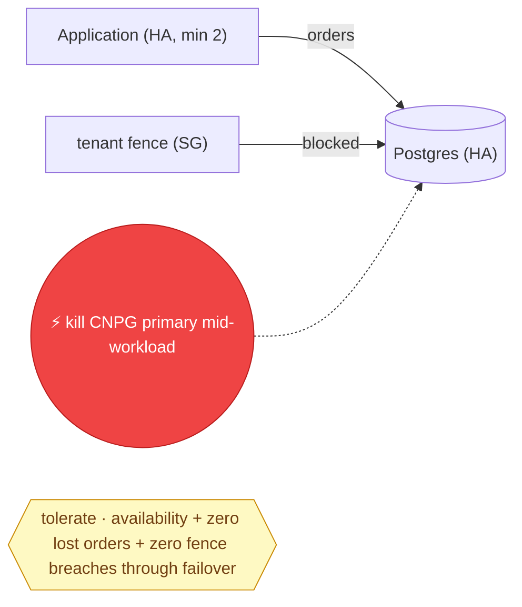
```mermaid
flowchart LR
  n_app["Application (HA, min 2)"]
  n_db[("Postgres (HA)")]
  n_fence["tenant fence (SG)"]
  n_app -->|"orders"| n_db
  n_fence -->|"blocked"| n_db
  FAULT(("⚡ kill CNPG primary mid-workload")):::fault
  FAULT -.-> n_db
  ORACLE{{"tolerate · availability + zero lost orders + zero fence breaches through failover"}}:::oracle_tolerate
  classDef fault fill:#ef4444,color:#fff,stroke:#b91c1c;
  classDef oracle_recover fill:#dcfce7,stroke:#16a34a,color:#14532d;
  classDef oracle_tolerate fill:#fef9c3,stroke:#ca8a04,color:#713f12;
  classDef oracle_deny fill:#dbeafe,stroke:#2563eb,color:#1e3a8a;
```

### C2 · Zero-downtime cutover &nbsp; 🟢 PASS

**Category:** Migration + live writes &nbsp;•&nbsp; **Oracle:** recover — zero downtime for the app + full fidelity at target

> Source 120/120 writes committed (zero app downtime) and all 120 reached the target.

```mermaid
flowchart LR
  n_src[("source DB")]
  n_sink["apply-sink"]
  n_tgt[("target DB")]
  n_src -->|"CDC"| n_sink
  n_sink -->|"apply"| n_tgt
  FAULT(("⚡ kill apply-sink mid-cutover")):::fault
  FAULT -.-> n_sink
  ORACLE{{"recover · zero downtime for the app + full fidelity at target"}}:::oracle_recover
  classDef fault fill:#ef4444,color:#fff,stroke:#b91c1c;
  classDef oracle_recover fill:#dcfce7,stroke:#16a34a,color:#14532d;
  classDef oracle_tolerate fill:#fef9c3,stroke:#ca8a04,color:#713f12;
  classDef oracle_deny fill:#dbeafe,stroke:#2563eb,color:#1e3a8a;
```

### C3 · Ledger conservation under DB failover &nbsp; 🟢 PASS

**Category:** Application + Postgres (HA) &nbsp;•&nbsp; **Oracle:** recover — SUM(balance) conserved exactly

> 144/150 transfers committed, 6 failed in the ~2.4s failover window, SUM(balance)=100000 exactly — no torn transfer.

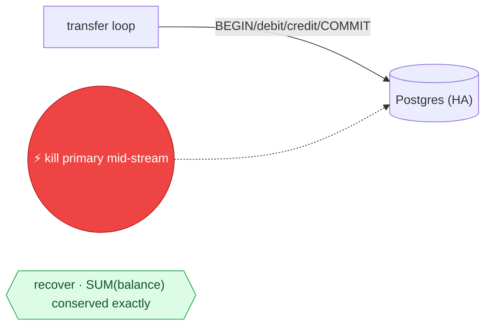
```mermaid
flowchart LR
  n_app["transfer loop"]
  n_db[("Postgres (HA)")]
  n_app -->|"BEGIN/debit/credit/COMMIT"| n_db
  FAULT(("⚡ kill primary mid-stream")):::fault
  FAULT -.-> n_db
  ORACLE{{"recover · SUM(balance) conserved exactly"}}:::oracle_recover
  classDef fault fill:#ef4444,color:#fff,stroke:#b91c1c;
  classDef oracle_recover fill:#dcfce7,stroke:#16a34a,color:#14532d;
  classDef oracle_tolerate fill:#fef9c3,stroke:#ca8a04,color:#713f12;
  classDef oracle_deny fill:#dbeafe,stroke:#2563eb,color:#1e3a8a;
```

### C4 · VDI correlated outage &nbsp; 🟢 PASS

**Category:** Directory + FileShare &nbsp;•&nbsp; **Oracle:** recover — identity + files both survive the correlated outage

> Killed the AD domain controller AND the Samba pod together; both recovered — user re-auth intact, file intact + writable.

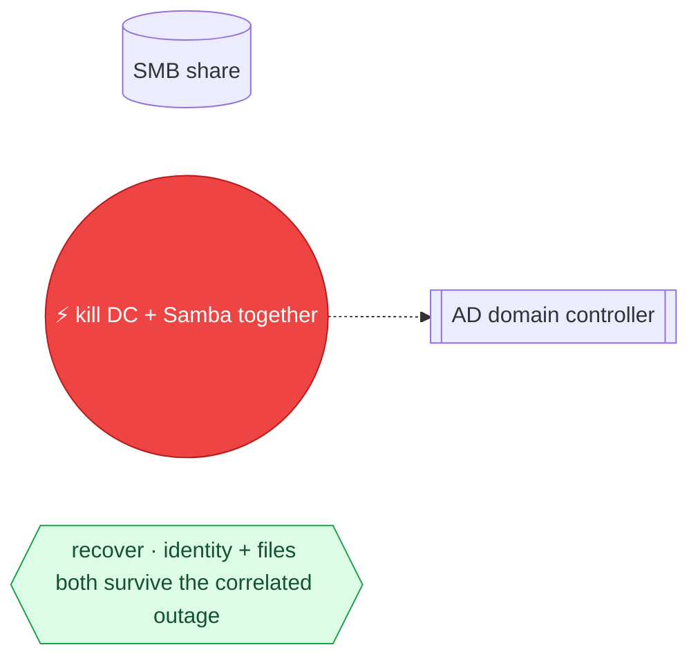
```mermaid
flowchart LR
  n_dc[["AD domain controller"]]
  n_fs[("SMB share")]
  FAULT(("⚡ kill DC + Samba together")):::fault
  FAULT -.-> n_dc
  ORACLE{{"recover · identity + files both survive the correlated outage"}}:::oracle_recover
  classDef fault fill:#ef4444,color:#fff,stroke:#b91c1c;
  classDef oracle_recover fill:#dcfce7,stroke:#16a34a,color:#14532d;
  classDef oracle_tolerate fill:#fef9c3,stroke:#ca8a04,color:#713f12;
  classDef oracle_deny fill:#dbeafe,stroke:#2563eb,color:#1e3a8a;
```

### C5 · Active-active multi-region &nbsp; 🟢 PASS

**Category:** Multi-master mesh (2 regions) &nbsp;•&nbsp; **Oracle:** tolerate — both serve local writes through the split, then reconverge

> Both regions served 20/20 local writes THROUGH the split; healed → reconverged 40/40 with zero lost writes.

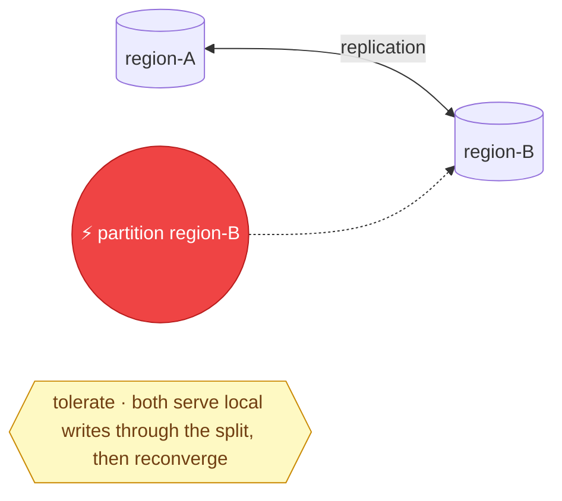
```mermaid
flowchart LR
  n_ra[("region-A")]
  n_rb[("region-B")]
  n_ra <-->|"replication"| n_rb
  FAULT(("⚡ partition region-B")):::fault
  FAULT -.-> n_rb
  ORACLE{{"tolerate · both serve local writes through the split, then reconverge"}}:::oracle_tolerate
  classDef fault fill:#ef4444,color:#fff,stroke:#b91c1c;
  classDef oracle_recover fill:#dcfce7,stroke:#16a34a,color:#14532d;
  classDef oracle_tolerate fill:#fef9c3,stroke:#ca8a04,color:#713f12;
  classDef oracle_deny fill:#dbeafe,stroke:#2563eb,color:#1e3a8a;
```

### C6 · Event pipeline (DB→Stream→Function) &nbsp; 🟢 PASS

**Category:** Stream + Function &nbsp;•&nbsp; **Oracle:** recover — zero events lost (durable consumer resumes from offset)

> Killed the Function's durable-consumer pump mid-stream; it redelivered from offset — all 120 changes reached the function, zero loss.

```mermaid
flowchart LR
  n_db[("Postgres")]
  n_st[["Stream cdc-evt"]]
  n_pump["pump (durable consumer)"]
  n_fn(["Function"])
  n_db -->|"CDC"| n_st
  n_st --> n_pump
  n_pump -->|"HTTP 200"| n_fn
  FAULT(("⚡ kill pump mid-stream")):::fault
  FAULT -.-> n_pump
  ORACLE{{"recover · zero events lost (durable consumer resumes from offset)"}}:::oracle_recover
  classDef fault fill:#ef4444,color:#fff,stroke:#b91c1c;
  classDef oracle_recover fill:#dcfce7,stroke:#16a34a,color:#14532d;
  classDef oracle_tolerate fill:#fef9c3,stroke:#ca8a04,color:#713f12;
  classDef oracle_deny fill:#dbeafe,stroke:#2563eb,color:#1e3a8a;
```

---

## Targeted batch (N-series)

New-coverage probes across untested ground: IAM/permission boundary, cross-namespace isolation, DataFlow internals, cross-engine replication, migration lifecycle, autoscaling, snapshots, and VM storage. Hand-driven.

### N01 · HPA scale-out under load + replica kill &nbsp; ⏳ PENDING

**Category:** Application autoscaling &nbsp;•&nbsp; **Oracle:** tolerate — availability holds; HPA restores the replica count

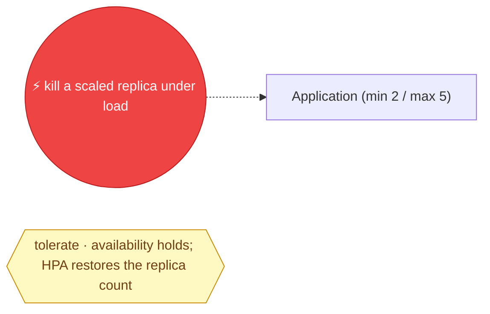
```mermaid
flowchart LR
  n_app["Application (min 2 / max 5)"]
  FAULT(("⚡ kill a scaled replica under load")):::fault
  FAULT -.-> n_app
  ORACLE{{"tolerate · availability holds; HPA restores the replica count"}}:::oracle_tolerate
  classDef fault fill:#ef4444,color:#fff,stroke:#b91c1c;
  classDef oracle_recover fill:#dcfce7,stroke:#16a34a,color:#14532d;
  classDef oracle_tolerate fill:#fef9c3,stroke:#ca8a04,color:#713f12;
  classDef oracle_deny fill:#dbeafe,stroke:#2563eb,color:#1e3a8a;
```

### N02 · Scale-to-zero cold burst with backlog &nbsp; ⏳ PENDING

**Category:** Function (Knative) &nbsp;•&nbsp; **Oracle:** recover — the whole backlog drains on wake, nothing dropped

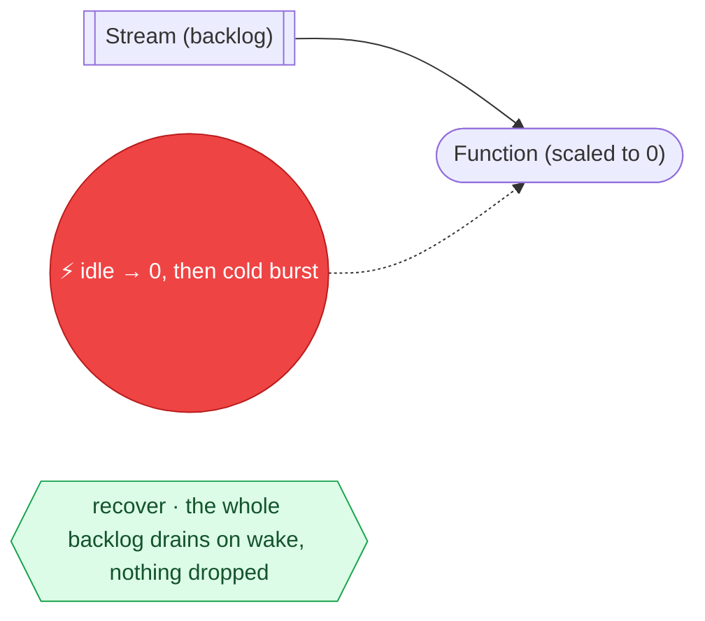
```mermaid
flowchart LR
  n_st[["Stream (backlog)"]]
  n_fn(["Function (scaled to 0)"])
  n_st --> n_fn
  FAULT(("⚡ idle → 0, then cold burst")):::fault
  FAULT -.-> n_fn
  ORACLE{{"recover · the whole backlog drains on wake, nothing dropped"}}:::oracle_recover
  classDef fault fill:#ef4444,color:#fff,stroke:#b91c1c;
  classDef oracle_recover fill:#dcfce7,stroke:#16a34a,color:#14532d;
  classDef oracle_tolerate fill:#fef9c3,stroke:#ca8a04,color:#713f12;
  classDef oracle_deny fill:#dbeafe,stroke:#2563eb,color:#1e3a8a;
```

### N03 · Postgres final snapshot → delete → restore &nbsp; ⏳ PENDING

**Category:** Snapshots (console-orchestrated) &nbsp;•&nbsp; **Oracle:** recover — restore into a new DB returns every row

> Snapshots are orchestrated by the console-api (no CRD); driven via the BFF.

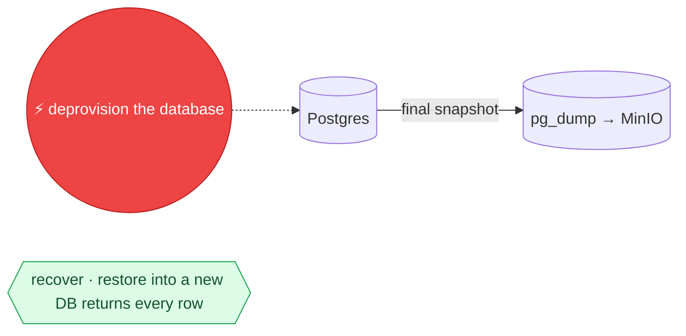
```mermaid
flowchart LR
  n_db[("Postgres")]
  n_snap[("pg_dump → MinIO")]
  n_db -->|"final snapshot"| n_snap
  FAULT(("⚡ deprovision the database")):::fault
  FAULT -.-> n_db
  ORACLE{{"recover · restore into a new DB returns every row"}}:::oracle_recover
  classDef fault fill:#ef4444,color:#fff,stroke:#b91c1c;
  classDef oracle_recover fill:#dcfce7,stroke:#16a34a,color:#14532d;
  classDef oracle_tolerate fill:#fef9c3,stroke:#ca8a04,color:#713f12;
  classDef oracle_deny fill:#dbeafe,stroke:#2563eb,color:#1e3a8a;
```

### N04 · MariaDB backup → restore &nbsp; ⏳ PENDING

**Category:** Snapshots (console-orchestrated) &nbsp;•&nbsp; **Oracle:** recover — restored DB returns all data

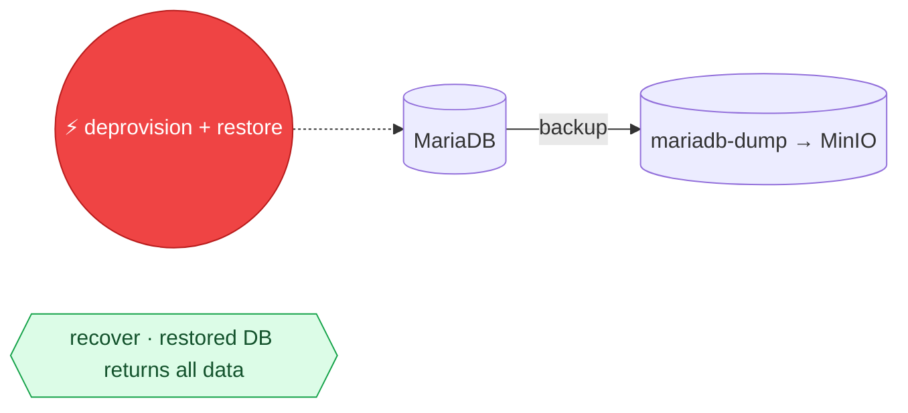
```mermaid
flowchart LR
  n_db[("MariaDB")]
  n_snap[("mariadb-dump → MinIO")]
  n_db -->|"backup"| n_snap
  FAULT(("⚡ deprovision + restore")):::fault
  FAULT -.-> n_db
  ORACLE{{"recover · restored DB returns all data"}}:::oracle_recover
  classDef fault fill:#ef4444,color:#fff,stroke:#b91c1c;
  classDef oracle_recover fill:#dcfce7,stroke:#16a34a,color:#14532d;
  classDef oracle_tolerate fill:#fef9c3,stroke:#ca8a04,color:#713f12;
  classDef oracle_deny fill:#dbeafe,stroke:#2563eb,color:#1e3a8a;
```

### N05 · Kill MinIO backup target mid-snapshot &nbsp; ⏳ PENDING

**Category:** Snapshots + object store &nbsp;•&nbsp; **Oracle:** recover — snapshot integrity preserved / retried, never silently truncated

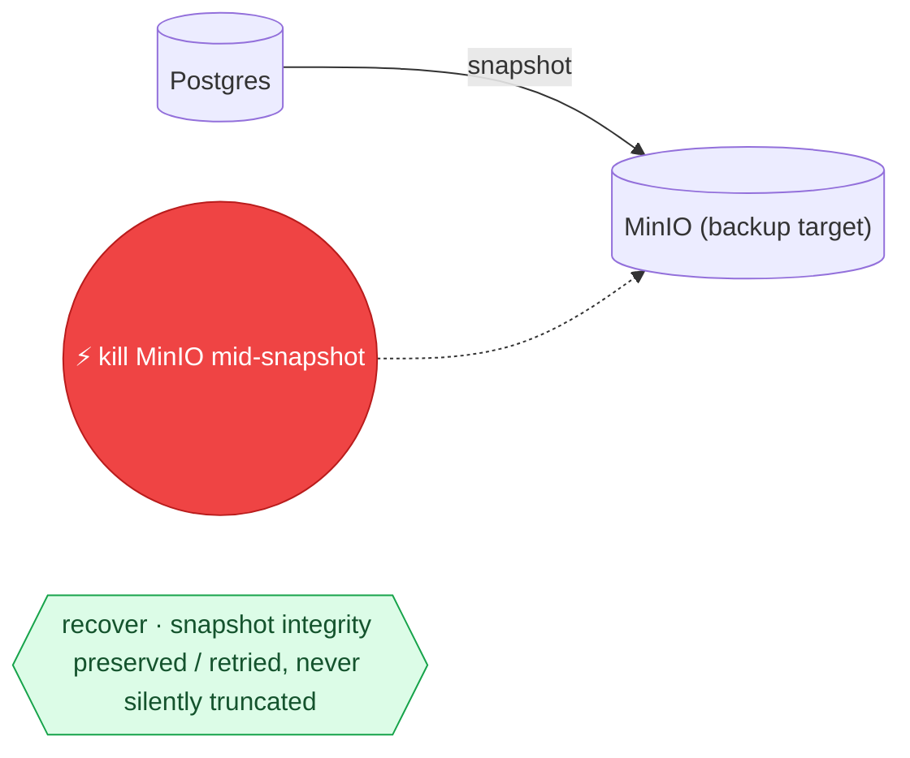
```mermaid
flowchart LR
  n_db[("Postgres")]
  n_snap[("MinIO (backup target)")]
  n_db -->|"snapshot"| n_snap
  FAULT(("⚡ kill MinIO mid-snapshot")):::fault
  FAULT -.-> n_snap
  ORACLE{{"recover · snapshot integrity preserved / retried, never silently truncated"}}:::oracle_recover
  classDef fault fill:#ef4444,color:#fff,stroke:#b91c1c;
  classDef oracle_recover fill:#dcfce7,stroke:#16a34a,color:#14532d;
  classDef oracle_tolerate fill:#fef9c3,stroke:#ca8a04,color:#713f12;
  classDef oracle_deny fill:#dbeafe,stroke:#2563eb,color:#1e3a8a;
```

### N06 · Permission-boundary self-escalation deny &nbsp; 🟢 PASS

**Category:** IAM (kind: Policy / Role) &nbsp;•&nbsp; **Oracle:** deny — escalation grants never materialize (0 breaches)

> A Policy that tried to grant policies:*/users:*/roles:* had all three dropped at compile time; the compiled ClusterRole held only the in-boundary grant.

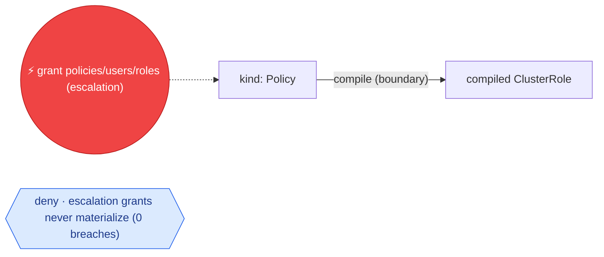
```mermaid
flowchart LR
  n_pol["kind: Policy"]
  n_cr["compiled ClusterRole"]
  n_pol -->|"compile (boundary)"| n_cr
  FAULT(("⚡ grant policies/users/roles (escalation)")):::fault
  FAULT -.-> n_pol
  ORACLE{{"deny · escalation grants never materialize (0 breaches)"}}:::oracle_deny
  classDef fault fill:#ef4444,color:#fff,stroke:#b91c1c;
  classDef oracle_recover fill:#dcfce7,stroke:#16a34a,color:#14532d;
  classDef oracle_tolerate fill:#fef9c3,stroke:#ca8a04,color:#713f12;
  classDef oracle_deny fill:#dbeafe,stroke:#2563eb,color:#1e3a8a;
```

### N07 · Least-privilege — mutating verbs denied &nbsp; 🟢 PASS

**Category:** IAM (impersonation / SAR) &nbsp;•&nbsp; **Oracle:** deny — every out-of-role mutating verb is denied

> Read-only subject can list, but delete/create denied across kinds.

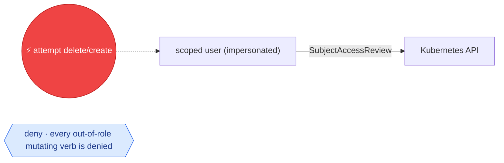
```mermaid
flowchart LR
  n_user["scoped user (impersonated)"]
  n_api["Kubernetes API"]
  n_user -->|"SubjectAccessReview"| n_api
  FAULT(("⚡ attempt delete/create")):::fault
  FAULT -.-> n_user
  ORACLE{{"deny · every out-of-role mutating verb is denied"}}:::oracle_deny
  classDef fault fill:#ef4444,color:#fff,stroke:#b91c1c;
  classDef oracle_recover fill:#dcfce7,stroke:#16a34a,color:#14532d;
  classDef oracle_tolerate fill:#fef9c3,stroke:#ca8a04,color:#713f12;
  classDef oracle_deny fill:#dbeafe,stroke:#2563eb,color:#1e3a8a;
```

### N08 · Cross-namespace SecurityGroup isolation &nbsp; 🟢 PASS

**Category:** SecurityGroup (Cilium/NetworkPolicy) &nbsp;•&nbsp; **Oracle:** deny — cross-namespace access blocked; same-namespace allowed

> Same-ns client 200; client in another namespace denied.

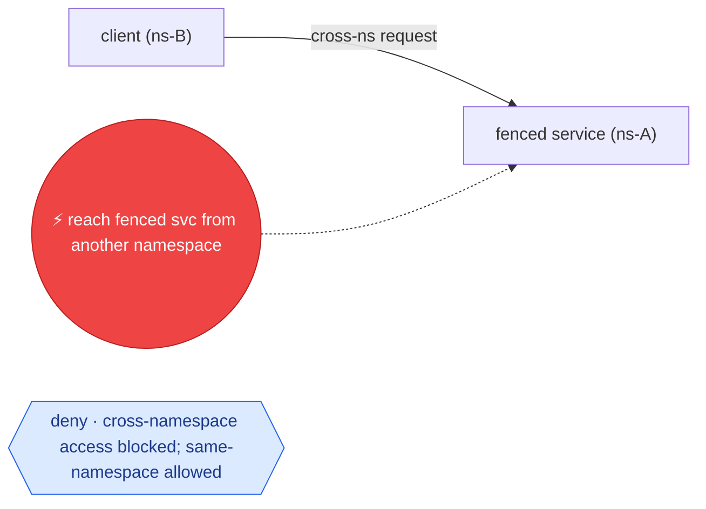
```mermaid
flowchart LR
  n_svc["fenced service (ns-A)"]
  n_ext["client (ns-B)"]
  n_ext -->|"cross-ns request"| n_svc
  FAULT(("⚡ reach fenced svc from another namespace")):::fault
  FAULT -.-> n_svc
  ORACLE{{"deny · cross-namespace access blocked; same-namespace allowed"}}:::oracle_deny
  classDef fault fill:#ef4444,color:#fff,stroke:#b91c1c;
  classDef oracle_recover fill:#dcfce7,stroke:#16a34a,color:#14532d;
  classDef oracle_tolerate fill:#fef9c3,stroke:#ca8a04,color:#713f12;
  classDef oracle_deny fill:#dbeafe,stroke:#2563eb,color:#1e3a8a;
```

### N09 · DataFlow autoSyncTables under concurrent writes &nbsp; 🟢 PASS

**Category:** DataFlow (mesh) &nbsp;•&nbsp; **Oracle:** recover — the new table is auto-created + synced on every peer

> New table added on one master under load → auto-created on the peer and synced 15/15.

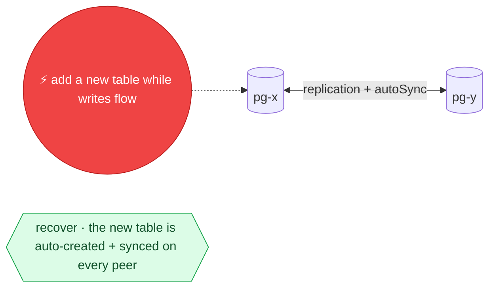
```mermaid
flowchart LR
  n_a[("pg-x")]
  n_b[("pg-y")]
  n_a <-->|"replication + autoSync"| n_b
  FAULT(("⚡ add a new table while writes flow")):::fault
  FAULT -.-> n_a
  ORACLE{{"recover · the new table is auto-created + synced on every peer"}}:::oracle_recover
  classDef fault fill:#ef4444,color:#fff,stroke:#b91c1c;
  classDef oracle_recover fill:#dcfce7,stroke:#16a34a,color:#14532d;
  classDef oracle_tolerate fill:#fef9c3,stroke:#ca8a04,color:#713f12;
  classDef oracle_deny fill:#dbeafe,stroke:#2563eb,color:#1e3a8a;
```

### N10 · Heterogeneous pg↔mysql mesh &nbsp; 🔴 FINDING

**Category:** DataFlow (cross-engine) &nbsp;•&nbsp; **Oracle:** recover — both engines converge to all rows

> FINDING (confirmed): a managed MariaDB without highAvailability ships log_bin=OFF, so Debezium cannot capture from it. pg→mysql applied 10/10, mysql→pg yielded 0/10 — the mesh silently runs one-way. Fix: enable binlog (log_bin + binlog_format=ROW) on a managed MariaDB used as a CDC source.

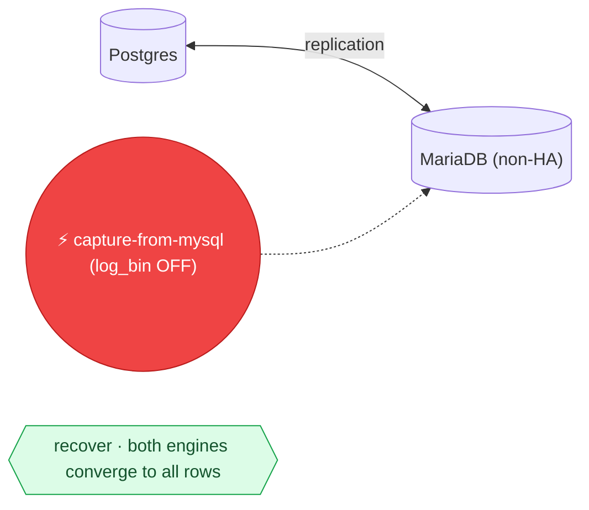
```mermaid
flowchart LR
  n_pg[("Postgres")]
  n_my[("MariaDB (non-HA)")]
  n_pg <-->|"replication"| n_my
  FAULT(("⚡ capture-from-mysql (log_bin OFF)")):::fault
  FAULT -.-> n_my
  ORACLE{{"recover · both engines converge to all rows"}}:::oracle_recover
  classDef fault fill:#ef4444,color:#fff,stroke:#b91c1c;
  classDef oracle_recover fill:#dcfce7,stroke:#16a34a,color:#14532d;
  classDef oracle_tolerate fill:#fef9c3,stroke:#ca8a04,color:#713f12;
  classDef oracle_deny fill:#dbeafe,stroke:#2563eb,color:#1e3a8a;
```

### N11 · Dead-letter on a poison row &nbsp; 🟢 PASS

**Category:** apply-sink error handling &nbsp;•&nbsp; **Oracle:** recover — poison dead-lettered; good rows keep flowing (no head-of-line block)

> Poison row (violates a target CHECK) did not head-of-line block: all good rows applied, poison never corrupted the target; apply-sink dead-letters to a bounded DLQ after MAX_DELIVER.

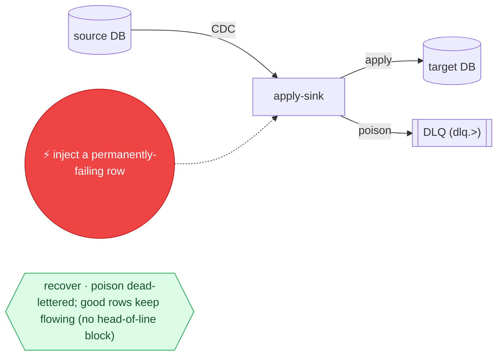
```mermaid
flowchart LR
  n_src[("source DB")]
  n_sink["apply-sink"]
  n_tgt[("target DB")]
  n_dlq[["DLQ (dlq.>)"]]
  n_src -->|"CDC"| n_sink
  n_sink -->|"apply"| n_tgt
  n_sink -->|"poison"| n_dlq
  FAULT(("⚡ inject a permanently-failing row")):::fault
  FAULT -.-> n_sink
  ORACLE{{"recover · poison dead-lettered; good rows keep flowing (no head-of-line block)"}}:::oracle_recover
  classDef fault fill:#ef4444,color:#fff,stroke:#b91c1c;
  classDef oracle_recover fill:#dcfce7,stroke:#16a34a,color:#14532d;
  classDef oracle_tolerate fill:#fef9c3,stroke:#ca8a04,color:#713f12;
  classDef oracle_deny fill:#dbeafe,stroke:#2563eb,color:#1e3a8a;
```

### N12 · Multi-master LWW conflict determinism &nbsp; 🟢 PASS

**Category:** Multi-master mesh &nbsp;•&nbsp; **Oracle:** recover — both masters converge to the same winner per key (deterministic LWW)

> 10 simultaneous conflicting writes to the same keys on both masters → all 10 resolved to the same winner on both; no split-brain.

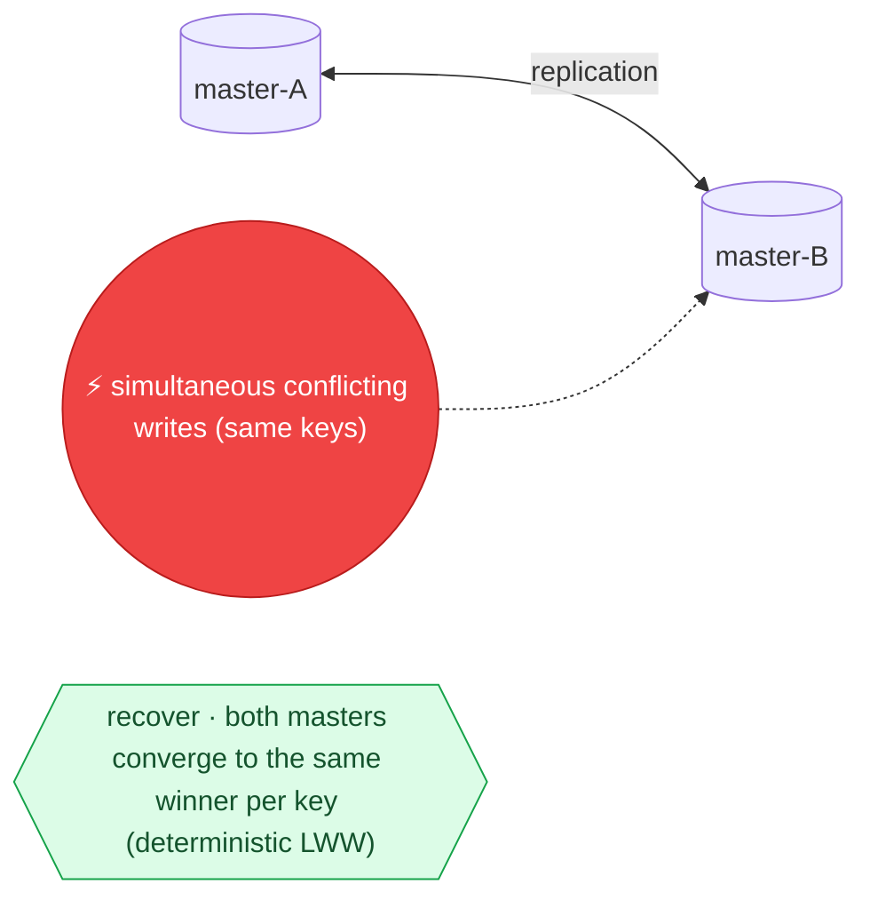
```mermaid
flowchart LR
  n_a[("master-A")]
  n_b[("master-B")]
  n_a <-->|"replication"| n_b
  FAULT(("⚡ simultaneous conflicting writes (same keys)")):::fault
  FAULT -.-> n_b
  ORACLE{{"recover · both masters converge to the same winner per key (deterministic LWW)"}}:::oracle_recover
  classDef fault fill:#ef4444,color:#fff,stroke:#b91c1c;
  classDef oracle_recover fill:#dcfce7,stroke:#16a34a,color:#14532d;
  classDef oracle_tolerate fill:#fef9c3,stroke:#ca8a04,color:#713f12;
  classDef oracle_deny fill:#dbeafe,stroke:#2563eb,color:#1e3a8a;
```

### N13 · Cross-engine key coercion (pg→mysql) &nbsp; 🟢 PASS

**Category:** Migration (cross-engine) &nbsp;•&nbsp; **Oracle:** recover — target table builds + loads without a key-length error

> INT pk + TEXT UNIQUE key loaded 25/25 with no key-spec error. Fidelity note: the source UNIQUE constraint is not replicated to the target (primary key only).

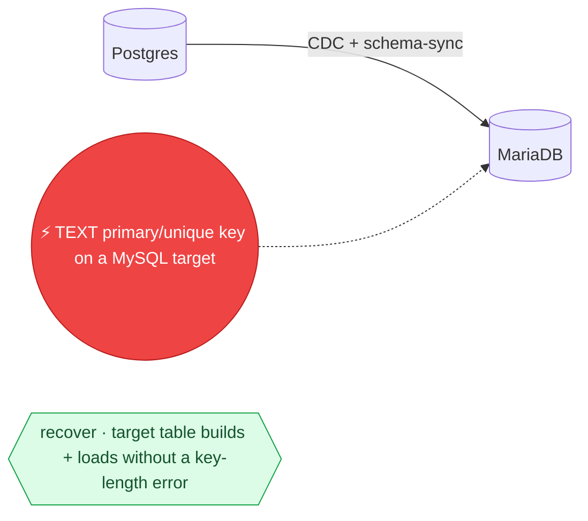
```mermaid
flowchart LR
  n_pg[("Postgres")]
  n_my[("MariaDB")]
  n_pg -->|"CDC + schema-sync"| n_my
  FAULT(("⚡ TEXT primary/unique key on a MySQL target")):::fault
  FAULT -.-> n_my
  ORACLE{{"recover · target table builds + loads without a key-length error"}}:::oracle_recover
  classDef fault fill:#ef4444,color:#fff,stroke:#b91c1c;
  classDef oracle_recover fill:#dcfce7,stroke:#16a34a,color:#14532d;
  classDef oracle_tolerate fill:#fef9c3,stroke:#ca8a04,color:#713f12;
  classDef oracle_deny fill:#dbeafe,stroke:#2563eb,color:#1e3a8a;
```

### N14 · Migration resume after apply-sink delete &nbsp; 🟢 PASS

**Category:** Migration lifecycle &nbsp;•&nbsp; **Oracle:** recover — apply-sink self-heals and resumes from offset, no loss

> Deleted the apply-sink Deployment mid-CDC; the composition recreated it (~212s) and CDC resumed from offset to 40/40 — zero loss.

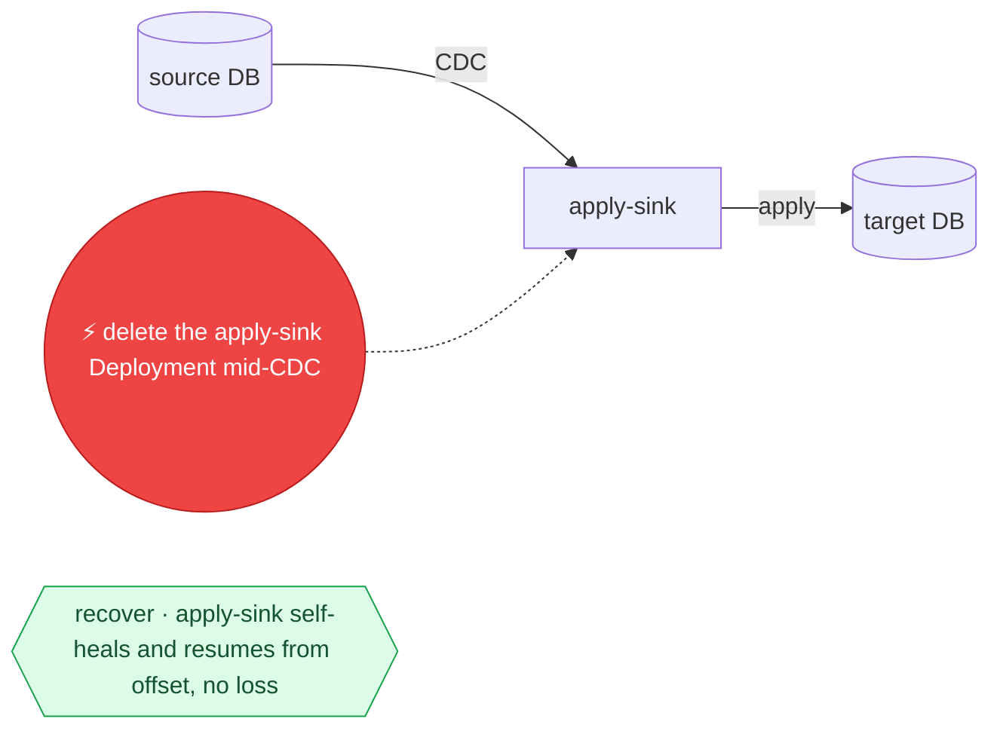
```mermaid
flowchart LR
  n_src[("source DB")]
  n_sink["apply-sink"]
  n_tgt[("target DB")]
  n_src -->|"CDC"| n_sink
  n_sink -->|"apply"| n_tgt
  FAULT(("⚡ delete the apply-sink Deployment mid-CDC")):::fault
  FAULT -.-> n_sink
  ORACLE{{"recover · apply-sink self-heals and resumes from offset, no loss"}}:::oracle_recover
  classDef fault fill:#ef4444,color:#fff,stroke:#b91c1c;
  classDef oracle_recover fill:#dcfce7,stroke:#16a34a,color:#14532d;
  classDef oracle_tolerate fill:#fef9c3,stroke:#ca8a04,color:#713f12;
  classDef oracle_deny fill:#dbeafe,stroke:#2563eb,color:#1e3a8a;
```

### N15 · Migration idempotency &nbsp; 🟢 PASS

**Category:** Migration lifecycle &nbsp;•&nbsp; **Oracle:** recover — idempotent upsert — no duplicate rows

> Re-running the same migration kept exactly 20 rows — the upsert is idempotent, no duplication.

```mermaid
flowchart LR
  n_src[("source DB")]
  n_tgt[("target DB")]
  n_src -->|"CDC (run twice)"| n_tgt
  FAULT(("⚡ re-run the same migration")):::fault
  FAULT -.-> n_tgt
  ORACLE{{"recover · idempotent upsert — no duplicate rows"}}:::oracle_recover
  classDef fault fill:#ef4444,color:#fff,stroke:#b91c1c;
  classDef oracle_recover fill:#dcfce7,stroke:#16a34a,color:#14532d;
  classDef oracle_tolerate fill:#fef9c3,stroke:#ca8a04,color:#713f12;
  classDef oracle_deny fill:#dbeafe,stroke:#2563eb,color:#1e3a8a;
```

### N16 · VM live-migration under node drain &nbsp; ⏳ PENDING

**Category:** Virtual machine &nbsp;•&nbsp; **Oracle:** tolerate — VM live-migrates to another node with no downtime

```mermaid
flowchart LR
  n_vm[/"VM"/]
  n_n1{{"sandbox-node-01"}}
  n_n2{{"sandbox-node-02"}}
  n_vm -->|"runs on"| n_n1
  FAULT(("⚡ cordon + drain the node")):::fault
  FAULT -.-> n_n1
  ORACLE{{"tolerate · VM live-migrates to another node with no downtime"}}:::oracle_tolerate
  classDef fault fill:#ef4444,color:#fff,stroke:#b91c1c;
  classDef oracle_recover fill:#dcfce7,stroke:#16a34a,color:#14532d;
  classDef oracle_tolerate fill:#fef9c3,stroke:#ca8a04,color:#713f12;
  classDef oracle_deny fill:#dbeafe,stroke:#2563eb,color:#1e3a8a;
```

### N17 · Block-mode volume hotplug to a running VM &nbsp; ⏳ PENDING

**Category:** Volume + VM &nbsp;•&nbsp; **Oracle:** recover — volume attaches + is usable with no VM reboot

```mermaid
flowchart LR
  n_vm[/"running VM"/]
  n_vol[("Block Volume")]
  n_vol -->|"hotplug"| n_vm
  FAULT(("⚡ attach a volume live")):::fault
  FAULT -.-> n_vm
  ORACLE{{"recover · volume attaches + is usable with no VM reboot"}}:::oracle_recover
  classDef fault fill:#ef4444,color:#fff,stroke:#b91c1c;
  classDef oracle_recover fill:#dcfce7,stroke:#16a34a,color:#14532d;
  classDef oracle_tolerate fill:#fef9c3,stroke:#ca8a04,color:#713f12;
  classDef oracle_deny fill:#dbeafe,stroke:#2563eb,color:#1e3a8a;
```

### N18 · VM disk backup → restore &nbsp; ⏳ PENDING

**Category:** Virtual machine (Longhorn/KubeVirt) &nbsp;•&nbsp; **Oracle:** recover — a new VM boots from the restored disk with its data

```mermaid
flowchart LR
  n_vm[/"VM"/]
  n_snap[("Longhorn backup → MinIO")]
  n_vm -->|"CSI snapshot"| n_snap
  FAULT(("⚡ delete + restore the root disk")):::fault
  FAULT -.-> n_vm
  ORACLE{{"recover · a new VM boots from the restored disk with its data"}}:::oracle_recover
  classDef fault fill:#ef4444,color:#fff,stroke:#b91c1c;
  classDef oracle_recover fill:#dcfce7,stroke:#16a34a,color:#14532d;
  classDef oracle_tolerate fill:#fef9c3,stroke:#ca8a04,color:#713f12;
  classDef oracle_deny fill:#dbeafe,stroke:#2563eb,color:#1e3a8a;
```

### N19 · Stream fan-out to two Functions &nbsp; 🟢 PASS

**Category:** Stream (delivery guarantee) &nbsp;•&nbsp; **Oracle:** recover — both functions receive every event (independent consumers)

> One Stream, two Functions → two independent durable consumers (fn-f1, fn-f2); both drained all 30 events (Unprocessed=0 each).

```mermaid
flowchart LR
  n_db[("Postgres")]
  n_st[["Stream cdc-evt"]]
  n_f1(["Function f1"])
  n_f2(["Function f2"])
  n_db -->|"CDC"| n_st
  n_st --> n_f1
  n_st --> n_f2
  ORACLE{{"recover · both functions receive every event (independent consumers)"}}:::oracle_recover
  classDef fault fill:#ef4444,color:#fff,stroke:#b91c1c;
  classDef oracle_recover fill:#dcfce7,stroke:#16a34a,color:#14532d;
  classDef oracle_tolerate fill:#fef9c3,stroke:#ca8a04,color:#713f12;
  classDef oracle_deny fill:#dbeafe,stroke:#2563eb,color:#1e3a8a;
```

### N20 · PriorityClass preemption under pressure &nbsp; ⏳ PENDING

**Category:** Scheduling / control-plane &nbsp;•&nbsp; **Oracle:** tolerate — high-priority workload scheduled; low-priority evicted

```mermaid
flowchart LR
  n_lo["low-priority pods"]
  n_hi["high-priority pod"]
  n_hi -->|"preempts"| n_lo
  FAULT(("⚡ fill capacity, then schedule a high-priority pod")):::fault
  FAULT -.-> n_lo
  ORACLE{{"tolerate · high-priority workload scheduled; low-priority evicted"}}:::oracle_tolerate
  classDef fault fill:#ef4444,color:#fff,stroke:#b91c1c;
  classDef oracle_recover fill:#dcfce7,stroke:#16a34a,color:#14532d;
  classDef oracle_tolerate fill:#fef9c3,stroke:#ca8a04,color:#713f12;
  classDef oracle_deny fill:#dbeafe,stroke:#2563eb,color:#1e3a8a;
```

---

## Discovery batch (S-series)

A broad first wave across non-Postgres engines, new fault types, control-plane, storage, and security/config — the sweep that surfaced the cross-engine primary-key regression (found + fixed).

### S01 · MariaDB Galera node kill &nbsp; 🟢 PASS

**Category:** MySQL (HA) &nbsp;•&nbsp; **Oracle:** recover — committed rows survive on quorum

```mermaid
flowchart LR
  n_db[("MariaDB (Galera x3)")]
  FAULT(("⚡ kill a Galera node")):::fault
  FAULT -.-> n_db
  ORACLE{{"recover · committed rows survive on quorum"}}:::oracle_recover
  classDef fault fill:#ef4444,color:#fff,stroke:#b91c1c;
  classDef oracle_recover fill:#dcfce7,stroke:#16a34a,color:#14532d;
  classDef oracle_tolerate fill:#fef9c3,stroke:#ca8a04,color:#713f12;
  classDef oracle_deny fill:#dbeafe,stroke:#2563eb,color:#1e3a8a;
```

### S02 · Mongo/FerretDB backend kill &nbsp; 🟢 PASS

**Category:** MongoDB (FerretDB on Postgres) &nbsp;•&nbsp; **Oracle:** recover — documents survive

```mermaid
flowchart LR
  n_db[("FerretDB + Postgres backend")]
  FAULT(("⚡ kill the storage-Postgres")):::fault
  FAULT -.-> n_db
  ORACLE{{"recover · documents survive"}}:::oracle_recover
  classDef fault fill:#ef4444,color:#fff,stroke:#b91c1c;
  classDef oracle_recover fill:#dcfce7,stroke:#16a34a,color:#14532d;
  classDef oracle_tolerate fill:#fef9c3,stroke:#ca8a04,color:#713f12;
  classDef oracle_deny fill:#dbeafe,stroke:#2563eb,color:#1e3a8a;
```

### S03 · Babelfish pod kill &nbsp; 🟢 PASS

**Category:** Babelfish (SQL-Server-compatible) &nbsp;•&nbsp; **Oracle:** recover — data durable across the reschedule (Longhorn PVC)

```mermaid
flowchart LR
  n_db[("Babelfish (StatefulSet on Longhorn)")]
  FAULT(("⚡ kill the pod")):::fault
  FAULT -.-> n_db
  ORACLE{{"recover · data durable across the reschedule (Longhorn PVC)"}}:::oracle_recover
  classDef fault fill:#ef4444,color:#fff,stroke:#b91c1c;
  classDef oracle_recover fill:#dcfce7,stroke:#16a34a,color:#14532d;
  classDef oracle_tolerate fill:#fef9c3,stroke:#ca8a04,color:#713f12;
  classDef oracle_deny fill:#dbeafe,stroke:#2563eb,color:#1e3a8a;
```

### S04 · Cross-engine primary-key coercion &nbsp; 🟢 PASS

**Category:** Migration (cross-engine) &nbsp;•&nbsp; **Oracle:** recover — target builds + fully populates (regression fixed)

> Surfaced a real regression: a pg text/UUID primary key mapped to MySQL TEXT failed CREATE (Error 1170) → empty target. FIXED — PK LOB columns now coerce to VARCHAR(255)/NVARCHAR(255); verified 25/25.

```mermaid
flowchart LR
  n_pg[("Postgres")]
  n_my[("MySQL")]
  n_pg -->|"CDC + schema-sync"| n_my
  FAULT(("⚡ TEXT primary key on a MySQL target")):::fault
  FAULT -.-> n_my
  ORACLE{{"recover · target builds + fully populates (regression fixed)"}}:::oracle_recover
  classDef fault fill:#ef4444,color:#fff,stroke:#b91c1c;
  classDef oracle_recover fill:#dcfce7,stroke:#16a34a,color:#14532d;
  classDef oracle_tolerate fill:#fef9c3,stroke:#ca8a04,color:#713f12;
  classDef oracle_deny fill:#dbeafe,stroke:#2563eb,color:#1e3a8a;
```

### S10 · 3-node DataFlow mesh convergence &nbsp; 🟢 PASS

**Category:** DataFlow (mesh, N≥3) &nbsp;•&nbsp; **Oracle:** recover — all three members reconverge byte-identical

> An earlier 'non-convergence' was traced to the 8-CPU sandbox quota starving apply-sinks (env, not product). Given capacity, the 3-node mesh converges 90/90/90. Multi-master now verified at N=2 and N=3.

```mermaid
flowchart LR
  n_a[("pg-a")]
  n_b[("pg-b")]
  n_c[("pg-c")]
  n_a <-->|"repl"| n_b
  n_b <-->|"repl"| n_c
  n_a <-->|"repl"| n_c
  FAULT(("⚡ capture kill (full mesh)")):::fault
  FAULT -.-> n_a
  ORACLE{{"recover · all three members reconverge byte-identical"}}:::oracle_recover
  classDef fault fill:#ef4444,color:#fff,stroke:#b91c1c;
  classDef oracle_recover fill:#dcfce7,stroke:#16a34a,color:#14532d;
  classDef oracle_tolerate fill:#fef9c3,stroke:#ca8a04,color:#713f12;
  classDef oracle_deny fill:#dbeafe,stroke:#2563eb,color:#1e3a8a;
```

### S12 · Kill 2-of-3 Deployment replicas &nbsp; 🟢 PASS

**Category:** Application availability &nbsp;•&nbsp; **Oracle:** tolerate — Service keeps serving; Deployment restores the count

```mermaid
flowchart LR
  n_app["Application (3 replicas)"]
  FAULT(("⚡ kill 2 of 3 replicas")):::fault
  FAULT -.-> n_app
  ORACLE{{"tolerate · Service keeps serving; Deployment restores the count"}}:::oracle_tolerate
  classDef fault fill:#ef4444,color:#fff,stroke:#b91c1c;
  classDef oracle_recover fill:#dcfce7,stroke:#16a34a,color:#14532d;
  classDef oracle_tolerate fill:#fef9c3,stroke:#ca8a04,color:#713f12;
  classDef oracle_deny fill:#dbeafe,stroke:#2563eb,color:#1e3a8a;
```

### S13 · Function cold-start burst &nbsp; 🟢 PASS

**Category:** Function (Knative) &nbsp;•&nbsp; **Oracle:** tolerate — all 60 requests served (60/60)

```mermaid
flowchart LR
  n_fn(["Function (scale-from-zero)"])
  FAULT(("⚡ burst 60 concurrent requests from cold")):::fault
  FAULT -.-> n_fn
  ORACLE{{"tolerate · all 60 requests served (60/60)"}}:::oracle_tolerate
  classDef fault fill:#ef4444,color:#fff,stroke:#b91c1c;
  classDef oracle_recover fill:#dcfce7,stroke:#16a34a,color:#14532d;
  classDef oracle_tolerate fill:#fef9c3,stroke:#ca8a04,color:#713f12;
  classDef oracle_deny fill:#dbeafe,stroke:#2563eb,color:#1e3a8a;
```

### S14 · HA-VM under fault &nbsp; ⚪ INCONCLUSIVE

**Category:** Virtual machine &nbsp;•&nbsp; **Oracle:** recover — the VM returns to Running

> Blocked on an intermittent CDI image-import flake (vm-root-scratch) — an environment issue, not a product result. The standalone VM resilience chain passes.

```mermaid
flowchart LR
  n_vm[/"VM (HA)"/]
  FAULT(("⚡ fault the VM")):::fault
  FAULT -.-> n_vm
  ORACLE{{"recover · the VM returns to Running"}}:::oracle_recover
  classDef fault fill:#ef4444,color:#fff,stroke:#b91c1c;
  classDef oracle_recover fill:#dcfce7,stroke:#16a34a,color:#14532d;
  classDef oracle_tolerate fill:#fef9c3,stroke:#ca8a04,color:#713f12;
  classDef oracle_deny fill:#dbeafe,stroke:#2563eb,color:#1e3a8a;
```

### S15 · Longhorn Volume replica loss &nbsp; 🟢 PASS

**Category:** Volume (Longhorn) &nbsp;•&nbsp; **Oracle:** recover — data intact; Longhorn rebuilds the replica

```mermaid
flowchart LR
  n_vol[("Longhorn Volume")]
  n_n{{"sandbox-node-02"}}
  n_vol -->|"replica"| n_n
  FAULT(("⚡ lose a replica")):::fault
  FAULT -.-> n_n
  ORACLE{{"recover · data intact; Longhorn rebuilds the replica"}}:::oracle_recover
  classDef fault fill:#ef4444,color:#fff,stroke:#b91c1c;
  classDef oracle_recover fill:#dcfce7,stroke:#16a34a,color:#14532d;
  classDef oracle_tolerate fill:#fef9c3,stroke:#ca8a04,color:#713f12;
  classDef oracle_deny fill:#dbeafe,stroke:#2563eb,color:#1e3a8a;
```

### S16 · FileShare killed mid-write &nbsp; 🟢 PASS

**Category:** FileShare (SMB) &nbsp;•&nbsp; **Oracle:** recover — the committed file is intact + writable after restart

```mermaid
flowchart LR
  n_fs[("SMB share")]
  FAULT(("⚡ kill the Samba pod mid-write")):::fault
  FAULT -.-> n_fs
  ORACLE{{"recover · the committed file is intact + writable after restart"}}:::oracle_recover
  classDef fault fill:#ef4444,color:#fff,stroke:#b91c1c;
  classDef oracle_recover fill:#dcfce7,stroke:#16a34a,color:#14532d;
  classDef oracle_tolerate fill:#fef9c3,stroke:#ca8a04,color:#713f12;
  classDef oracle_deny fill:#dbeafe,stroke:#2563eb,color:#1e3a8a;
```

### S17 · Online Volume expand &nbsp; 🟢 PASS

**Category:** Volume (Longhorn) &nbsp;•&nbsp; **Oracle:** recover — capacity grows with data intact

> An earlier 'failure' was a harness bug (ambiguous 'volume' short-name hit the wrong CRD). With volume.openinfra.dev: 1Gi→2Gi propagated and Longhorn expanded in ~16s.

```mermaid
flowchart LR
  n_vol[("Longhorn Volume")]
  FAULT(("⚡ expand 1Gi → 2Gi online")):::fault
  FAULT -.-> n_vol
  ORACLE{{"recover · capacity grows with data intact"}}:::oracle_recover
  classDef fault fill:#ef4444,color:#fff,stroke:#b91c1c;
  classDef oracle_recover fill:#dcfce7,stroke:#16a34a,color:#14532d;
  classDef oracle_tolerate fill:#fef9c3,stroke:#ca8a04,color:#713f12;
  classDef oracle_deny fill:#dbeafe,stroke:#2563eb,color:#1e3a8a;
```

### S18 · Live SecurityGroup egress change &nbsp; 🟢 PASS

**Category:** SecurityGroup &nbsp;•&nbsp; **Oracle:** tolerate — the change applies to running pods with no restart

```mermaid
flowchart LR
  n_cl["client"]
  n_svc["target service"]
  n_cl -->|"egress"| n_svc
  FAULT(("⚡ flip SG egress denied → allowed (live)")):::fault
  FAULT -.-> n_svc
  ORACLE{{"tolerate · the change applies to running pods with no restart"}}:::oracle_tolerate
  classDef fault fill:#ef4444,color:#fff,stroke:#b91c1c;
  classDef oracle_recover fill:#dcfce7,stroke:#16a34a,color:#14532d;
  classDef oracle_tolerate fill:#fef9c3,stroke:#ca8a04,color:#713f12;
  classDef oracle_deny fill:#dbeafe,stroke:#2563eb,color:#1e3a8a;
```

### S19 · Secret rotation propagation &nbsp; 🟢 PASS

**Category:** Application config &nbsp;•&nbsp; **Oracle:** recover — the new secret value is picked up

```mermaid
flowchart LR
  n_app["Application (envFrom secret)"]
  FAULT(("⚡ rotate the secret + rollout-restart")):::fault
  FAULT -.-> n_app
  ORACLE{{"recover · the new secret value is picked up"}}:::oracle_recover
  classDef fault fill:#ef4444,color:#fff,stroke:#b91c1c;
  classDef oracle_recover fill:#dcfce7,stroke:#16a34a,color:#14532d;
  classDef oracle_tolerate fill:#fef9c3,stroke:#ca8a04,color:#713f12;
  classDef oracle_deny fill:#dbeafe,stroke:#2563eb,color:#1e3a8a;
```

### S20 · ResourceQuota caps a runaway &nbsp; 🟢 PASS

**Category:** Control-plane (quota) &nbsp;•&nbsp; **Oracle:** deny — excess pods rejected at admission (blast contained)

```mermaid
flowchart LR
  n_run["50-pod runaway"]
  n_q["ResourceQuota"]
  n_run -->|"admission"| n_q
  FAULT(("⚡ request 50 pods past the quota")):::fault
  FAULT -.-> n_run
  ORACLE{{"deny · excess pods rejected at admission (blast contained)"}}:::oracle_deny
  classDef fault fill:#ef4444,color:#fff,stroke:#b91c1c;
  classDef oracle_recover fill:#dcfce7,stroke:#16a34a,color:#14532d;
  classDef oracle_tolerate fill:#fef9c3,stroke:#ca8a04,color:#713f12;
  classDef oracle_deny fill:#dbeafe,stroke:#2563eb,color:#1e3a8a;
```

---

## Nightly suite

Runs every night on a self-hosted runner, sandbox-scoped. Each scenario asserts its fault actually landed (proof-of-fire) while the harness is still holding the break, so a false-green fails loud. This is the continuously-green core.

### M01 · app-availability &nbsp; 🟢 PASS

**Category:** Application &nbsp;•&nbsp; **Oracle:** tolerate — HTTP success rate ≥ SLO during the fault

```mermaid
flowchart LR
  n_app["Application (HA)"]
  n_db[("Postgres")]
  n_app --> n_db
  FAULT(("⚡ kill an instance")):::fault
  FAULT -.-> n_app
  ORACLE{{"tolerate · HTTP success rate ≥ SLO during the fault"}}:::oracle_tolerate
  classDef fault fill:#ef4444,color:#fff,stroke:#b91c1c;
  classDef oracle_recover fill:#dcfce7,stroke:#16a34a,color:#14532d;
  classDef oracle_tolerate fill:#fef9c3,stroke:#ca8a04,color:#713f12;
  classDef oracle_deny fill:#dbeafe,stroke:#2563eb,color:#1e3a8a;
```

### M02 · cnpg-failover &nbsp; 🟢 PASS

**Category:** Postgres (HA) &nbsp;•&nbsp; **Oracle:** recover — failover with no lost writes

```mermaid
flowchart LR
  n_db[("CNPG cluster")]
  FAULT(("⚡ kill the primary")):::fault
  FAULT -.-> n_db
  ORACLE{{"recover · failover with no lost writes"}}:::oracle_recover
  classDef fault fill:#ef4444,color:#fff,stroke:#b91c1c;
  classDef oracle_recover fill:#dcfce7,stroke:#16a34a,color:#14532d;
  classDef oracle_tolerate fill:#fef9c3,stroke:#ca8a04,color:#713f12;
  classDef oracle_deny fill:#dbeafe,stroke:#2563eb,color:#1e3a8a;
```

### M03 · partition &nbsp; 🟢 PASS

**Category:** Multi-master mesh &nbsp;•&nbsp; **Oracle:** recover — reconverge byte-identical after heal

```mermaid
flowchart LR
  n_a[("pg-a")]
  n_b[("pg-b")]
  n_a <-->|"replication"| n_b
  FAULT(("⚡ clean partition")):::fault
  FAULT -.-> n_b
  ORACLE{{"recover · reconverge byte-identical after heal"}}:::oracle_recover
  classDef fault fill:#ef4444,color:#fff,stroke:#b91c1c;
  classDef oracle_recover fill:#dcfce7,stroke:#16a34a,color:#14532d;
  classDef oracle_tolerate fill:#fef9c3,stroke:#ca8a04,color:#713f12;
  classDef oracle_deny fill:#dbeafe,stroke:#2563eb,color:#1e3a8a;
```

### M04 · partition-isolation &nbsp; 🟢 PASS

**Category:** Multi-master mesh &nbsp;•&nbsp; **Oracle:** recover — both members diverge then reconverge byte-identical

```mermaid
flowchart LR
  n_a[("pg-a")]
  n_b[("pg-b")]
  n_a <-->|"replication"| n_b
  FAULT(("⚡ sever B from the whole mesh (both links)")):::fault
  FAULT -.-> n_b
  ORACLE{{"recover · both members diverge then reconverge byte-identical"}}:::oracle_recover
  classDef fault fill:#ef4444,color:#fff,stroke:#b91c1c;
  classDef oracle_recover fill:#dcfce7,stroke:#16a34a,color:#14532d;
  classDef oracle_tolerate fill:#fef9c3,stroke:#ca8a04,color:#713f12;
  classDef oracle_deny fill:#dbeafe,stroke:#2563eb,color:#1e3a8a;
```

### M05 · partition-flapping &nbsp; 🟢 PASS

**Category:** Multi-master mesh &nbsp;•&nbsp; **Oracle:** recover — reconverge byte-identical after flapping stops

```mermaid
flowchart LR
  n_a[("pg-a")]
  n_b[("pg-b")]
  n_a <-->|"replication"| n_b
  FAULT(("⚡ repeated cut/heal cycles")):::fault
  FAULT -.-> n_b
  ORACLE{{"recover · reconverge byte-identical after flapping stops"}}:::oracle_recover
  classDef fault fill:#ef4444,color:#fff,stroke:#b91c1c;
  classDef oracle_recover fill:#dcfce7,stroke:#16a34a,color:#14532d;
  classDef oracle_tolerate fill:#fef9c3,stroke:#ca8a04,color:#713f12;
  classDef oracle_deny fill:#dbeafe,stroke:#2563eb,color:#1e3a8a;
```

### M06 · partition-latency &nbsp; 🟢 PASS

**Category:** Multi-master mesh &nbsp;•&nbsp; **Oracle:** tolerate — keeps converging under a ~4× slower apply path

```mermaid
flowchart LR
  n_a[("pg-a")]
  n_b[("pg-b")]
  n_a <-->|"replication"| n_b
  FAULT(("⚡ 800ms latency both ways")):::fault
  FAULT -.-> n_b
  ORACLE{{"tolerate · keeps converging under a ~4× slower apply path"}}:::oracle_tolerate
  classDef fault fill:#ef4444,color:#fff,stroke:#b91c1c;
  classDef oracle_recover fill:#dcfce7,stroke:#16a34a,color:#14532d;
  classDef oracle_tolerate fill:#fef9c3,stroke:#ca8a04,color:#713f12;
  classDef oracle_deny fill:#dbeafe,stroke:#2563eb,color:#1e3a8a;
```

### M07 · partition-loss &nbsp; 🟢 PASS

**Category:** Multi-master mesh &nbsp;•&nbsp; **Oracle:** tolerate — keeps converging under sustained loss

```mermaid
flowchart LR
  n_a[("pg-a")]
  n_b[("pg-b")]
  n_a <-->|"replication"| n_b
  FAULT(("⚡ 15% packet loss")):::fault
  FAULT -.-> n_b
  ORACLE{{"tolerate · keeps converging under sustained loss"}}:::oracle_tolerate
  classDef fault fill:#ef4444,color:#fff,stroke:#b91c1c;
  classDef oracle_recover fill:#dcfce7,stroke:#16a34a,color:#14532d;
  classDef oracle_tolerate fill:#fef9c3,stroke:#ca8a04,color:#713f12;
  classDef oracle_deny fill:#dbeafe,stroke:#2563eb,color:#1e3a8a;
```

### M08 · clock-skew &nbsp; 🟢 PASS

**Category:** Multi-master mesh &nbsp;•&nbsp; **Oracle:** recover — LWW still converges (no lost-write regression)

```mermaid
flowchart LR
  n_a[("pg-a")]
  n_b[("pg-b")]
  n_a <-->|"replication"| n_b
  FAULT(("⚡ clock skew on a member")):::fault
  FAULT -.-> n_b
  ORACLE{{"recover · LWW still converges (no lost-write regression)"}}:::oracle_recover
  classDef fault fill:#ef4444,color:#fff,stroke:#b91c1c;
  classDef oracle_recover fill:#dcfce7,stroke:#16a34a,color:#14532d;
  classDef oracle_tolerate fill:#fef9c3,stroke:#ca8a04,color:#713f12;
  classDef oracle_deny fill:#dbeafe,stroke:#2563eb,color:#1e3a8a;
```

### M09 · healing-order &nbsp; 🟢 PASS

**Category:** Multi-master mesh (timing) &nbsp;•&nbsp; **Oracle:** recover — reconverge regardless of heal order

```mermaid
flowchart LR
  n_a[("pg-a")]
  n_b[("pg-b")]
  n_s["a→b sink"]
  n_a --> n_s
  n_s --> n_b
  FAULT(("⚡ overlap partition + held-down sink, heal in order")):::fault
  FAULT -.-> n_s
  ORACLE{{"recover · reconverge regardless of heal order"}}:::oracle_recover
  classDef fault fill:#ef4444,color:#fff,stroke:#b91c1c;
  classDef oracle_recover fill:#dcfce7,stroke:#16a34a,color:#14532d;
  classDef oracle_tolerate fill:#fef9c3,stroke:#ca8a04,color:#713f12;
  classDef oracle_deny fill:#dbeafe,stroke:#2563eb,color:#1e3a8a;
```

### M10 · concurrent (mesh under overlapping chaos) &nbsp; 🟢 PASS

**Category:** Multi-master mesh &nbsp;•&nbsp; **Oracle:** recover — reconverge with zero lost writes (graduation test)

```mermaid
flowchart LR
  n_a[("pg-a")]
  n_b[("pg-b")]
  n_a <-->|"replication"| n_b
  FAULT(("⚡ partition + sink kill together")):::fault
  FAULT -.-> n_b
  ORACLE{{"recover · reconverge with zero lost writes (graduation test)"}}:::oracle_recover
  classDef fault fill:#ef4444,color:#fff,stroke:#b91c1c;
  classDef oracle_recover fill:#dcfce7,stroke:#16a34a,color:#14532d;
  classDef oracle_tolerate fill:#fef9c3,stroke:#ca8a04,color:#713f12;
  classDef oracle_deny fill:#dbeafe,stroke:#2563eb,color:#1e3a8a;
```

### M11 · stress-cpu &nbsp; 🟢 PASS

**Category:** apply-sink (fault variety) &nbsp;•&nbsp; **Oracle:** tolerate — keeps converging under CPU pressure

```mermaid
flowchart LR
  n_s["a→b apply-sink"]
  FAULT(("⚡ saturate the sink's CPU")):::fault
  FAULT -.-> n_s
  ORACLE{{"tolerate · keeps converging under CPU pressure"}}:::oracle_tolerate
  classDef fault fill:#ef4444,color:#fff,stroke:#b91c1c;
  classDef oracle_recover fill:#dcfce7,stroke:#16a34a,color:#14532d;
  classDef oracle_tolerate fill:#fef9c3,stroke:#ca8a04,color:#713f12;
  classDef oracle_deny fill:#dbeafe,stroke:#2563eb,color:#1e3a8a;
```

### M12 · stress-mem &nbsp; 🟢 PASS

**Category:** Postgres (fault variety) &nbsp;•&nbsp; **Oracle:** tolerate — DB stays queryable; mesh converges zero-lost

```mermaid
flowchart LR
  n_b[("site-B Postgres")]
  FAULT(("⚡ 300MB memory pressure (under the limit)")):::fault
  FAULT -.-> n_b
  ORACLE{{"tolerate · DB stays queryable; mesh converges zero-lost"}}:::oracle_tolerate
  classDef fault fill:#ef4444,color:#fff,stroke:#b91c1c;
  classDef oracle_recover fill:#dcfce7,stroke:#16a34a,color:#14532d;
  classDef oracle_tolerate fill:#fef9c3,stroke:#ca8a04,color:#713f12;
  classDef oracle_deny fill:#dbeafe,stroke:#2563eb,color:#1e3a8a;
```

### M13 · sink-kill &nbsp; 🟢 PASS

**Category:** apply-sink &nbsp;•&nbsp; **Oracle:** recover — resume from offset, no loss

```mermaid
flowchart LR
  n_src[("source")]
  n_s["apply-sink"]
  n_tgt[("target")]
  n_src --> n_s
  n_s --> n_tgt
  FAULT(("⚡ kill the apply-sink")):::fault
  FAULT -.-> n_s
  ORACLE{{"recover · resume from offset, no loss"}}:::oracle_recover
  classDef fault fill:#ef4444,color:#fff,stroke:#b91c1c;
  classDef oracle_recover fill:#dcfce7,stroke:#16a34a,color:#14532d;
  classDef oracle_tolerate fill:#fef9c3,stroke:#ca8a04,color:#713f12;
  classDef oracle_deny fill:#dbeafe,stroke:#2563eb,color:#1e3a8a;
```

### M14 · sink-drain-kill &nbsp; 🟢 PASS

**Category:** apply-sink (hardest state) &nbsp;•&nbsp; **Oracle:** recover — no loss even killed at its hardest moment

```mermaid
flowchart LR
  n_src[("source")]
  n_s["apply-sink (mid-backlog)"]
  n_tgt[("target")]
  n_src --> n_s
  n_s --> n_tgt
  FAULT(("⚡ kill mid-backlog-drain")):::fault
  FAULT -.-> n_s
  ORACLE{{"recover · no loss even killed at its hardest moment"}}:::oracle_recover
  classDef fault fill:#ef4444,color:#fff,stroke:#b91c1c;
  classDef oracle_recover fill:#dcfce7,stroke:#16a34a,color:#14532d;
  classDef oracle_tolerate fill:#fef9c3,stroke:#ca8a04,color:#713f12;
  classDef oracle_deny fill:#dbeafe,stroke:#2563eb,color:#1e3a8a;
```

### M15 · migration &nbsp; 🟢 PASS

**Category:** Migration (fidelity) &nbsp;•&nbsp; **Oracle:** recover — target reflects every acknowledged source row

```mermaid
flowchart LR
  n_src[("source DB")]
  n_tgt[("target DB")]
  n_src -->|"CDC"| n_tgt
  FAULT(("⚡ kill capture/apply mid-migration")):::fault
  FAULT -.-> n_src
  ORACLE{{"recover · target reflects every acknowledged source row"}}:::oracle_recover
  classDef fault fill:#ef4444,color:#fff,stroke:#b91c1c;
  classDef oracle_recover fill:#dcfce7,stroke:#16a34a,color:#14532d;
  classDef oracle_tolerate fill:#fef9c3,stroke:#ca8a04,color:#713f12;
  classDef oracle_deny fill:#dbeafe,stroke:#2563eb,color:#1e3a8a;
```

### M16 · stream-noloss &nbsp; 🟢 PASS

**Category:** Stream (CDC) &nbsp;•&nbsp; **Oracle:** recover — stream message count ≥ driven changes (no dropped events)

```mermaid
flowchart LR
  n_db[("source DB")]
  n_st[["Stream cdc-evt"]]
  n_db -->|"CDC"| n_st
  FAULT(("⚡ kill the capture")):::fault
  FAULT -.-> n_db
  ORACLE{{"recover · stream message count ≥ driven changes (no dropped events)"}}:::oracle_recover
  classDef fault fill:#ef4444,color:#fff,stroke:#b91c1c;
  classDef oracle_recover fill:#dcfce7,stroke:#16a34a,color:#14532d;
  classDef oracle_tolerate fill:#fef9c3,stroke:#ca8a04,color:#713f12;
  classDef oracle_deny fill:#dbeafe,stroke:#2563eb,color:#1e3a8a;
```

### M17 · dataflow-converge &nbsp; 🟢 PASS

**Category:** DataFlow &nbsp;•&nbsp; **Oracle:** recover — members byte-identical after heal

```mermaid
flowchart LR
  n_a[("member-A")]
  n_b[("member-B")]
  n_a <-->|"DataFlow mesh"| n_b
  FAULT(("⚡ DataFlow capture kill")):::fault
  FAULT -.-> n_a
  ORACLE{{"recover · members byte-identical after heal"}}:::oracle_recover
  classDef fault fill:#ef4444,color:#fff,stroke:#b91c1c;
  classDef oracle_recover fill:#dcfce7,stroke:#16a34a,color:#14532d;
  classDef oracle_tolerate fill:#fef9c3,stroke:#ca8a04,color:#713f12;
  classDef oracle_deny fill:#dbeafe,stroke:#2563eb,color:#1e3a8a;
```

### M18 · security-deny &nbsp; 🟢 PASS

**Category:** SecurityGroup &nbsp;•&nbsp; **Oracle:** deny — the fence never leaks (0 breaches)

```mermaid
flowchart LR
  n_cl["egress-locked client"]
  n_svc["forbidden service"]
  n_cl -->|"blocked"| n_svc
  FAULT(("⚡ locked client churns against a forbidden service")):::fault
  FAULT -.-> n_svc
  ORACLE{{"deny · the fence never leaks (0 breaches)"}}:::oracle_deny
  classDef fault fill:#ef4444,color:#fff,stroke:#b91c1c;
  classDef oracle_recover fill:#dcfce7,stroke:#16a34a,color:#14532d;
  classDef oracle_tolerate fill:#fef9c3,stroke:#ca8a04,color:#713f12;
  classDef oracle_deny fill:#dbeafe,stroke:#2563eb,color:#1e3a8a;
```

### M19 · directory-recover &nbsp; 🟢 PASS

**Category:** Active Directory &nbsp;•&nbsp; **Oracle:** recover — an account created pre-fault survives the restart

```mermaid
flowchart LR
  n_dc[["AD domain controller"]]
  FAULT(("⚡ kill the DC")):::fault
  FAULT -.-> n_dc
  ORACLE{{"recover · an account created pre-fault survives the restart"}}:::oracle_recover
  classDef fault fill:#ef4444,color:#fff,stroke:#b91c1c;
  classDef oracle_recover fill:#dcfce7,stroke:#16a34a,color:#14532d;
  classDef oracle_tolerate fill:#fef9c3,stroke:#ca8a04,color:#713f12;
  classDef oracle_deny fill:#dbeafe,stroke:#2563eb,color:#1e3a8a;
```

### M20 · fileshare-durable &nbsp; 🟢 PASS

**Category:** FileShare (SMB) &nbsp;•&nbsp; **Oracle:** recover — a pre-fault file is present + writable after restart

```mermaid
flowchart LR
  n_fs[("SMB share")]
  FAULT(("⚡ kill the Samba server")):::fault
  FAULT -.-> n_fs
  ORACLE{{"recover · a pre-fault file is present + writable after restart"}}:::oracle_recover
  classDef fault fill:#ef4444,color:#fff,stroke:#b91c1c;
  classDef oracle_recover fill:#dcfce7,stroke:#16a34a,color:#14532d;
  classDef oracle_tolerate fill:#fef9c3,stroke:#ca8a04,color:#713f12;
  classDef oracle_deny fill:#dbeafe,stroke:#2563eb,color:#1e3a8a;
```

### M21 · volume-durable &nbsp; 🟢 PASS

**Category:** Volume (Longhorn) &nbsp;•&nbsp; **Oracle:** recover — a raw-block signature reads back after reschedule

```mermaid
flowchart LR
  n_vol[("block Volume")]
  FAULT(("⚡ kill the attached pod (reschedule)")):::fault
  FAULT -.-> n_vol
  ORACLE{{"recover · a raw-block signature reads back after reschedule"}}:::oracle_recover
  classDef fault fill:#ef4444,color:#fff,stroke:#b91c1c;
  classDef oracle_recover fill:#dcfce7,stroke:#16a34a,color:#14532d;
  classDef oracle_tolerate fill:#fef9c3,stroke:#ca8a04,color:#713f12;
  classDef oracle_deny fill:#dbeafe,stroke:#2563eb,color:#1e3a8a;
```

### M22 · storage-replica-loss &nbsp; 🟢 PASS

**Category:** Storage (Longhorn) &nbsp;•&nbsp; **Oracle:** recover — volume survives on the surviving replica; rebuilds

```mermaid
flowchart LR
  n_vol[("Longhorn Volume")]
  n_n1{{"sandbox-node-01"}}
  n_n2{{"sandbox-node-02"}}
  n_vol -->|"replica"| n_n1
  n_vol -->|"replica"| n_n2
  FAULT(("⚡ lose a replica (distinct nodes)")):::fault
  FAULT -.-> n_n1
  ORACLE{{"recover · volume survives on the surviving replica; rebuilds"}}:::oracle_recover
  classDef fault fill:#ef4444,color:#fff,stroke:#b91c1c;
  classDef oracle_recover fill:#dcfce7,stroke:#16a34a,color:#14532d;
  classDef oracle_tolerate fill:#fef9c3,stroke:#ca8a04,color:#713f12;
  classDef oracle_deny fill:#dbeafe,stroke:#2563eb,color:#1e3a8a;
```

### M23 · vm-resilience &nbsp; 🟢 PASS

**Category:** Virtual machine &nbsp;•&nbsp; **Oracle:** recover — the VMI returns to Running

```mermaid
flowchart LR
  n_vm[/"VM"/]
  FAULT(("⚡ kill the virt-launcher pod")):::fault
  FAULT -.-> n_vm
  ORACLE{{"recover · the VMI returns to Running"}}:::oracle_recover
  classDef fault fill:#ef4444,color:#fff,stroke:#b91c1c;
  classDef oracle_recover fill:#dcfce7,stroke:#16a34a,color:#14532d;
  classDef oracle_tolerate fill:#fef9c3,stroke:#ca8a04,color:#713f12;
  classDef oracle_deny fill:#dbeafe,stroke:#2563eb,color:#1e3a8a;
```

### M24 · lottery (correlation capstone) &nbsp; ⏸️ PARKED

**Category:** Multi-master mesh (seeded) &nbsp;•&nbsp; **Oracle:** recover — reconverge under any composed blast

> The correlation capstone: a seeded RNG composes 2–4 physically-composable faults per night. Backlogged until the base suite banks 30 consecutive green nights.

```mermaid
flowchart LR
  n_a[("pg-a")]
  n_b[("pg-b")]
  n_a <-->|"replication"| n_b
  FAULT(("⚡ seeded blast (2–4 composed faults)")):::fault
  FAULT -.-> n_b
  ORACLE{{"recover · reconverge under any composed blast"}}:::oracle_recover
  classDef fault fill:#ef4444,color:#fff,stroke:#b91c1c;
  classDef oracle_recover fill:#dcfce7,stroke:#16a34a,color:#14532d;
  classDef oracle_tolerate fill:#fef9c3,stroke:#ca8a04,color:#713f12;
  classDef oracle_deny fill:#dbeafe,stroke:#2563eb,color:#1e3a8a;
```

---

_Generated by [`tools/chaosdoc`](../tools/chaosdoc). Add or update a scenario in [`chaos/scenarios.json`](../chaos/scenarios.json) and run `go run ./tools/chaosdoc`._
